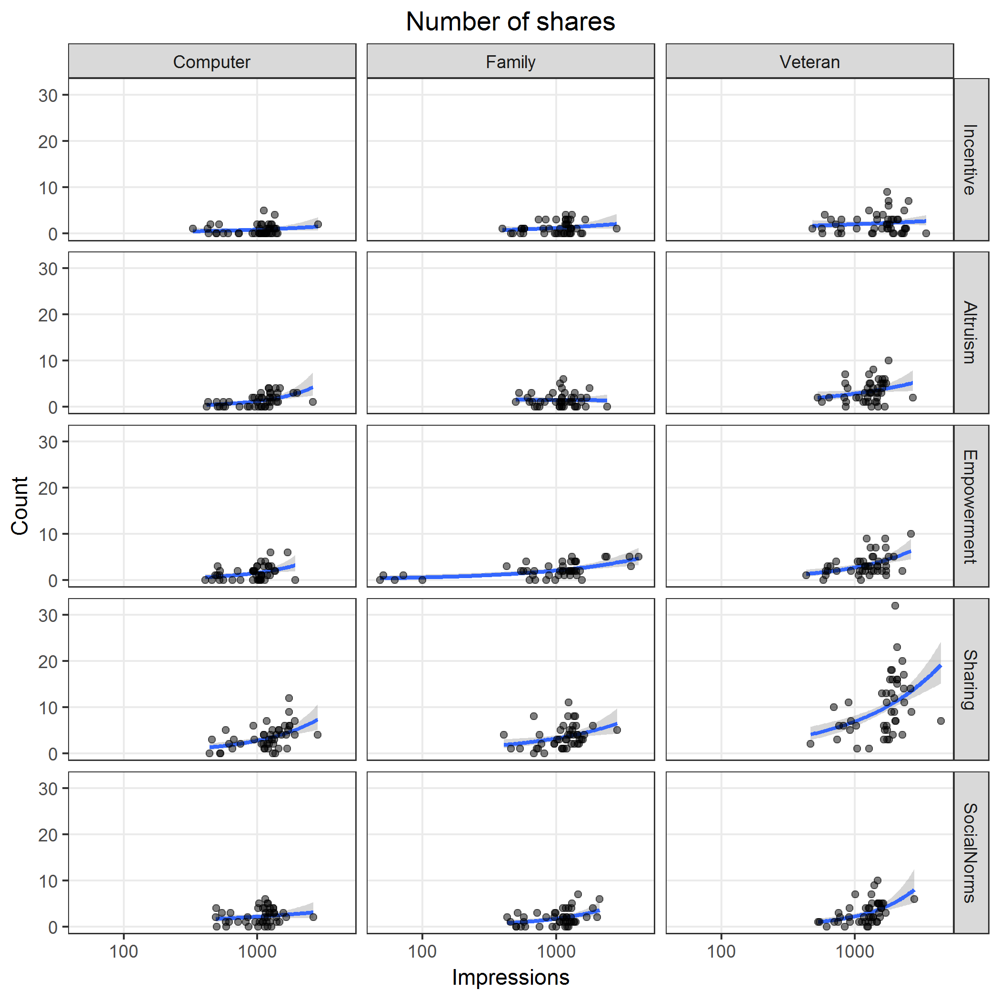

# Preamble

Set working directory and load libraries.


```
## 
## Attaching package: 'dplyr'
```

```
## The following object is masked from 'package:MASS':
## 
##     select
```

```
## The following objects are masked from 'package:stats':
## 
##     filter, lag
```

```
## The following objects are masked from 'package:base':
## 
##     intersect, setdiff, setequal, union
```

```
## Loading required package: mvtnorm
```

```
## Loading required package: survival
```

```
## Loading required package: TH.data
```

```
## 
## Attaching package: 'TH.data'
```

```
## The following object is masked from 'package:MASS':
## 
##     geyser
```

Reproducibility steps.


```
## R version 3.3.3 (2017-03-06)
## Platform: x86_64-w64-mingw32/x64 (64-bit)
## Running under: Windows 7 x64 (build 7601) Service Pack 1
## 
## attached base packages:
## [1] tools     stats     graphics  grDevices utils     datasets  base     
## 
## other attached packages:
##  [1] multcomp_1.4-6   TH.data_1.0-8    survival_2.41-2  mvtnorm_1.0-6   
##  [5] broom_0.4.2      svglite_1.2.0    ggplot2_2.2.1    dplyr_0.5.0     
##  [9] magrittr_1.5     readxl_0.1.1     MASS_7.3-45      rmarkdown_1.4   
## [13] knitr_1.15.1     checkpoint_0.4.0
## 
## loaded via a namespace (and not attached):
##  [1] Rcpp_0.12.10     plyr_1.8.4       methods_3.3.3    digest_0.6.12   
##  [5] evaluate_0.10    tibble_1.2       gtable_0.2.0     nlme_3.1-131    
##  [9] lattice_0.20-35  Matrix_1.2-8     psych_1.7.3.21   DBI_0.6         
## [13] parallel_3.3.3   stringr_1.2.0    gdtools_0.1.4    rprojroot_1.2   
## [17] grid_3.3.3       R6_2.2.0         foreign_0.8-67   reshape2_1.4.2  
## [21] tidyr_0.6.1      codetools_0.2-15 backports_1.0.5  scales_0.4.1    
## [25] htmltools_0.3.5  splines_3.3.3    assertthat_0.1   mnormt_1.5-5    
## [29] colorspace_1.3-2 sandwich_2.3-4   stringi_1.1.3    lazyeval_0.2.0  
## [33] munsell_0.4.3    zoo_1.7-14
```

References

* Zeileis, A., Kleiber, C., & Jackman, S. (2008). Regression Models for Count Data in R. Journal of Statistical Software, 27(8), 1 - 25. doi:[http://dx.doi.org/10.18637/jss.v027.i08](http://dx.doi.org/10.18637/jss.v027.i08)


```
## 
## To cite R in publications use:
## 
##   R Core Team (2017). R: A language and environment for
##   statistical computing. R Foundation for Statistical Computing,
##   Vienna, Austria. URL https://www.R-project.org/.
## 
## A BibTeX entry for LaTeX users is
## 
##   @Manual{,
##     title = {R: A Language and Environment for Statistical Computing},
##     author = {{R Core Team}},
##     organization = {R Foundation for Statistical Computing},
##     address = {Vienna, Austria},
##     year = {2017},
##     url = {https://www.R-project.org/},
##   }
## 
## We have invested a lot of time and effort in creating R, please
## cite it when using it for data analysis. See also
## 'citation("pkgname")' for citing R packages.
```

```
## 
## To cite the MASS package in publications use:
## 
##   Venables, W. N. & Ripley, B. D. (2002) Modern Applied Statistics
##   with S. Fourth Edition. Springer, New York. ISBN 0-387-95457-0
## 
## A BibTeX entry for LaTeX users is
## 
##   @Book{,
##     title = {Modern Applied Statistics with S},
##     author = {W. N. Venables and B. D. Ripley},
##     publisher = {Springer},
##     edition = {Fourth},
##     address = {New York},
##     year = {2002},
##     note = {ISBN 0-387-95457-0},
##     url = {http://www.stats.ox.ac.uk/pub/MASS4},
##   }
```

```
## 
## Please cite the multcomp package by the following reference:
## 
##   Torsten Hothorn, Frank Bretz and Peter Westfall (2008).
##   Simultaneous Inference in General Parametric Models. Biometrical
##   Journal 50(3), 346--363.
## 
## A BibTeX entry for LaTeX users is
## 
##   @Article{,
##     title = {Simultaneous Inference in General Parametric Models},
##     author = {Torsten Hothorn and Frank Bretz and Peter Westfall},
##     journal = {Biometrical Journal},
##     year = {2008},
##     volume = {50},
##     number = {3},
##     pages = {346--363},
##   }
```

Source user-defined functions.


```
##         ../lib/modelCounts.R ../lib/plotRates.R ../lib/plotResid.R
## value   ?                    ?                  ?                 
## visible FALSE                FALSE              FALSE
```
# Read data


```
## Classes 'tbl_df', 'tbl' and 'data.frame':	676 obs. of  12 variables:
##  $ date            : Date, format: "2017-01-15" "2017-01-16" ...
##  $ clicksTotal     : num  7 12 19 13 15 6 9 5 5 1 ...
##  $ linkClicksTotal : num  5 5 8 6 8 2 4 1 4 0 ...
##  $ impressions     : num  737 1086 1487 1998 1862 ...
##  $ clicksUnique    : num  7 12 17 12 14 6 9 4 5 1 ...
##  $ linkClicksUnique: num  5 5 8 6 8 2 4 1 4 0 ...
##  $ reach           : num  736 1084 1480 1981 1853 ...
##  $ reactions       : num  1 5 7 4 2 0 0 3 0 0 ...
##  $ comments        : num  0 0 2 0 0 0 2 0 0 0 ...
##  $ shares          : num  0 2 4 3 3 2 3 1 1 0 ...
##  $ image           : Factor w/ 3 levels "Computer","Family",..: 1 1 1 1 1 1 1 1 1 1 ...
##  $ text            : Factor w/ 5 levels "Altruism","Empowerment",..: 1 1 1 1 1 1 1 1 1 1 ...
```


|image    |text        | nDays|minDate    |maxDate    |
|:--------|:-----------|-----:|:----------|:----------|
|Computer |Altruism    |    45|2017-01-15 |2017-03-14 |
|Computer |Empowerment |    45|2017-01-15 |2017-03-14 |
|Computer |Incentive   |    45|2017-01-15 |2017-03-14 |
|Computer |Sharing     |    45|2017-01-15 |2017-03-14 |
|Computer |SocialNorms |    45|2017-01-15 |2017-03-14 |
|Family   |Altruism    |    45|2017-01-15 |2017-03-14 |
|Family   |Empowerment |    46|2017-01-15 |2017-03-20 |
|Family   |Incentive   |    45|2017-01-15 |2017-03-14 |
|Family   |Sharing     |    45|2017-01-15 |2017-03-14 |
|Family   |SocialNorms |    45|2017-01-15 |2017-03-14 |
|Veteran  |Altruism    |    45|2017-01-15 |2017-03-14 |
|Veteran  |Empowerment |    45|2017-01-15 |2017-03-14 |
|Veteran  |Incentive   |    45|2017-01-15 |2017-03-14 |
|Veteran  |Sharing     |    45|2017-01-15 |2017-03-14 |
|Veteran  |SocialNorms |    45|2017-01-15 |2017-03-14 |
# Correlate Facebook metrics data


|                 | clicksTotal| linkClicksTotal| impressions| clicksUnique| linkClicksUnique| reach| reactions| comments| shares|
|:----------------|-----------:|---------------:|-----------:|------------:|----------------:|-----:|---------:|--------:|------:|
|clicksTotal      |           1|            0.83|        0.71|         0.99|             0.83|  0.71|      0.49|     0.44|   0.66|
|linkClicksTotal  |          NA|            1.00|        0.65|         0.83|             1.00|  0.65|      0.09|     0.24|   0.32|
|impressions      |          NA|              NA|        1.00|         0.72|             0.65|  1.00|      0.30|     0.31|   0.40|
|clicksUnique     |          NA|              NA|          NA|         1.00|             0.83|  0.72|      0.50|     0.41|   0.65|
|linkClicksUnique |          NA|              NA|          NA|           NA|             1.00|  0.65|      0.09|     0.24|   0.32|
|reach            |          NA|              NA|          NA|           NA|               NA|  1.00|      0.30|     0.31|   0.40|
|reactions        |          NA|              NA|          NA|           NA|               NA|    NA|      1.00|     0.31|   0.33|
|comments         |          NA|              NA|          NA|           NA|               NA|    NA|        NA|     1.00|   0.25|
|shares           |          NA|              NA|          NA|           NA|               NA|    NA|        NA|       NA|   1.00|
# Model counts

* Use negative binomial model
* Factors
  * Ad `image`
  * Ad `text`
* Include full factorial interaction
* Use $\log(\text{impressions})$ or $\log(\text{reach})$ as an offset variable
* Calculate predicted counts per 1,000 impressions/reach

**Model**

$$
\begin{align*}
\log(y) = & \beta_0 + \\
          & \beta_1 x_\text{image: Family} + 
            \beta_2 x_\text{image: Veteran} + \\
          & \beta_3 x_\text{text: Empowerment} + 
            \beta_4 x_\text{text: Incentive} + 
            \beta_5 x_\text{text: Sharing} + 
            \beta_6 x_\text{text: Social norms} + \\
          & \gamma_1 x_\text{image: Family} x_\text{text: Empowerment} + 
            \gamma_2 x_\text{image: Family} x_\text{text: Incentive} + 
            \gamma_3 x_\text{image: Family} x_\text{text: Sharing} + 
            \gamma_4 x_\text{image: Family} x_\text{text: Social norms} + \\
          & \gamma_5 x_\text{image: Veteran} x_\text{text: Empowerment} + 
            \gamma_6 x_\text{image: Veteran} x_\text{text: Incentive} + 
            \gamma_7 x_\text{image: Veteran} x_\text{text: Sharing} + 
            \gamma_8 x_\text{image: Veteran} x_\text{text: Social norms} + \\
          & \log(x_\text{offset})
\end{align*}
$$


## Total clicks

Image files saved as [PNG](../figures/clicksTotal.png), [SVG](../figures/clicksTotal.svg)


```
## Saving 7 x 7 in image
## Saving 7 x 7 in image
```


|image    |text        | impressions|  pred| predLower| predUpper|
|:--------|:-----------|-----------:|-----:|---------:|---------:|
|Veteran  |SocialNorms |        1000| 18.14|     16.74|     19.65|
|Veteran  |Sharing     |        1000| 16.68|     15.47|     17.97|
|Veteran  |Altruism    |        1000| 14.34|     13.17|     15.61|
|Veteran  |Incentive   |        1000| 12.66|     11.64|     13.77|
|Veteran  |Empowerment |        1000| 11.29|     10.28|     12.39|
|Family   |Altruism    |        1000| 11.25|     10.21|     12.40|
|Computer |SocialNorms |        1000| 11.09|     10.04|     12.24|
|Family   |Sharing     |        1000| 10.68|      9.69|     11.77|
|Family   |Empowerment |        1000| 10.21|      9.23|     11.30|
|Family   |SocialNorms |        1000|  9.85|      8.89|     10.93|
|Computer |Sharing     |        1000|  9.71|      8.79|     10.72|
|Computer |Empowerment |        1000|  8.64|      7.71|      9.68|
|Family   |Incentive   |        1000|  8.52|      7.63|      9.50|
|Computer |Altruism    |        1000|  8.25|      7.39|      9.21|
|Computer |Incentive   |        1000|  7.33|      6.52|      8.25|

```
## 
## Call:
## glm.nb(formula = formula(text), data = df, init.theta = 33.93522219, 
##     link = log)
## 
## Deviance Residuals: 
##     Min       1Q   Median       3Q      Max  
## -3.2316  -0.7114  -0.0379   0.6036   2.7668  
## 
## Coefficients:
##                               Estimate Std. Error z value Pr(>|z|)    
## (Intercept)                  -4.797671   0.056419 -85.037  < 2e-16 ***
## imageFamily                   0.310288   0.075119   4.131 3.62e-05 ***
## imageVeteran                  0.552909   0.071094   7.777 7.42e-15 ***
## textEmpowerment               0.046318   0.080788   0.573  0.56642    
## textIncentive                -0.117563   0.082369  -1.427  0.15350    
## textSharing                   0.162739   0.075675   2.151  0.03152 *  
## textSocialNorms               0.295610   0.075608   3.910 9.24e-05 ***
## imageFamily:textEmpowerment  -0.142974   0.107839  -1.326  0.18490    
## imageVeteran:textEmpowerment -0.285680   0.103227  -2.767  0.00565 ** 
## imageFamily:textIncentive    -0.160905   0.111301  -1.446  0.14827    
## imageVeteran:textIncentive   -0.006924   0.102365  -0.068  0.94607    
## imageFamily:textSharing      -0.214610   0.103150  -2.081  0.03747 *  
## imageVeteran:textSharing     -0.011815   0.095198  -0.124  0.90123    
## imageFamily:textSocialNorms  -0.428042   0.104689  -4.089 4.34e-05 ***
## imageVeteran:textSocialNorms -0.060496   0.096224  -0.629  0.52955    
## ---
## Signif. codes:  0 '***' 0.001 '**' 0.01 '*' 0.05 '.' 0.1 ' ' 1
## 
## (Dispersion parameter for Negative Binomial(33.9352) family taken to be 1)
## 
##     Null deviance: 1111.83  on 675  degrees of freedom
## Residual deviance:  686.74  on 661  degrees of freedom
## AIC: 3850.7
## 
## Number of Fisher Scoring iterations: 1
## 
## 
##               Theta:  33.94 
##           Std. Err.:  6.11 
## 
##  2 x log-likelihood:  -3818.726
```

```
## Saving 7 x 7 in image
## Saving 7 x 7 in image
```

Image files saved as [PNG](../figures/clicksTotalResid.png), [SVG](../figures/clicksTotalResid.svg)


## Unique clicks

Image files saved as [PNG](../figures/clicksUnique.png), [SVG](../figures/clicksUnique.svg)


```
## Saving 7 x 7 in image
## Saving 7 x 7 in image
```


|image    |text        | reach|  pred| predLower| predUpper|
|:--------|:-----------|-----:|-----:|---------:|---------:|
|Veteran  |SocialNorms |  1000| 16.66|     15.42|     17.99|
|Veteran  |Sharing     |  1000| 15.33|     14.28|     16.46|
|Veteran  |Altruism    |  1000| 13.63|     12.57|     14.78|
|Veteran  |Incentive   |  1000| 11.83|     10.91|     12.81|
|Family   |Altruism    |  1000| 10.76|      9.79|     11.83|
|Veteran  |Empowerment |  1000| 10.61|      9.69|     11.62|
|Computer |SocialNorms |  1000| 10.04|      9.10|     11.07|
|Family   |Sharing     |  1000| 10.03|      9.12|     11.03|
|Family   |Empowerment |  1000|  9.36|      8.48|     10.34|
|Family   |SocialNorms |  1000|  9.35|      8.44|     10.34|
|Computer |Sharing     |  1000|  8.91|      8.08|      9.83|
|Computer |Empowerment |  1000|  8.14|      7.28|      9.11|
|Family   |Incentive   |  1000|  8.05|      7.22|      8.97|
|Computer |Altruism    |  1000|  7.89|      7.07|      8.79|
|Computer |Incentive   |  1000|  7.08|      6.31|      7.95|

```
## 
## Call:
## glm.nb(formula = formula(text), data = df, init.theta = 50.32473536, 
##     link = log)
## 
## Deviance Residuals: 
##     Min       1Q   Median       3Q      Max  
## -3.2251  -0.7013  -0.0467   0.6165   2.9646  
## 
## Coefficients:
##                               Estimate Std. Error z value Pr(>|z|)    
## (Intercept)                  -4.842692   0.055445 -87.343  < 2e-16 ***
## imageFamily                   0.311127   0.073446   4.236 2.27e-05 ***
## imageVeteran                  0.547114   0.069205   7.906 2.67e-15 ***
## textEmpowerment               0.032207   0.079777   0.404 0.686427    
## textIncentive                -0.107545   0.080976  -1.328 0.184143    
## textSharing                   0.122481   0.074537   1.643 0.100335    
## textSocialNorms               0.241336   0.074696   3.231 0.001234 ** 
## imageFamily:textEmpowerment  -0.171431   0.105992  -1.617 0.105792    
## imageVeteran:textEmpowerment -0.282257   0.101058  -2.793 0.005222 ** 
## imageFamily:textIncentive    -0.183361   0.109270  -1.678 0.093336 .  
## imageVeteran:textIncentive   -0.034353   0.099731  -0.344 0.730505    
## imageFamily:textSharing      -0.192925   0.101101  -1.908 0.056359 .  
## imageVeteran:textSharing     -0.004814   0.092632  -0.052 0.958553    
## imageFamily:textSocialNorms  -0.382634   0.102825  -3.721 0.000198 ***
## imageVeteran:textSocialNorms -0.040613   0.093995  -0.432 0.665685    
## ---
## Signif. codes:  0 '***' 0.001 '**' 0.01 '*' 0.05 '.' 0.1 ' ' 1
## 
## (Dispersion parameter for Negative Binomial(50.3247) family taken to be 1)
## 
##     Null deviance: 1088.44  on 675  degrees of freedom
## Residual deviance:  666.42  on 661  degrees of freedom
## AIC: 3715.6
## 
## Number of Fisher Scoring iterations: 1
## 
## 
##               Theta:  50.3 
##           Std. Err.:  12.2 
## 
##  2 x log-likelihood:  -3683.577
```

```
## Saving 7 x 7 in image
## Saving 7 x 7 in image
```

Image files saved as [PNG](../figures/clicksUniqueResid.png), [SVG](../figures/clicksUniqueResid.svg)


## Total link clicks

Image files saved as [PNG](../figures/linkClicksTotal.png), [SVG](../figures/linkClicksTotal.svg)


```
## Saving 7 x 7 in image
## Saving 7 x 7 in image
```


|image    |text        | impressions|  pred| predLower| predUpper|
|:--------|:-----------|-----------:|-----:|---------:|---------:|
|Veteran  |SocialNorms |        1000| 11.48|     10.47|     12.58|
|Veteran  |Incentive   |        1000|  8.48|      7.72|      9.31|
|Veteran  |Sharing     |        1000|  7.90|      7.19|      8.67|
|Computer |SocialNorms |        1000|  6.31|      5.59|      7.13|
|Family   |SocialNorms |        1000|  5.21|      4.56|      5.94|
|Veteran  |Empowerment |        1000|  5.13|      4.53|      5.82|
|Computer |Sharing     |        1000|  5.01|      4.41|      5.69|
|Family   |Sharing     |        1000|  4.86|      4.26|      5.55|
|Computer |Incentive   |        1000|  4.84|      4.22|      5.57|
|Computer |Empowerment |        1000|  4.77|      4.13|      5.51|
|Family   |Empowerment |        1000|  4.57|      3.99|      5.24|
|Family   |Altruism    |        1000|  4.56|      3.97|      5.24|
|Family   |Incentive   |        1000|  4.43|      3.84|      5.11|
|Computer |Altruism    |        1000|  4.29|      3.72|      4.96|
|Veteran  |Altruism    |        1000|  4.24|      3.71|      4.84|

```
## 
## Call:
## glm.nb(formula = formula(text), data = df, init.theta = 37.15282495, 
##     link = log)
## 
## Deviance Residuals: 
##     Min       1Q   Median       3Q      Max  
## -3.2351  -0.7542  -0.0703   0.5668   2.7117  
## 
## Coefficients:
##                              Estimate Std. Error z value Pr(>|z|)    
## (Intercept)                  -5.45080    0.07342 -74.242  < 2e-16 ***
## imageFamily                   0.06077    0.10184   0.597 0.550706    
## imageVeteran                 -0.01302    0.10014  -0.130 0.896565    
## textEmpowerment               0.10559    0.10398   1.016 0.309867    
## textIncentive                 0.12075    0.10203   1.183 0.236621    
## textSharing                   0.15489    0.09791   1.582 0.113675    
## textSocialNorms               0.38536    0.09618   4.007 6.16e-05 ***
## imageFamily:textEmpowerment  -0.10349    0.14354  -0.721 0.470952    
## imageVeteran:textEmpowerment  0.08634    0.13967   0.618 0.536425    
## imageFamily:textIncentive    -0.15008    0.14391  -1.043 0.296992    
## imageVeteran:textIncentive    0.57267    0.13174   4.347 1.38e-05 ***
## imageFamily:textSharing      -0.09099    0.13805  -0.659 0.509819    
## imageVeteran:textSharing      0.46744    0.12840   3.641 0.000272 ***
## imageFamily:textSocialNorms  -0.25334    0.13712  -1.847 0.064675 .  
## imageVeteran:textSocialNorms  0.61115    0.12678   4.820 1.43e-06 ***
## ---
## Signif. codes:  0 '***' 0.001 '**' 0.01 '*' 0.05 '.' 0.1 ' ' 1
## 
## (Dispersion parameter for Negative Binomial(37.1528) family taken to be 1)
## 
##     Null deviance: 1080.25  on 675  degrees of freedom
## Residual deviance:  675.51  on 661  degrees of freedom
## AIC: 3235.1
## 
## Number of Fisher Scoring iterations: 1
## 
## 
##               Theta:  37.2 
##           Std. Err.:  11.5 
## 
##  2 x log-likelihood:  -3203.106
```

```
## Saving 7 x 7 in image
## Saving 7 x 7 in image
```

Image files saved as [PNG](../figures/linkClicksTotalResid.png), [SVG](../figures/linkClicksTotalResid.svg)


## Unique link clicks

Image files saved as [PNG](../figures/linkClicksUnique.png), [SVG](../figures/linkClicksUnique.svg)


```
## Saving 7 x 7 in image
## Saving 7 x 7 in image
```


|image    |text        | reach|  pred| predLower| predUpper|
|:--------|:-----------|-----:|-----:|---------:|---------:|
|Veteran  |SocialNorms |  1000| 11.35|     10.37|     12.43|
|Veteran  |Incentive   |  1000|  8.48|      7.73|      9.31|
|Veteran  |Sharing     |  1000|  7.81|      7.12|      8.56|
|Computer |SocialNorms |  1000|  6.21|      5.49|      7.01|
|Family   |SocialNorms |  1000|  5.19|      4.54|      5.92|
|Veteran  |Empowerment |  1000|  5.07|      4.47|      5.74|
|Computer |Sharing     |  1000|  4.97|      4.38|      5.64|
|Family   |Sharing     |  1000|  4.84|      4.25|      5.52|
|Computer |Incentive   |  1000|  4.82|      4.20|      5.54|
|Computer |Empowerment |  1000|  4.77|      4.13|      5.51|
|Family   |Empowerment |  1000|  4.57|      3.99|      5.23|
|Family   |Altruism    |  1000|  4.54|      3.95|      5.21|
|Family   |Incentive   |  1000|  4.45|      3.86|      5.13|
|Computer |Altruism    |  1000|  4.29|      3.72|      4.95|
|Veteran  |Altruism    |  1000|  4.22|      3.69|      4.82|

```
## 
## Call:
## glm.nb(formula = formula(text), data = df, init.theta = 40.7437904, 
##     link = log)
## 
## Deviance Residuals: 
##     Min       1Q   Median       3Q      Max  
## -3.2411  -0.7580  -0.0693   0.5469   2.7292  
## 
## Coefficients:
##                              Estimate Std. Error z value Pr(>|z|)    
## (Intercept)                  -5.45168    0.07319 -74.488  < 2e-16 ***
## imageFamily                   0.05680    0.10158   0.559 0.576068    
## imageVeteran                 -0.01687    0.09985  -0.169 0.865804    
## textEmpowerment               0.10712    0.10365   1.033 0.301416    
## textIncentive                 0.11764    0.10176   1.156 0.247676    
## textSharing                   0.14776    0.09765   1.513 0.130230    
## textSocialNorms               0.36962    0.09605   3.848 0.000119 ***
## imageFamily:textEmpowerment  -0.10092    0.14306  -0.705 0.480554    
## imageVeteran:textEmpowerment  0.07678    0.13933   0.551 0.581579    
## imageFamily:textIncentive    -0.13814    0.14345  -0.963 0.335555    
## imageVeteran:textIncentive    0.58099    0.13125   4.427 9.57e-06 ***
## imageFamily:textSharing      -0.08318    0.13768  -0.604 0.545768    
## imageVeteran:textSharing      0.46822    0.12797   3.659 0.000253 ***
## imageFamily:textSocialNorms  -0.23640    0.13686  -1.727 0.084122 .  
## imageVeteran:textSocialNorms  0.62067    0.12646   4.908 9.20e-07 ***
## ---
## Signif. codes:  0 '***' 0.001 '**' 0.01 '*' 0.05 '.' 0.1 ' ' 1
## 
## (Dispersion parameter for Negative Binomial(40.7438) family taken to be 1)
## 
##     Null deviance: 1076.26  on 675  degrees of freedom
## Residual deviance:  672.94  on 661  degrees of freedom
## AIC: 3217.5
## 
## Number of Fisher Scoring iterations: 1
## 
## 
##               Theta:  40.7 
##           Std. Err.:  13.6 
## 
##  2 x log-likelihood:  -3185.508
```

```
## Saving 7 x 7 in image
## Saving 7 x 7 in image
```

Image files saved as [PNG](../figures/linkClicksUniqueResid.png), [SVG](../figures/linkClicksUniqueResid.svg)


## Reactions

Image files saved as [PNG](../figures/reactions.png), [SVG](../figures/reactions.svg)


```
## Saving 7 x 7 in image
## Saving 7 x 7 in image
```


|image    |text        | impressions| pred| predLower| predUpper|
|:--------|:-----------|-----------:|----:|---------:|---------:|
|Veteran  |Altruism    |        1000| 6.47|      5.61|      7.46|
|Family   |Altruism    |        1000| 4.27|      3.61|      5.06|
|Veteran  |Empowerment |        1000| 2.34|      1.92|      2.85|
|Family   |Empowerment |        1000| 2.25|      1.82|      2.78|
|Veteran  |Sharing     |        1000| 2.22|      1.85|      2.66|
|Veteran  |SocialNorms |        1000| 2.16|      1.76|      2.65|
|Family   |Sharing     |        1000| 1.85|      1.48|      2.31|
|Computer |Altruism    |        1000| 1.70|      1.34|      2.16|
|Family   |SocialNorms |        1000| 1.60|      1.26|      2.05|
|Family   |Incentive   |        1000| 1.51|      1.17|      1.94|
|Computer |SocialNorms |        1000| 1.46|      1.13|      1.88|
|Computer |Empowerment |        1000| 1.27|      0.96|      1.68|
|Computer |Sharing     |        1000| 1.13|      0.86|      1.47|
|Veteran  |Incentive   |        1000| 1.11|      0.87|      1.42|
|Computer |Incentive   |        1000| 0.95|      0.70|      1.30|

```
## 
## Call:
## glm.nb(formula = formula(text), data = df, init.theta = 8.66717617, 
##     link = log)
## 
## Deviance Residuals: 
##     Min       1Q   Median       3Q      Max  
## -3.2285  -0.9696  -0.1044   0.5733   2.5948  
## 
## Coefficients:
##                              Estimate Std. Error z value Pr(>|z|)    
## (Intercept)                   -6.3782     0.1216 -52.451  < 2e-16 ***
## imageFamily                    0.9229     0.1488   6.202 5.57e-10 ***
## imageVeteran                   1.3373     0.1417   9.437  < 2e-16 ***
## textEmpowerment               -0.2909     0.1884  -1.544 0.122595    
## textIncentive                 -0.5787     0.1995  -2.901 0.003718 ** 
## textSharing                   -0.4079     0.1825  -2.235 0.025420 *  
## textSocialNorms               -0.1515     0.1774  -0.855 0.392819    
## imageFamily:textEmpowerment   -0.3508     0.2331  -1.505 0.132376    
## imageVeteran:textEmpowerment  -0.7273     0.2260  -3.218 0.001289 ** 
## imageFamily:textIncentive     -0.4640     0.2523  -1.839 0.065931 .  
## imageVeteran:textIncentive    -1.1794     0.2459  -4.797 1.61e-06 ***
## imageFamily:textSharing       -0.4301     0.2314  -1.859 0.063048 .  
## imageVeteran:textSharing      -0.6631     0.2171  -3.055 0.002254 ** 
## imageFamily:textSocialNorms   -0.8281     0.2331  -3.553 0.000381 ***
## imageVeteran:textSocialNorms  -0.9449     0.2184  -4.326 1.52e-05 ***
## ---
## Signif. codes:  0 '***' 0.001 '**' 0.01 '*' 0.05 '.' 0.1 ' ' 1
## 
## (Dispersion parameter for Negative Binomial(8.6672) family taken to be 1)
## 
##     Null deviance: 1165.39  on 675  degrees of freedom
## Residual deviance:  753.66  on 661  degrees of freedom
## AIC: 2503.7
## 
## Number of Fisher Scoring iterations: 1
## 
## 
##               Theta:  8.67 
##           Std. Err.:  2.03 
## 
##  2 x log-likelihood:  -2471.707
```

```
## Saving 7 x 7 in image
## Saving 7 x 7 in image
```

Image files saved as [PNG](../figures/reactionsResid.png), [SVG](../figures/reactionsResid.svg)


## Comments

Image files saved as [PNG](../figures/comments.png), [SVG](../figures/comments.svg)


```
## Saving 7 x 7 in image
## Saving 7 x 7 in image
```


|image    |text        | impressions| pred| predLower| predUpper|
|:--------|:-----------|-----------:|----:|---------:|---------:|
|Veteran  |Empowerment |        1000| 1.01|      0.73|      1.39|
|Veteran  |SocialNorms |        1000| 1.01|      0.73|      1.39|
|Veteran  |Altruism    |        1000| 0.80|      0.57|      1.12|
|Family   |Altruism    |        1000| 0.79|      0.55|      1.14|
|Family   |Sharing     |        1000| 0.67|      0.46|      0.97|
|Family   |Empowerment |        1000| 0.59|      0.40|      0.89|
|Veteran  |Sharing     |        1000| 0.59|      0.42|      0.83|
|Computer |Sharing     |        1000| 0.49|      0.33|      0.75|
|Family   |Incentive   |        1000| 0.47|      0.30|      0.74|
|Computer |Empowerment |        1000| 0.44|      0.27|      0.72|
|Computer |SocialNorms |        1000| 0.44|      0.28|      0.70|
|Family   |SocialNorms |        1000| 0.42|      0.27|      0.68|
|Veteran  |Incentive   |        1000| 0.36|      0.23|      0.55|
|Computer |Altruism    |        1000| 0.28|      0.16|      0.49|
|Computer |Incentive   |        1000| 0.06|      0.02|      0.20|

```
## 
## Call:
## glm.nb(formula = formula(text), data = df, init.theta = 2.563164256, 
##     link = log)
## 
## Deviance Residuals: 
##     Min       1Q   Median       3Q      Max  
## -1.7722  -1.0058  -0.6424   0.4029   2.4644  
## 
## Coefficients:
##                              Estimate Std. Error z value Pr(>|z|)    
## (Intercept)                   -8.1713     0.2853 -28.639  < 2e-16 ***
## imageFamily                    1.0287     0.3402   3.024  0.00249 ** 
## imageVeteran                   1.0350     0.3345   3.094  0.00197 ** 
## textEmpowerment                0.4502     0.3770   1.194  0.23246    
## textIncentive                 -1.4987     0.6516  -2.300  0.02144 *  
## textSharing                    0.5590     0.3561   1.570  0.11648    
## textSocialNorms                0.4499     0.3695   1.218  0.22341    
## imageFamily:textEmpowerment   -0.7395     0.4678  -1.581  0.11390    
## imageVeteran:textEmpowerment  -0.2110     0.4464  -0.473  0.63651    
## imageFamily:textIncentive      0.9855     0.7156   1.377  0.16843    
## imageVeteran:textIncentive     0.7064     0.7095   0.996  0.31944    
## imageFamily:textSharing       -0.7310     0.4456  -1.641  0.10090    
## imageVeteran:textSharing      -0.8593     0.4339  -1.980  0.04767 *  
## imageFamily:textSocialNorms   -1.0720     0.4779  -2.243  0.02488 *  
## imageVeteran:textSocialNorms  -0.2122     0.4402  -0.482  0.62976    
## ---
## Signif. codes:  0 '***' 0.001 '**' 0.01 '*' 0.05 '.' 0.1 ' ' 1
## 
## (Dispersion parameter for Negative Binomial(2.5632) family taken to be 1)
## 
##     Null deviance: 706.85  on 675  degrees of freedom
## Residual deviance: 629.46  on 661  degrees of freedom
## AIC: 1455
## 
## Number of Fisher Scoring iterations: 1
## 
## 
##               Theta:  2.563 
##           Std. Err.:  0.728 
## 
##  2 x log-likelihood:  -1423.011
```

```
## Saving 7 x 7 in image
## Saving 7 x 7 in image
```

Image files saved as [PNG](../figures/commentsResid.png), [SVG](../figures/commentsResid.svg)


## Shares

Image files saved as [PNG](../figures/shares.png), [SVG](../figures/shares.svg)




```
## Saving 7 x 7 in image
## Saving 7 x 7 in image
```


|image    |text        | impressions| pred| predLower| predUpper|
|:--------|:-----------|-----------:|----:|---------:|---------:|
|Veteran  |Sharing     |        1000| 5.87|      5.01|      6.88|
|Family   |Sharing     |        1000| 3.06|      2.51|      3.75|
|Computer |Sharing     |        1000| 2.73|      2.22|      3.36|
|Veteran  |Empowerment |        1000| 2.65|      2.15|      3.25|
|Veteran  |Altruism    |        1000| 2.55|      2.08|      3.14|
|Veteran  |SocialNorms |        1000| 2.38|      1.92|      2.95|
|Computer |SocialNorms |        1000| 2.04|      1.62|      2.59|
|Family   |Empowerment |        1000| 1.89|      1.49|      2.40|
|Family   |SocialNorms |        1000| 1.71|      1.33|      2.19|
|Computer |Empowerment |        1000| 1.57|      1.19|      2.05|
|Veteran  |Incentive   |        1000| 1.41|      1.12|      1.79|
|Family   |Altruism    |        1000| 1.32|      1.00|      1.73|
|Computer |Altruism    |        1000| 1.27|      0.96|      1.68|
|Family   |Incentive   |        1000| 1.13|      0.84|      1.52|
|Computer |Incentive   |        1000| 0.78|      0.55|      1.11|

```
## 
## Call:
## glm.nb(formula = formula(text), data = df, init.theta = 5.336707895, 
##     link = log)
## 
## Deviance Residuals: 
##     Min       1Q   Median       3Q      Max  
## -2.6223  -1.0413  -0.1675   0.5480   2.6187  
## 
## Coefficients:
##                              Estimate Std. Error z value Pr(>|z|)    
## (Intercept)                  -6.67090    0.14357 -46.465  < 2e-16 ***
## imageFamily                   0.03704    0.20033   0.185   0.8533    
## imageVeteran                  0.70115    0.17782   3.943 8.05e-05 ***
## textEmpowerment               0.21164    0.19912   1.063   0.2878    
## textIncentive                -0.48105    0.22840  -2.106   0.0352 *  
## textSharing                   0.76833    0.17779   4.322 1.55e-05 ***
## textSocialNorms               0.47837    0.18708   2.557   0.0106 *  
## imageFamily:textEmpowerment   0.15091    0.27242   0.554   0.5796    
## imageVeteran:textEmpowerment -0.17646    0.24848  -0.710   0.4776    
## imageFamily:textIncentive     0.32647    0.30755   1.062   0.2885    
## imageVeteran:textIncentive   -0.11107    0.27867  -0.399   0.6902    
## imageFamily:textSharing       0.07755    0.24831   0.312   0.7548    
## imageVeteran:textSharing      0.06401    0.22172   0.289   0.7728    
## imageFamily:textSocialNorms  -0.21793    0.26647  -0.818   0.4134    
## imageVeteran:textSocialNorms -0.54929    0.24060  -2.283   0.0224 *  
## ---
## Signif. codes:  0 '***' 0.001 '**' 0.01 '*' 0.05 '.' 0.1 ' ' 1
## 
## (Dispersion parameter for Negative Binomial(5.3367) family taken to be 1)
## 
##     Null deviance: 1058.9  on 675  degrees of freedom
## Residual deviance:  762.3  on 661  degrees of freedom
## AIC: 2589.1
## 
## Number of Fisher Scoring iterations: 1
## 
## 
##               Theta:  5.337 
##           Std. Err.:  0.904 
## 
##  2 x log-likelihood:  -2557.090
```

```
## Saving 7 x 7 in image
## Saving 7 x 7 in image
```

Image files saved as [PNG](../figures/sharesResid.png), [SVG](../figures/sharesResid.svg)
