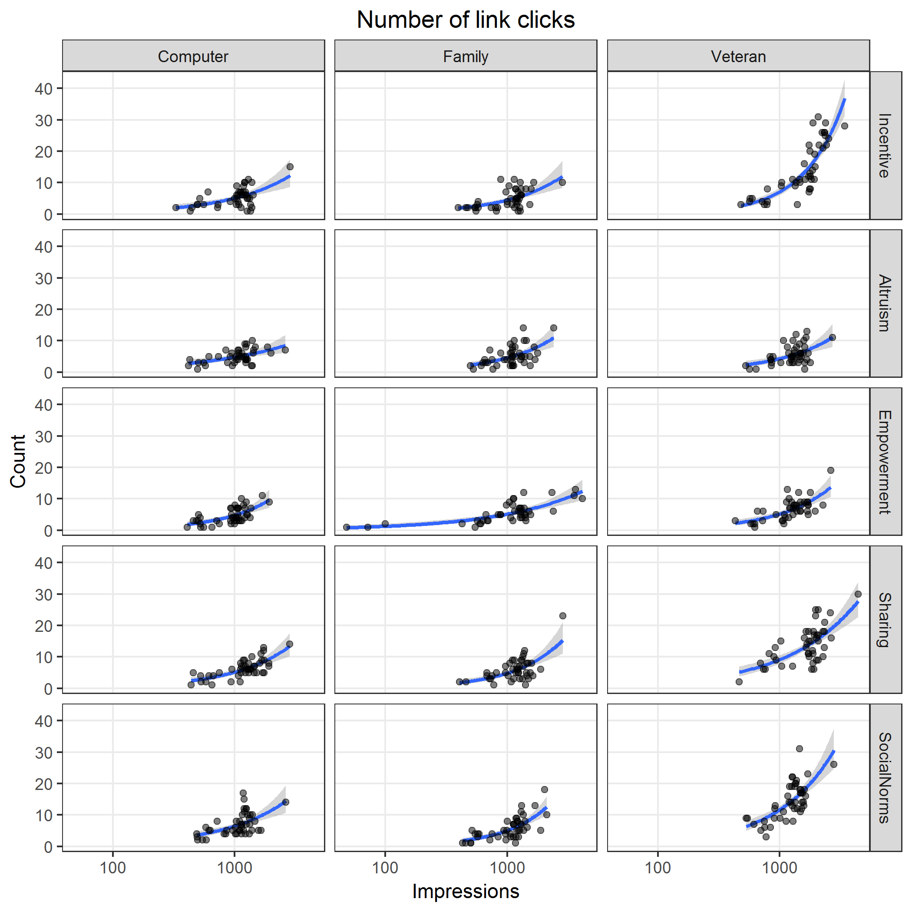
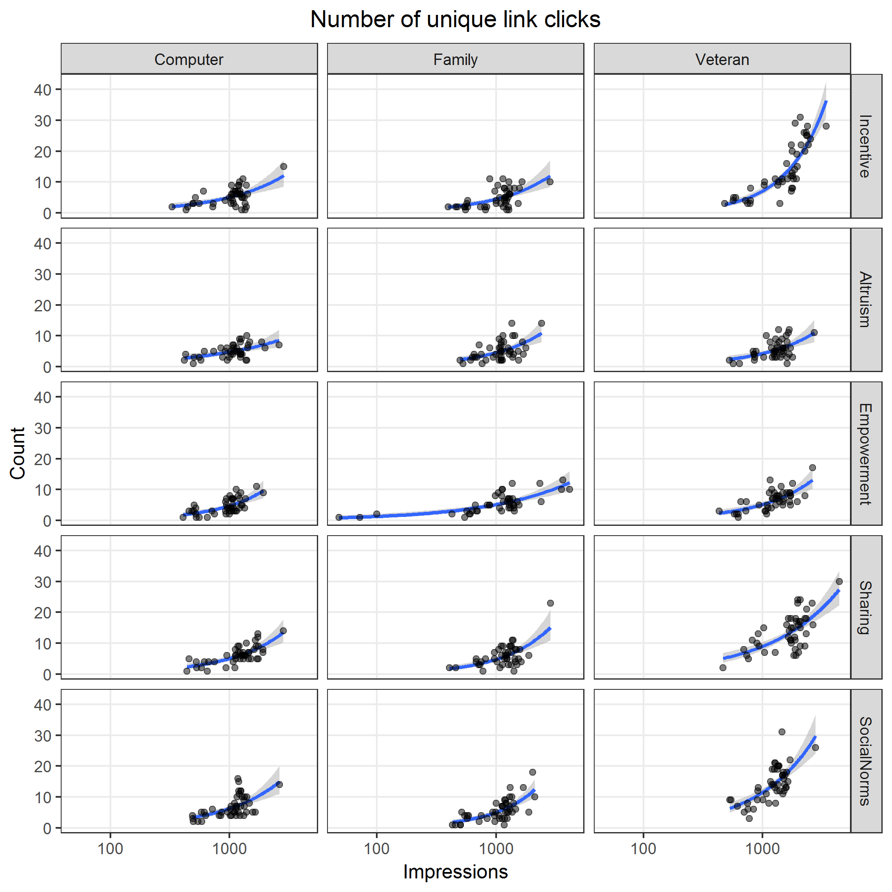

# Preamble

Set working directory and load libraries.


```
## 
## Attaching package: 'dplyr'
```

```
## The following object is masked from 'package:MASS':
## 
##     select
```

```
## The following objects are masked from 'package:stats':
## 
##     filter, lag
```

```
## The following objects are masked from 'package:base':
## 
##     intersect, setdiff, setequal, union
```

```
## Loading required package: mvtnorm
```

```
## Loading required package: survival
```

```
## Loading required package: TH.data
```

```
## 
## Attaching package: 'TH.data'
```

```
## The following object is masked from 'package:MASS':
## 
##     geyser
```

Reproducibility steps.


```
## R version 3.3.3 (2017-03-06)
## Platform: x86_64-w64-mingw32/x64 (64-bit)
## Running under: Windows 7 x64 (build 7601) Service Pack 1
## 
## attached base packages:
## [1] tools     stats     graphics  grDevices utils     datasets  base     
## 
## other attached packages:
##  [1] multcomp_1.4-6   TH.data_1.0-8    survival_2.41-2  mvtnorm_1.0-6   
##  [5] broom_0.4.2      svglite_1.2.0    ggplot2_2.2.1    dplyr_0.5.0     
##  [9] magrittr_1.5     readxl_0.1.1     MASS_7.3-45      rmarkdown_1.4   
## [13] knitr_1.15.1     checkpoint_0.4.0
## 
## loaded via a namespace (and not attached):
##  [1] Rcpp_0.12.10     plyr_1.8.4       methods_3.3.3    digest_0.6.12   
##  [5] evaluate_0.10    tibble_1.2       gtable_0.2.0     nlme_3.1-131    
##  [9] lattice_0.20-35  Matrix_1.2-8     psych_1.7.3.21   DBI_0.6         
## [13] parallel_3.3.3   stringr_1.2.0    gdtools_0.1.4    rprojroot_1.2   
## [17] grid_3.3.3       R6_2.2.0         foreign_0.8-67   reshape2_1.4.2  
## [21] tidyr_0.6.1      codetools_0.2-15 backports_1.0.5  scales_0.4.1    
## [25] htmltools_0.3.5  splines_3.3.3    assertthat_0.1   mnormt_1.5-5    
## [29] colorspace_1.3-2 sandwich_2.3-4   stringi_1.1.3    lazyeval_0.2.0  
## [33] munsell_0.4.3    zoo_1.7-14
```

References

* Zeileis, A., Kleiber, C., & Jackman, S. (2008). Regression Models for Count Data in R. Journal of Statistical Software, 27(8), 1 - 25. doi:[http://dx.doi.org/10.18637/jss.v027.i08](http://dx.doi.org/10.18637/jss.v027.i08)


```
## 
## To cite R in publications use:
## 
##   R Core Team (2017). R: A language and environment for
##   statistical computing. R Foundation for Statistical Computing,
##   Vienna, Austria. URL https://www.R-project.org/.
## 
## A BibTeX entry for LaTeX users is
## 
##   @Manual{,
##     title = {R: A Language and Environment for Statistical Computing},
##     author = {{R Core Team}},
##     organization = {R Foundation for Statistical Computing},
##     address = {Vienna, Austria},
##     year = {2017},
##     url = {https://www.R-project.org/},
##   }
## 
## We have invested a lot of time and effort in creating R, please
## cite it when using it for data analysis. See also
## 'citation("pkgname")' for citing R packages.
```

```
## 
## To cite the MASS package in publications use:
## 
##   Venables, W. N. & Ripley, B. D. (2002) Modern Applied Statistics
##   with S. Fourth Edition. Springer, New York. ISBN 0-387-95457-0
## 
## A BibTeX entry for LaTeX users is
## 
##   @Book{,
##     title = {Modern Applied Statistics with S},
##     author = {W. N. Venables and B. D. Ripley},
##     publisher = {Springer},
##     edition = {Fourth},
##     address = {New York},
##     year = {2002},
##     note = {ISBN 0-387-95457-0},
##     url = {http://www.stats.ox.ac.uk/pub/MASS4},
##   }
```

```
## 
## Please cite the multcomp package by the following reference:
## 
##   Torsten Hothorn, Frank Bretz and Peter Westfall (2008).
##   Simultaneous Inference in General Parametric Models. Biometrical
##   Journal 50(3), 346--363.
## 
## A BibTeX entry for LaTeX users is
## 
##   @Article{,
##     title = {Simultaneous Inference in General Parametric Models},
##     author = {Torsten Hothorn and Frank Bretz and Peter Westfall},
##     journal = {Biometrical Journal},
##     year = {2008},
##     volume = {50},
##     number = {3},
##     pages = {346--363},
##   }
```

Source user-defined functions.


```
##         ../lib/contrastHeatmap.R ../lib/contrastTable.R
## value   ?                        ?                     
## visible FALSE                    FALSE                 
##         ../lib/modelCounts.R ../lib/plotRates.R ../lib/plotResid.R
## value   ?                    ?                  ?                 
## visible FALSE                FALSE              FALSE
```
# Read data


Column name mapping.


|old                                    |new                    |
|:--------------------------------------|:----------------------|
|Reporting                              |date                   |
|Ad                                     |ad                     |
|Reach                                  |reach                  |
|Cost.per.1.000.People.Reached..USD.    |cost                   |
|Impressions                            |impressions            |
|CPM..Cost.per.1.000.Impressions...USD. |cpm                    |
|Link.Clicks                            |linkClicks             |
|CTR..Link.Click.Through.Rate.          |ctr                    |
|CPC..Cost.per.Link.Click...USD.        |cpc                    |
|Unique.Link.Clicks                     |uniqueLinkClicks       |
|Unique.CTR..Link.Click.Through.Rate.   |uniqueCTR              |
|Cost.per.Unique.Link.Click..USD.       |costPerUniqueLinkClick |
|Clicks..All.                           |clicksAll              |
|CTR..All.                              |ctrAll                 |
|CPC..All...USD.                        |cpcAll                 |
|Unique.Clicks..All.                    |uniqueClicksAll        |
|Unique.CTR..All.                       |uniqueCTRAll           |
|Cost.per.Unique.Click..All...USD.      |costPerUniqueClickAll  |
|Post.Reactions                         |reactions              |
|Post.Comments                          |comments               |
|Post.Shares                            |shares                 |
|NA                                     |image                  |
|NA                                     |text                   |

Summarize.


|image    |text        | nDays|minDate    |maxDate    |
|:--------|:-----------|-----:|:----------|:----------|
|Computer |Incentive   |    45|2017-01-13 |2017-03-12 |
|Computer |Altruism    |    45|2017-01-13 |2017-03-12 |
|Computer |Empowerment |    40|2017-01-13 |2017-03-07 |
|Computer |Sharing     |    45|2017-01-13 |2017-03-12 |
|Computer |SocialNorms |    45|2017-01-13 |2017-03-12 |
|Family   |Incentive   |    45|2017-01-13 |2017-03-12 |
|Family   |Altruism    |    45|2017-01-13 |2017-03-12 |
|Family   |Empowerment |    40|2017-01-13 |2017-03-12 |
|Family   |Sharing     |    45|2017-01-13 |2017-03-12 |
|Family   |SocialNorms |    45|2017-01-13 |2017-03-12 |
|Veteran  |Incentive   |    45|2017-01-13 |2017-03-12 |
|Veteran  |Altruism    |    45|2017-01-13 |2017-03-12 |
|Veteran  |Empowerment |    45|2017-01-13 |2017-03-12 |
|Veteran  |Sharing     |    45|2017-01-13 |2017-03-12 |
|Veteran  |SocialNorms |    45|2017-01-13 |2017-03-12 |
# Correlate Facebook metrics data


|                 | impressions| reach| clicksAll| linkClicks| uniqueClicksAll| uniqueLinkClicks| reactions| comments| shares|
|:----------------|-----------:|-----:|---------:|----------:|---------------:|----------------:|---------:|--------:|------:|
|impressions      |           1|     1|      0.70|       0.64|            0.71|             0.64|      0.22|     0.20|   0.40|
|reach            |          NA|     1|      0.71|       0.64|            0.71|             0.64|      0.22|     0.20|   0.40|
|clicksAll        |          NA|    NA|      1.00|       0.83|            0.99|             0.83|      0.41|     0.32|   0.65|
|linkClicks       |          NA|    NA|        NA|       1.00|            0.83|             1.00|     -0.01|     0.18|   0.31|
|uniqueClicksAll  |          NA|    NA|        NA|         NA|            1.00|             0.83|      0.42|     0.29|   0.64|
|uniqueLinkClicks |          NA|    NA|        NA|         NA|              NA|             1.00|     -0.01|     0.18|   0.30|
|reactions        |          NA|    NA|        NA|         NA|              NA|               NA|      1.00|     0.19|   0.25|
|comments         |          NA|    NA|        NA|         NA|              NA|               NA|        NA|     1.00|   0.09|
|shares           |          NA|    NA|        NA|         NA|              NA|               NA|        NA|       NA|   1.00|
# Model counts

* Use negative binomial model
* Factors
  * Ad `image`
  * Ad `text`
* Include full factorial interaction

**Model**

Define the linear predictor as $\eta$, where

$$
\begin{align*}
\eta = & \beta_0 + \\\\
       & \beta_1 x_\text{image: Family} + 
         \beta_2 x_\text{image: Veteran} + \\\\
       & \beta_3 x_\text{text: Altruism} + 
         \beta_4 x_\text{text: Empowerment} + 
         \beta_5 x_\text{text: Sharing} + 
         \beta_6 x_\text{text: Social norms} + \\\\
       & \gamma_1 x_\text{image: Family} x_\text{text: Altruism} + 
         \gamma_2 x_\text{image: Family} x_\text{text: Empowerment} +  \\\\
       & \gamma_3 x_\text{image: Family} x_\text{text: Sharing} + 
         \gamma_4 x_\text{image: Family} x_\text{text: Social norms} + \\\\
       & \gamma_5 x_\text{image: Veteran} x_\text{text: Altruism} + 
         \gamma_6 x_\text{image: Veteran} x_\text{text: Empowerment} +  \\\\
       & \gamma_7 x_\text{image: Veteran} x_\text{text: Sharing} + 
         \gamma_8 x_\text{image: Veteran} x_\text{text: Social norms}
\end{align*}
$$

The model for impressions and reach is

$$
\log(y) = \eta
$$

Clicks, unique clicks, total link clicks, unique link clicks are bounded by and related to the number of impressions.
The model for these dependent variables uses impressions as an offset and is specified as

$$
\log(y) = \eta + \log(x_\text{impressions})
$$

Reactions, comments, and shares are bounded by and related to the number of clicks.
The model for these dependent variables uses all clicks as an offset and is specified as

$$
\log(y) = \eta + \log(x_\text{clicksAll})
$$


## Impressions

Image files saved as [PNG](../figures/impressions.png), [SVG](../figures/impressions.svg)


```
## Saving 7 x 7 in image
## Saving 7 x 7 in image
```

```
## impressions ~ image + text + image * text
## 
## 
## |image    |text        |    pred| predLower| predUpper|
## |:--------|:-----------|-------:|---------:|---------:|
## |Veteran  |Sharing     | 1757.73|   1575.81|   1960.66|
## |Veteran  |Incentive   | 1602.71|   1436.80|   1787.78|
## |Veteran  |Altruism    | 1312.31|   1176.40|   1463.92|
## |Veteran  |Empowerment | 1275.38|   1143.28|   1422.74|
## |Family   |Empowerment | 1274.75|   1135.17|   1431.50|
## |Computer |Sharing     | 1256.49|   1126.35|   1401.67|
## |Veteran  |SocialNorms | 1250.96|   1121.38|   1395.50|
## |Family   |Sharing     | 1193.04|   1069.45|   1330.92|
## |Family   |Altruism    | 1125.38|   1008.78|   1255.46|
## |Computer |SocialNorms | 1099.00|    985.12|   1226.04|
## |Computer |Altruism    | 1097.71|    983.97|   1224.60|
## |Family   |SocialNorms | 1093.20|    979.92|   1219.57|
## |Family   |Incentive   | 1080.02|    968.11|   1204.87|
## |Computer |Incentive   | 1056.07|    946.63|   1178.16|
## |Computer |Empowerment |  979.60|    872.25|   1100.16|
## 
## 
## |         |Computer | Family| Veteran|
## |:--------|:--------|------:|-------:|
## |Computer |NA       |  0.776|       0|
## |Family   |NA       |     NA|       0|
## |Veteran  |NA       |     NA|      NA|
## 
## |            |Incentive | Altruism| Empowerment| Sharing| SocialNorms|
## |:-----------|:---------|--------:|-----------:|-------:|-----------:|
## |Incentive   |NA        |    0.624|       0.356|   0.028|       0.614|
## |Altruism    |NA        |       NA|       0.162|   0.087|       0.988|
## |Empowerment |NA        |       NA|          NA|   0.002|       0.158|
## |Sharing     |NA        |       NA|          NA|      NA|       0.090|
## |SocialNorms |NA        |       NA|          NA|      NA|          NA|
## 
## |        |Com-Inc | Com-Alt| Com-Emp| Com-Sha| Com-Soc| Fam-Inc| Fam-Alt| Fam-Emp| Fam-Sha| Fam-Soc| Vet-Inc| Vet-Alt| Vet-Emp| Vet-Sha| Vet-Soc|
## |:-------|:-------|-------:|-------:|-------:|-------:|-------:|-------:|-------:|-------:|-------:|-------:|-------:|-------:|-------:|-------:|
## |Com-Inc |NA      |   0.624|   0.356|   0.028|   0.614|   0.776|   0.421|   0.021|   0.122|   0.662|   0.000|   0.006|   0.017|   0.000|   0.032|
## |Com-Alt |NA      |      NA|   0.162|   0.087|   0.988|   0.837|   0.752|   0.066|   0.291|   0.958|   0.000|   0.024|   0.057|   0.000|   0.098|
## |Com-Emp |NA      |      NA|      NA|   0.002|   0.158|   0.230|   0.088|   0.002|   0.015|   0.178|   0.000|   0.000|   0.001|   0.000|   0.003|
## |Com-Sha |NA      |      NA|      NA|      NA|   0.090|   0.055|   0.163|   0.859|   0.511|   0.078|   0.002|   0.582|   0.850|   0.000|   0.955|
## |Com-Soc |NA      |      NA|      NA|      NA|      NA|   0.825|   0.764|   0.068|   0.298|   0.947|   0.000|   0.025|   0.059|   0.000|   0.101|
## |Fam-Inc |NA      |      NA|      NA|      NA|      NA|      NA|   0.602|   0.042|   0.207|   0.878|   0.000|   0.014|   0.035|   0.000|   0.063|
## |Fam-Alt |NA      |      NA|      NA|      NA|      NA|      NA|      NA|   0.125|   0.459|   0.713|   0.000|   0.051|   0.113|   0.000|   0.180|
## |Fam-Emp |NA      |      NA|      NA|      NA|      NA|      NA|      NA|      NA|   0.415|   0.059|   0.005|   0.721|   0.995|   0.000|   0.817|
## |Fam-Sha |NA      |      NA|      NA|      NA|      NA|      NA|      NA|      NA|      NA|   0.154|   0.000|   0.227|   0.398|   0.000|   0.548|
## |Fam-Soc |NA      |      NA|      NA|      NA|      NA|      NA|      NA|      NA|      NA|      NA|   0.000|   0.021|   0.051|   0.000|   0.088|
## |Vet-Inc |NA      |      NA|      NA|      NA|      NA|      NA|      NA|      NA|      NA|      NA|      NA|   0.011|   0.004|   0.242|   0.002|
## |Vet-Alt |NA      |      NA|      NA|      NA|      NA|      NA|      NA|      NA|      NA|      NA|      NA|      NA|   0.717|   0.000|   0.544|
## |Vet-Emp |NA      |      NA|      NA|      NA|      NA|      NA|      NA|      NA|      NA|      NA|      NA|      NA|      NA|   0.000|   0.806|
## |Vet-Sha |NA      |      NA|      NA|      NA|      NA|      NA|      NA|      NA|      NA|      NA|      NA|      NA|      NA|      NA|   0.000|
## |Vet-Soc |NA      |      NA|      NA|      NA|      NA|      NA|      NA|      NA|      NA|      NA|      NA|      NA|      NA|      NA|      NA|
```

```
## Loading required package: reshape2
```

```
## Loading required package: RColorBrewer
```

```
## Saving 7 x 7 in image
## Saving 7 x 7 in image
## Saving 7 x 7 in image
## Saving 7 x 7 in image
## Saving 7 x 7 in image
## Saving 7 x 7 in image
```

```
## 
## Call:
## glm.nb(formula = formula(text), data = df, init.theta = 7.180819185, 
##     link = log)
## 
## Deviance Residuals: 
##     Min       1Q   Median       3Q      Max  
## -2.9074  -0.6555   0.0650   0.4441   3.9275  
## 
## Coefficients:
##                               Estimate Std. Error z value Pr(>|z|)    
## (Intercept)                   6.962307   0.055819 124.731  < 2e-16 ***
## imageFamily                   0.022430   0.078936   0.284  0.77629    
## imageVeteran                  0.417145   0.078894   5.287 1.24e-07 ***
## textAltruism                  0.038676   0.078934   0.490  0.62415    
## textEmpowerment              -0.075162   0.081380  -0.924  0.35570    
## textSharing                   0.173770   0.078918   2.202  0.02767 *  
## textSocialNorms               0.039849   0.078934   0.505  0.61367    
## imageFamily:textAltruism      0.002461   0.111626   0.022  0.98241    
## imageVeteran:textAltruism    -0.238583   0.111583  -2.138  0.03250 *  
## imageFamily:textEmpowerment   0.240931   0.115061   2.094  0.03627 *  
## imageVeteran:textEmpowerment -0.153292   0.113328  -1.353  0.17617    
## imageFamily:textSharing      -0.074243   0.111609  -0.665  0.50592    
## imageVeteran:textSharing     -0.081441   0.111552  -0.730  0.46534    
## imageFamily:textSocialNorms  -0.027722   0.111628  -0.248  0.80387    
## imageVeteran:textSocialNorms -0.287638   0.111587  -2.578  0.00995 ** 
## ---
## Signif. codes:  0 '***' 0.001 '**' 0.01 '*' 0.05 '.' 0.1 ' ' 1
## 
## (Dispersion parameter for Negative Binomial(7.1808) family taken to be 1)
## 
##     Null deviance: 794.82  on 664  degrees of freedom
## Residual deviance: 680.44  on 650  degrees of freedom
## AIC: 9996.9
## 
## Number of Fisher Scoring iterations: 1
## 
## 
##               Theta:  7.181 
##           Std. Err.:  0.388 
## 
##  2 x log-likelihood:  -9964.874
```

```
## Saving 7 x 7 in image
## Saving 7 x 7 in image
```


## Reach

Image files saved as [PNG](../figures/reach.png), [SVG](../figures/reach.svg)


```
## Saving 7 x 7 in image
## Saving 7 x 7 in image
```

```
## reach ~ image + text + image * text
## 
## 
## |image    |text        |    pred| predLower| predUpper|
## |:--------|:-----------|-------:|---------:|---------:|
## |Veteran  |Sharing     | 1752.78|   1571.80|   1954.59|
## |Veteran  |Incentive   | 1596.22|   1431.38|   1780.05|
## |Veteran  |Altruism    | 1307.96|   1172.82|   1458.66|
## |Veteran  |Empowerment | 1271.02|   1139.69|   1417.48|
## |Family   |Empowerment | 1270.50|   1131.71|   1426.31|
## |Computer |Sharing     | 1252.44|   1123.03|   1396.77|
## |Veteran  |SocialNorms | 1247.20|   1118.33|   1390.93|
## |Family   |Sharing     | 1189.13|   1066.24|   1326.19|
## |Family   |Altruism    | 1121.07|   1005.19|   1250.30|
## |Computer |SocialNorms | 1094.47|    981.33|   1220.64|
## |Computer |Altruism    | 1092.84|    979.88|   1218.84|
## |Family   |SocialNorms | 1089.00|    976.43|   1214.55|
## |Family   |Incentive   | 1075.53|    964.35|   1199.54|
## |Computer |Incentive   | 1051.13|    942.46|   1172.33|
## |Computer |Empowerment |  975.35|    868.72|   1095.07|
## 
## 
## |         |Computer | Family| Veteran|
## |:--------|:--------|------:|-------:|
## |Computer |NA       |  0.771|       0|
## |Family   |NA       |     NA|       0|
## |Veteran  |NA       |     NA|      NA|
## 
## |            |Incentive | Altruism| Empowerment| Sharing| SocialNorms|
## |:-----------|:---------|--------:|-----------:|-------:|-----------:|
## |Incentive   |NA        |    0.621|       0.357|   0.026|       0.608|
## |Altruism    |NA        |       NA|       0.161|   0.083|       0.985|
## |Empowerment |NA        |       NA|          NA|   0.002|       0.156|
## |Sharing     |NA        |       NA|          NA|      NA|       0.087|
## |SocialNorms |NA        |       NA|          NA|      NA|          NA|
## 
## |        |Com-Inc | Com-Alt| Com-Emp| Com-Sha| Com-Soc| Fam-Inc| Fam-Alt| Fam-Emp| Fam-Sha| Fam-Soc| Vet-Inc| Vet-Alt| Vet-Emp| Vet-Sha| Vet-Soc|
## |:-------|:-------|-------:|-------:|-------:|-------:|-------:|-------:|-------:|-------:|-------:|-------:|-------:|-------:|-------:|-------:|
## |Com-Inc |NA      |   0.621|   0.357|   0.026|   0.608|   0.771|   0.413|   0.019|   0.117|   0.653|   0.000|   0.005|   0.016|   0.000|   0.030|
## |Com-Alt |NA      |      NA|   0.161|   0.083|   0.985|   0.839|   0.746|   0.063|   0.283|   0.964|   0.000|   0.022|   0.055|   0.000|   0.093|
## |Com-Emp |NA      |      NA|      NA|   0.002|   0.156|   0.228|   0.086|   0.002|   0.015|   0.175|   0.000|   0.000|   0.001|   0.000|   0.002|
## |Com-Sha |NA      |      NA|      NA|      NA|   0.087|   0.053|   0.159|   0.860|   0.510|   0.076|   0.002|   0.582|   0.852|   0.000|   0.957|
## |Com-Soc |NA      |      NA|      NA|      NA|      NA|   0.825|   0.760|   0.066|   0.292|   0.949|   0.000|   0.024|   0.057|   0.000|   0.097|
## |Fam-Inc |NA      |      NA|      NA|      NA|      NA|      NA|   0.598|   0.040|   0.202|   0.874|   0.000|   0.013|   0.034|   0.000|   0.060|
## |Fam-Alt |NA      |      NA|      NA|      NA|      NA|      NA|      NA|   0.123|   0.454|   0.712|   0.000|   0.050|   0.111|   0.000|   0.176|
## |Fam-Emp |NA      |      NA|      NA|      NA|      NA|      NA|      NA|      NA|   0.415|   0.057|   0.005|   0.720|   0.996|   0.000|   0.820|
## |Fam-Sha |NA      |      NA|      NA|      NA|      NA|      NA|      NA|      NA|      NA|   0.152|   0.000|   0.226|   0.397|   0.000|   0.545|
## |Fam-Soc |NA      |      NA|      NA|      NA|      NA|      NA|      NA|      NA|      NA|      NA|   0.000|   0.020|   0.050|   0.000|   0.085|
## |Vet-Inc |NA      |      NA|      NA|      NA|      NA|      NA|      NA|      NA|      NA|      NA|      NA|   0.011|   0.004|   0.234|   0.002|
## |Vet-Alt |NA      |      NA|      NA|      NA|      NA|      NA|      NA|      NA|      NA|      NA|      NA|      NA|   0.716|   0.000|   0.546|
## |Vet-Emp |NA      |      NA|      NA|      NA|      NA|      NA|      NA|      NA|      NA|      NA|      NA|      NA|      NA|   0.000|   0.810|
## |Vet-Sha |NA      |      NA|      NA|      NA|      NA|      NA|      NA|      NA|      NA|      NA|      NA|      NA|      NA|      NA|   0.000|
## |Vet-Soc |NA      |      NA|      NA|      NA|      NA|      NA|      NA|      NA|      NA|      NA|      NA|      NA|      NA|      NA|      NA|
```

```
## Saving 7 x 7 in image
## Saving 7 x 7 in image
## Saving 7 x 7 in image
## Saving 7 x 7 in image
## Saving 7 x 7 in image
## Saving 7 x 7 in image
```

```
## 
## Call:
## glm.nb(formula = formula(text), data = df, init.theta = 7.217640526, 
##     link = log)
## 
## Deviance Residuals: 
##     Min       1Q   Median       3Q      Max  
## -2.9097  -0.6531   0.0648   0.4421   3.9084  
## 
## Coefficients:
##                               Estimate Std. Error z value Pr(>|z|)    
## (Intercept)                   6.957624   0.055678 124.962  < 2e-16 ***
## imageFamily                   0.022948   0.078737   0.291  0.77071    
## imageVeteran                  0.417771   0.078694   5.309  1.1e-07 ***
## textAltruism                  0.038915   0.078735   0.494  0.62113    
## textEmpowerment              -0.074828   0.081175  -0.922  0.35663    
## textSharing                   0.175228   0.078719   2.226  0.02601 *  
## textSocialNorms               0.040398   0.078735   0.513  0.60789    
## imageFamily:textAltruism      0.002549   0.111344   0.023  0.98174    
## imageVeteran:textAltruism    -0.238089   0.111301  -2.139  0.03242 *  
## imageFamily:textEmpowerment   0.241422   0.114771   2.104  0.03542 *  
## imageVeteran:textEmpowerment -0.152990   0.113042  -1.353  0.17593    
## imageFamily:textSharing      -0.074820   0.111327  -0.672  0.50154    
## imageVeteran:textSharing     -0.081666   0.111270  -0.734  0.46298    
## imageFamily:textSocialNorms  -0.027955   0.111346  -0.251  0.80176    
## imageVeteran:textSocialNorms -0.287137   0.111304  -2.580  0.00989 ** 
## ---
## Signif. codes:  0 '***' 0.001 '**' 0.01 '*' 0.05 '.' 0.1 ' ' 1
## 
## (Dispersion parameter for Negative Binomial(7.2176) family taken to be 1)
## 
##     Null deviance: 795.83  on 664  degrees of freedom
## Residual deviance: 680.36  on 650  degrees of freedom
## AIC: 9988.9
## 
## Number of Fisher Scoring iterations: 1
## 
## 
##               Theta:  7.218 
##           Std. Err.:  0.390 
## 
##  2 x log-likelihood:  -9956.888
```

```
## Saving 7 x 7 in image
## Saving 7 x 7 in image
```


## Clicks, all

Image files saved as [PNG](../figures/clicksAll.png), [SVG](../figures/clicksAll.svg)


```
## Saving 7 x 7 in image
## Saving 7 x 7 in image
```

```
## clicksAll ~ image + text + image * text + offset(log(impressions))
## 
## 
## |image    |text        | impressions|  pred| predLower| predUpper|
## |:--------|:-----------|-----------:|-----:|---------:|---------:|
## |Veteran  |SocialNorms |        1000| 18.14|     16.74|     19.66|
## |Veteran  |Sharing     |        1000| 16.68|     15.47|     17.98|
## |Veteran  |Altruism    |        1000| 14.34|     13.17|     15.61|
## |Veteran  |Incentive   |        1000| 12.66|     11.64|     13.77|
## |Veteran  |Empowerment |        1000| 11.29|     10.28|     12.39|
## |Family   |Altruism    |        1000| 11.25|     10.21|     12.40|
## |Computer |SocialNorms |        1000| 11.09|     10.04|     12.24|
## |Family   |Sharing     |        1000| 10.68|      9.69|     11.77|
## |Family   |Empowerment |        1000| 10.03|      9.03|     11.13|
## |Family   |SocialNorms |        1000|  9.85|      8.88|     10.93|
## |Computer |Sharing     |        1000|  9.71|      8.79|     10.72|
## |Computer |Empowerment |        1000|  8.68|      7.70|      9.78|
## |Family   |Incentive   |        1000|  8.52|      7.63|      9.51|
## |Computer |Altruism    |        1000|  8.25|      7.38|      9.22|
## |Computer |Incentive   |        1000|  7.33|      6.52|      8.25|
## 
## 
## |         |Computer | Family| Veteran|
## |:--------|:--------|------:|-------:|
## |Computer |NA       |  0.069|       0|
## |Family   |NA       |     NA|       0|
## |Veteran  |NA       |     NA|      NA|
## 
## |            |Incentive | Altruism| Empowerment| Sharing| SocialNorms|
## |:-----------|:---------|--------:|-----------:|-------:|-----------:|
## |Incentive   |NA        |    0.154|       0.050|   0.000|       0.000|
## |Altruism    |NA        |       NA|       0.544|   0.032|       0.000|
## |Empowerment |NA        |       NA|          NA|   0.158|       0.002|
## |Sharing     |NA        |       NA|          NA|      NA|       0.063|
## |SocialNorms |NA        |       NA|          NA|      NA|          NA|
## 
## |        |Com-Inc | Com-Alt| Com-Emp| Com-Sha| Com-Soc| Fam-Inc| Fam-Alt| Fam-Emp| Fam-Sha| Fam-Soc| Vet-Inc| Vet-Alt| Vet-Emp| Vet-Sha| Vet-Soc|
## |:-------|:-------|-------:|-------:|-------:|-------:|-------:|-------:|-------:|-------:|-------:|-------:|-------:|-------:|-------:|-------:|
## |Com-Inc |NA      |   0.154|   0.050|   0.000|   0.000|   0.069|   0.000|   0.000|   0.000|   0.000|   0.000|   0.000|   0.000|   0.000|   0.000|
## |Com-Alt |NA      |      NA|   0.544|   0.032|   0.000|   0.690|   0.000|   0.012|   0.001|   0.022|   0.000|   0.000|   0.000|   0.000|   0.000|
## |Com-Emp |NA      |      NA|      NA|   0.158|   0.002|   0.821|   0.001|   0.075|   0.008|   0.116|   0.000|   0.000|   0.001|   0.000|   0.000|
## |Com-Sha |NA      |      NA|      NA|      NA|   0.063|   0.083|   0.037|   0.659|   0.177|   0.837|   0.000|   0.000|   0.030|   0.000|   0.000|
## |Com-Soc |NA      |      NA|      NA|      NA|      NA|   0.000|   0.835|   0.171|   0.599|   0.107|   0.045|   0.000|   0.796|   0.000|   0.000|
## |Fam-Inc |NA      |      NA|      NA|      NA|      NA|      NA|   0.000|   0.035|   0.002|   0.058|   0.000|   0.000|   0.000|   0.000|   0.000|
## |Fam-Alt |NA      |      NA|      NA|      NA|      NA|      NA|      NA|   0.114|   0.460|   0.068|   0.072|   0.000|   0.963|   0.000|   0.000|
## |Fam-Emp |NA      |      NA|      NA|      NA|      NA|      NA|      NA|      NA|   0.386|   0.816|   0.001|   0.000|   0.098|   0.000|   0.000|
## |Fam-Sha |NA      |      NA|      NA|      NA|      NA|      NA|      NA|      NA|      NA|   0.770|   0.010|   0.000|   0.423|   0.000|   0.000|
## |Fam-Soc |NA      |      NA|      NA|      NA|      NA|      NA|      NA|      NA|      NA|      NA|   0.000|   0.000|   0.056|   0.000|   0.000|
## |Vet-Inc |NA      |      NA|      NA|      NA|      NA|      NA|      NA|      NA|      NA|      NA|      NA|   0.041|   0.073|   0.000|   0.000|
## |Vet-Alt |NA      |      NA|      NA|      NA|      NA|      NA|      NA|      NA|      NA|      NA|      NA|      NA|   0.000|   0.009|   0.000|
## |Vet-Emp |NA      |      NA|      NA|      NA|      NA|      NA|      NA|      NA|      NA|      NA|      NA|      NA|      NA|   0.000|   0.000|
## |Vet-Sha |NA      |      NA|      NA|      NA|      NA|      NA|      NA|      NA|      NA|      NA|      NA|      NA|      NA|      NA|   0.134|
## |Vet-Soc |NA      |      NA|      NA|      NA|      NA|      NA|      NA|      NA|      NA|      NA|      NA|      NA|      NA|      NA|      NA|
```

```
## Saving 7 x 7 in image
## Saving 7 x 7 in image
## Saving 7 x 7 in image
## Saving 7 x 7 in image
## Saving 7 x 7 in image
## Saving 7 x 7 in image
```

```
## 
## Call:
## glm.nb(formula = formula(text), data = df, init.theta = 33.4500866, 
##     link = log)
## 
## Deviance Residuals: 
##     Min       1Q   Median       3Q      Max  
## -3.2285  -0.7317  -0.0295   0.5969   2.7554  
## 
## Coefficients:
##                               Estimate Std. Error z value Pr(>|z|)    
## (Intercept)                  -4.915177   0.060098 -81.786  < 2e-16 ***
## imageFamily                   0.149369   0.082252   1.816 0.069374 .  
## imageVeteran                  0.545880   0.073789   7.398 1.38e-13 ***
## textAltruism                  0.117562   0.082493   1.425 0.154123    
## textEmpowerment               0.168161   0.085830   1.959 0.050086 .  
## textSharing                   0.280279   0.078521   3.569 0.000358 ***
## textSocialNorms               0.413189   0.078455   5.267 1.39e-07 ***
## imageFamily:textAltruism      0.160983   0.111482   1.444 0.148732    
## imageVeteran:textAltruism     0.006996   0.102563   0.068 0.945618    
## imageFamily:textEmpowerment  -0.004782   0.115618  -0.041 0.967006    
## imageVeteran:textEmpowerment -0.282946   0.107088  -2.642 0.008238 ** 
## imageFamily:textSharing      -0.053679   0.108548  -0.495 0.620936    
## imageVeteran:textSharing     -0.004710   0.097331  -0.048 0.961404    
## imageFamily:textSocialNorms  -0.267242   0.110012  -2.429 0.015132 *  
## imageVeteran:textSocialNorms -0.053538   0.098333  -0.544 0.586132    
## ---
## Signif. codes:  0 '***' 0.001 '**' 0.01 '*' 0.05 '.' 0.1 ' ' 1
## 
## (Dispersion parameter for Negative Binomial(33.4501) family taken to be 1)
## 
##     Null deviance: 1090.54  on 664  degrees of freedom
## Residual deviance:  669.49  on 650  degrees of freedom
## AIC: 3795.9
## 
## Number of Fisher Scoring iterations: 1
## 
## 
##               Theta:  33.45 
##           Std. Err.:  6.00 
## 
##  2 x log-likelihood:  -3763.939
```

```
## Saving 7 x 7 in image
## Saving 7 x 7 in image
```


## Unique clicks, all

Image files saved as [PNG](../figures/uniqueClicksAll.png), [SVG](../figures/uniqueClicksAll.svg)


```
## Saving 7 x 7 in image
## Saving 7 x 7 in image
```

```
## uniqueClicksAll ~ image + text + image * text + offset(log(impressions))
## 
## 
## |image    |text        | impressions|  pred| predLower| predUpper|
## |:--------|:-----------|-----------:|-----:|---------:|---------:|
## |Veteran  |SocialNorms |        1000| 16.61|     15.38|     17.94|
## |Veteran  |Sharing     |        1000| 15.29|     14.24|     16.42|
## |Veteran  |Altruism    |        1000| 13.58|     12.52|     14.74|
## |Veteran  |Incentive   |        1000| 11.78|     10.87|     12.76|
## |Family   |Altruism    |        1000| 10.72|      9.76|     11.79|
## |Veteran  |Empowerment |        1000| 10.58|      9.66|     11.58|
## |Family   |Sharing     |        1000| 10.00|      9.09|     11.00|
## |Computer |SocialNorms |        1000| 10.00|      9.06|     11.03|
## |Family   |SocialNorms |        1000|  9.31|      8.41|     10.30|
## |Family   |Empowerment |        1000|  9.27|      8.37|     10.27|
## |Computer |Sharing     |        1000|  8.89|      8.06|      9.80|
## |Computer |Empowerment |        1000|  8.10|      7.18|      9.12|
## |Family   |Incentive   |        1000|  8.01|      7.19|      8.93|
## |Computer |Altruism    |        1000|  7.85|      7.04|      8.75|
## |Computer |Incentive   |        1000|  7.05|      6.28|      7.91|
## 
## 
## |         |Computer | Family| Veteran|
## |:--------|:--------|------:|-------:|
## |Computer |NA       |  0.113|       0|
## |Family   |NA       |     NA|       0|
## |Veteran  |NA       |     NA|      NA|
## 
## |            |Incentive | Altruism| Empowerment| Sharing| SocialNorms|
## |:-----------|:---------|--------:|-----------:|-------:|-----------:|
## |Incentive   |NA        |    0.184|       0.103|   0.003|       0.000|
## |Altruism    |NA        |       NA|       0.711|   0.098|       0.001|
## |Empowerment |NA        |       NA|          NA|   0.237|       0.007|
## |Sharing     |NA        |       NA|          NA|      NA|       0.096|
## |SocialNorms |NA        |       NA|          NA|      NA|          NA|
## 
## |        |Com-Inc | Com-Alt| Com-Emp| Com-Sha| Com-Soc| Fam-Inc| Fam-Alt| Fam-Emp| Fam-Sha| Fam-Soc| Vet-Inc| Vet-Alt| Vet-Emp| Vet-Sha| Vet-Soc|
## |:-------|:-------|-------:|-------:|-------:|-------:|-------:|-------:|-------:|-------:|-------:|-------:|-------:|-------:|-------:|-------:|
## |Com-Inc |NA      |   0.184|   0.103|   0.003|   0.000|   0.113|   0.000|   0.001|   0.000|   0.000|   0.000|   0.000|   0.000|   0.000|   0.000|
## |Com-Alt |NA      |      NA|   0.711|   0.098|   0.001|   0.794|   0.000|   0.030|   0.001|   0.025|   0.000|   0.000|   0.000|   0.000|   0.000|
## |Com-Emp |NA      |      NA|      NA|   0.237|   0.007|   0.903|   0.000|   0.092|   0.007|   0.080|   0.000|   0.000|   0.000|   0.000|   0.000|
## |Com-Sha |NA      |      NA|      NA|      NA|   0.096|   0.167|   0.007|   0.558|   0.090|   0.517|   0.000|   0.000|   0.010|   0.000|   0.000|
## |Com-Soc |NA      |      NA|      NA|      NA|      NA|   0.003|   0.314|   0.297|   0.997|   0.323|   0.011|   0.000|   0.408|   0.000|   0.000|
## |Fam-Inc |NA      |      NA|      NA|      NA|      NA|      NA|   0.000|   0.056|   0.003|   0.048|   0.000|   0.000|   0.000|   0.000|   0.000|
## |Fam-Alt |NA      |      NA|      NA|      NA|      NA|      NA|      NA|   0.041|   0.307|   0.046|   0.139|   0.000|   0.837|   0.000|   0.000|
## |Fam-Emp |NA      |      NA|      NA|      NA|      NA|      NA|      NA|      NA|   0.288|   0.953|   0.000|   0.000|   0.059|   0.000|   0.000|
## |Fam-Sha |NA      |      NA|      NA|      NA|      NA|      NA|      NA|      NA|      NA|   0.839|   0.010|   0.000|   0.402|   0.000|   0.000|
## |Fam-Soc |NA      |      NA|      NA|      NA|      NA|      NA|      NA|      NA|      NA|      NA|   0.000|   0.000|   0.066|   0.000|   0.000|
## |Vet-Inc |NA      |      NA|      NA|      NA|      NA|      NA|      NA|      NA|      NA|      NA|      NA|   0.015|   0.082|   0.000|   0.000|
## |Vet-Alt |NA      |      NA|      NA|      NA|      NA|      NA|      NA|      NA|      NA|      NA|      NA|      NA|   0.000|   0.032|   0.000|
## |Vet-Emp |NA      |      NA|      NA|      NA|      NA|      NA|      NA|      NA|      NA|      NA|      NA|      NA|      NA|   0.000|   0.000|
## |Vet-Sha |NA      |      NA|      NA|      NA|      NA|      NA|      NA|      NA|      NA|      NA|      NA|      NA|      NA|      NA|   0.123|
## |Vet-Soc |NA      |      NA|      NA|      NA|      NA|      NA|      NA|      NA|      NA|      NA|      NA|      NA|      NA|      NA|      NA|
```

```
## Saving 7 x 7 in image
## Saving 7 x 7 in image
## Saving 7 x 7 in image
## Saving 7 x 7 in image
## Saving 7 x 7 in image
## Saving 7 x 7 in image
```

```
## 
## Call:
## glm.nb(formula = formula(text), data = df, init.theta = 49.27844985, 
##     link = log)
## 
## Deviance Residuals: 
##     Min       1Q   Median       3Q      Max  
## -3.2204  -0.7087  -0.0395   0.6228   2.9611  
## 
## Coefficients:
##                               Estimate Std. Error z value Pr(>|z|)    
## (Intercept)                  -4.954874   0.059105 -83.831  < 2e-16 ***
## imageFamily                   0.128349   0.081032   1.584  0.11321    
## imageVeteran                  0.513360   0.071957   7.134 9.73e-13 ***
## textAltruism                  0.107866   0.081104   1.330  0.18352    
## textEmpowerment               0.138425   0.084864   1.631  0.10286    
## textSharing                   0.231538   0.077365   2.993  0.00276 ** 
## textSocialNorms               0.349465   0.077517   4.508 6.54e-06 ***
## imageFamily:textAltruism      0.183395   0.109456   1.676  0.09383 .  
## imageVeteran:textAltruism     0.034792   0.099937   0.348  0.72774    
## imageFamily:textEmpowerment   0.007088   0.114067   0.062  0.95046    
## imageVeteran:textEmpowerment -0.245903   0.105022  -2.341  0.01921 *  
## imageFamily:textSharing      -0.010180   0.106833  -0.095  0.92408    
## imageVeteran:textSharing      0.029626   0.094812   0.312  0.75469    
## imageFamily:textSocialNorms  -0.199633   0.108467  -1.840  0.06570 .  
## imageVeteran:textSocialNorms -0.005701   0.096144  -0.059  0.95272    
## ---
## Signif. codes:  0 '***' 0.001 '**' 0.01 '*' 0.05 '.' 0.1 ' ' 1
## 
## (Dispersion parameter for Negative Binomial(49.2784) family taken to be 1)
## 
##     Null deviance: 1072.57  on 664  degrees of freedom
## Residual deviance:  653.31  on 650  degrees of freedom
## AIC: 3667.6
## 
## Number of Fisher Scoring iterations: 1
## 
## 
##               Theta:  49.3 
##           Std. Err.:  11.8 
## 
##  2 x log-likelihood:  -3635.577
```

```
## Saving 7 x 7 in image
## Saving 7 x 7 in image
```


## Total link clicks

Image files saved as [PNG](../figures/linkClicks.png), [SVG](../figures/linkClicks.svg)




```
## Saving 7 x 7 in image
```

```
## Warning: Removed 8 rows containing non-finite values (stat_smooth).
```

```
## Warning: Removed 8 rows containing missing values (geom_point).
```

```
## Saving 7 x 7 in image
```

```
## Warning: Removed 8 rows containing non-finite values (stat_smooth).

## Warning: Removed 8 rows containing missing values (geom_point).
```

```
## linkClicks ~ image + text + image * text + offset(log(impressions))
## 
## 
## |image    |text        | impressions|  pred| predLower| predUpper|
## |:--------|:-----------|-----------:|-----:|---------:|---------:|
## |Veteran  |SocialNorms |        1000| 11.48|     10.49|     12.56|
## |Veteran  |Incentive   |        1000|  8.58|      7.82|      9.42|
## |Veteran  |Sharing     |        1000|  7.89|      7.20|      8.65|
## |Computer |SocialNorms |        1000|  6.31|      5.59|      7.12|
## |Family   |SocialNorms |        1000|  5.21|      4.57|      5.94|
## |Veteran  |Empowerment |        1000|  5.19|      4.59|      5.88|
## |Computer |Sharing     |        1000|  5.01|      4.42|      5.68|
## |Computer |Incentive   |        1000|  5.00|      4.35|      5.74|
## |Family   |Sharing     |        1000|  4.92|      4.32|      5.60|
## |Computer |Empowerment |        1000|  4.74|      4.07|      5.52|
## |Family   |Empowerment |        1000|  4.56|      3.97|      5.25|
## |Family   |Altruism    |        1000|  4.56|      3.98|      5.23|
## |Computer |Altruism    |        1000|  4.52|      3.91|      5.21|
## |Family   |Incentive   |        1000|  4.43|      3.84|      5.10|
## |Veteran  |Altruism    |        1000|  4.24|      3.71|      4.84|
## 
## 
## |         |Computer | Family| Veteran|
## |:--------|:--------|------:|-------:|
## |Computer |NA       |  0.234|       0|
## |Family   |NA       |     NA|       0|
## |Veteran  |NA       |     NA|      NA|
## 
## |            |Incentive | Altruism| Empowerment| Sharing| SocialNorms|
## |:-----------|:---------|--------:|-----------:|-------:|-----------:|
## |Incentive   |NA        |     0.32|       0.616|   0.974|       0.013|
## |Altruism    |NA        |       NA|       0.651|   0.285|       0.000|
## |Empowerment |NA        |       NA|          NA|   0.581|       0.004|
## |Sharing     |NA        |       NA|          NA|      NA|       0.010|
## |SocialNorms |NA        |       NA|          NA|      NA|          NA|
## 
## |        |Com-Inc | Com-Alt| Com-Emp| Com-Sha| Com-Soc| Fam-Inc| Fam-Alt| Fam-Emp| Fam-Sha| Fam-Soc| Vet-Inc| Vet-Alt| Vet-Emp| Vet-Sha| Vet-Soc|
## |:-------|:-------|-------:|-------:|-------:|-------:|-------:|-------:|-------:|-------:|-------:|-------:|-------:|-------:|-------:|-------:|
## |Com-Inc |NA      |    0.32|   0.616|   0.974|   0.013|   0.234|   0.360|   0.367|   0.870|   0.670|       0|   0.091|   0.681|   0.000|       0|
## |Com-Alt |NA      |      NA|   0.651|   0.285|   0.000|   0.850|   0.921|   0.917|   0.390|   0.151|       0|   0.521|   0.148|   0.000|       0|
## |Com-Emp |NA      |      NA|      NA|   0.581|   0.004|   0.523|   0.714|   0.721|   0.720|   0.360|       0|   0.276|   0.361|   0.000|       0|
## |Com-Sha |NA      |      NA|      NA|      NA|   0.010|   0.202|   0.323|   0.330|   0.838|   0.679|       0|   0.072|   0.691|   0.000|       0|
## |Com-Soc |NA      |      NA|      NA|      NA|      NA|   0.000|   0.001|   0.001|   0.006|   0.035|       0|   0.000|   0.027|   0.004|       0|
## |Fam-Inc |NA      |      NA|      NA|      NA|      NA|      NA|   0.770|   0.767|   0.288|   0.101|       0|   0.654|   0.097|   0.000|       0|
## |Fam-Alt |NA      |      NA|      NA|      NA|      NA|      NA|      NA|   0.995|   0.437|   0.172|       0|   0.448|   0.169|   0.000|       0|
## |Fam-Emp |NA      |      NA|      NA|      NA|      NA|      NA|      NA|      NA|   0.445|   0.178|       0|   0.447|   0.174|   0.000|       0|
## |Fam-Sha |NA      |      NA|      NA|      NA|      NA|      NA|      NA|      NA|      NA|   0.413|       0|   0.116|   0.550|   0.000|       0|
## |Fam-Soc |NA      |      NA|      NA|      NA|      NA|      NA|      NA|      NA|      NA|      NA|       0|   0.030|   0.978|   0.000|       0|
## |Vet-Inc |NA      |      NA|      NA|      NA|      NA|      NA|      NA|      NA|      NA|      NA|      NA|   0.000|   0.000|   0.206|       0|
## |Vet-Alt |NA      |      NA|      NA|      NA|      NA|      NA|      NA|      NA|      NA|      NA|      NA|      NA|   0.028|   0.000|       0|
## |Vet-Emp |NA      |      NA|      NA|      NA|      NA|      NA|      NA|      NA|      NA|      NA|      NA|      NA|      NA|   0.000|       0|
## |Vet-Sha |NA      |      NA|      NA|      NA|      NA|      NA|      NA|      NA|      NA|      NA|      NA|      NA|      NA|      NA|       0|
## |Vet-Soc |NA      |      NA|      NA|      NA|      NA|      NA|      NA|      NA|      NA|      NA|      NA|      NA|      NA|      NA|      NA|
```

```
## Saving 7 x 7 in image
## Saving 7 x 7 in image
## Saving 7 x 7 in image
## Saving 7 x 7 in image
## Saving 7 x 7 in image
## Saving 7 x 7 in image
```

```
## 
## Call:
## glm.nb(formula = formula(text), data = df, init.theta = 41.83400464, 
##     link = log)
## 
## Deviance Residuals: 
##      Min        1Q    Median        3Q       Max  
## -2.84823  -0.73468  -0.07223   0.53679   2.73262  
## 
## Coefficients:
##                               Estimate Std. Error z value Pr(>|z|)    
## (Intercept)                  -5.299142   0.070455 -75.214  < 2e-16 ***
## imageFamily                  -0.120340   0.101036  -1.191 0.233631    
## imageVeteran                  0.540994   0.084876   6.374 1.84e-10 ***
## textAltruism                 -0.100885   0.101548  -0.993 0.320481    
## textEmpowerment              -0.052560   0.104906  -0.501 0.616354    
## textSharing                   0.003095   0.095328   0.032 0.974098    
## textSocialNorms               0.233385   0.093553   2.495 0.012607 *  
## imageFamily:textAltruism      0.130321   0.143060   0.911 0.362318    
## imageVeteran:textAltruism    -0.604870   0.130839  -4.623 3.78e-06 ***
## imageFamily:textEmpowerment   0.082682   0.145933   0.567 0.571001    
## imageVeteran:textEmpowerment -0.449510   0.131283  -3.424 0.000617 ***
## imageFamily:textSharing       0.101401   0.136941   0.740 0.459012    
## imageVeteran:textSharing     -0.087198   0.116266  -0.750 0.453263    
## imageFamily:textSocialNorms  -0.071571   0.135988  -0.526 0.598679    
## imageVeteran:textSocialNorms  0.057358   0.114492   0.501 0.616385    
## ---
## Signif. codes:  0 '***' 0.001 '**' 0.01 '*' 0.05 '.' 0.1 ' ' 1
## 
## (Dispersion parameter for Negative Binomial(41.834) family taken to be 1)
## 
##     Null deviance: 1028.41  on 656  degrees of freedom
## Residual deviance:  623.07  on 642  degrees of freedom
##   (8 observations deleted due to missingness)
## AIC: 3142.1
## 
## Number of Fisher Scoring iterations: 1
## 
## 
##               Theta:  41.8 
##           Std. Err.:  14.0 
## 
##  2 x log-likelihood:  -3110.141
```

```
## Error in mutate_impl(.data, dots): wrong result size (657), expected 665 or 1
```


## Unique link clicks

Image files saved as [PNG](../figures/uniqueLinkClicks.png), [SVG](../figures/uniqueLinkClicks.svg)




```
## Saving 7 x 7 in image
```

```
## Warning: Removed 8 rows containing non-finite values (stat_smooth).
```

```
## Warning: Removed 8 rows containing missing values (geom_point).
```

```
## Saving 7 x 7 in image
```

```
## Warning: Removed 8 rows containing non-finite values (stat_smooth).

## Warning: Removed 8 rows containing missing values (geom_point).
```

```
## uniqueLinkClicks ~ image + text + image * text + offset(log(impressions))
## 
## 
## |image    |text        | impressions|  pred| predLower| predUpper|
## |:--------|:-----------|-----------:|-----:|---------:|---------:|
## |Veteran  |SocialNorms |        1000| 11.32|     10.35|     12.38|
## |Veteran  |Incentive   |        1000|  8.55|      7.80|      9.37|
## |Veteran  |Sharing     |        1000|  7.78|      7.10|      8.52|
## |Computer |SocialNorms |        1000|  6.18|      5.48|      6.97|
## |Family   |SocialNorms |        1000|  5.17|      4.53|      5.89|
## |Veteran  |Empowerment |        1000|  5.11|      4.51|      5.78|
## |Computer |Sharing     |        1000|  4.96|      4.37|      5.62|
## |Computer |Incentive   |        1000|  4.95|      4.31|      5.68|
## |Family   |Sharing     |        1000|  4.88|      4.29|      5.56|
## |Computer |Empowerment |        1000|  4.71|      4.05|      5.49|
## |Family   |Empowerment |        1000|  4.54|      3.95|      5.22|
## |Family   |Altruism    |        1000|  4.52|      3.94|      5.19|
## |Computer |Altruism    |        1000|  4.49|      3.89|      5.18|
## |Family   |Incentive   |        1000|  4.43|      3.85|      5.10|
## |Veteran  |Altruism    |        1000|  4.20|      3.68|      4.80|
## 
## 
## |         |Computer | Family| Veteran|
## |:--------|:--------|------:|-------:|
## |Computer |NA       |  0.268|       0|
## |Family   |NA       |     NA|       0|
## |Veteran  |NA       |     NA|      NA|
## 
## |            |Incentive | Altruism| Empowerment| Sharing| SocialNorms|
## |:-----------|:---------|--------:|-----------:|-------:|-----------:|
## |Incentive   |NA        |    0.336|       0.639|   0.993|       0.018|
## |Altruism    |NA        |       NA|       0.650|   0.312|       0.001|
## |Empowerment |NA        |       NA|          NA|   0.620|       0.006|
## |Sharing     |NA        |       NA|          NA|      NA|       0.013|
## |SocialNorms |NA        |       NA|          NA|      NA|          NA|
## 
## |        |Com-Inc | Com-Alt| Com-Emp| Com-Sha| Com-Soc| Fam-Inc| Fam-Alt| Fam-Emp| Fam-Sha| Fam-Soc| Vet-Inc| Vet-Alt| Vet-Emp| Vet-Sha| Vet-Soc|
## |:-------|:-------|-------:|-------:|-------:|-------:|-------:|-------:|-------:|-------:|-------:|-------:|-------:|-------:|-------:|-------:|
## |Com-Inc |NA      |   0.336|   0.639|   0.993|   0.018|   0.268|   0.360|   0.387|   0.881|   0.659|       0|   0.092|   0.740|   0.000|       0|
## |Com-Alt |NA      |      NA|   0.650|   0.312|   0.001|   0.890|   0.948|   0.912|   0.400|   0.156|       0|   0.503|   0.182|   0.000|       0|
## |Com-Emp |NA      |      NA|      NA|   0.620|   0.006|   0.555|   0.689|   0.723|   0.735|   0.370|       0|   0.264|   0.421|   0.000|       0|
## |Com-Sha |NA      |      NA|      NA|      NA|   0.013|   0.244|   0.334|   0.362|   0.868|   0.650|       0|   0.077|   0.734|   0.000|       0|
## |Com-Soc |NA      |      NA|      NA|      NA|      NA|   0.000|   0.001|   0.001|   0.009|   0.049|       0|   0.000|   0.031|   0.003|       0|
## |Fam-Inc |NA      |      NA|      NA|      NA|      NA|      NA|   0.836|   0.802|   0.321|   0.116|       0|   0.596|   0.136|   0.000|       0|
## |Fam-Alt |NA      |      NA|      NA|      NA|      NA|      NA|      NA|   0.963|   0.428|   0.167|       0|   0.452|   0.195|   0.000|       0|
## |Fam-Emp |NA      |      NA|      NA|      NA|      NA|      NA|      NA|      NA|   0.459|   0.185|       0|   0.426|   0.215|   0.000|       0|
## |Fam-Sha |NA      |      NA|      NA|      NA|      NA|      NA|      NA|      NA|      NA|   0.437|       0|   0.114|   0.616|   0.000|       0|
## |Fam-Soc |NA      |      NA|      NA|      NA|      NA|      NA|      NA|      NA|      NA|      NA|       0|   0.029|   0.901|   0.000|       0|
## |Vet-Inc |NA      |      NA|      NA|      NA|      NA|      NA|      NA|      NA|      NA|      NA|      NA|   0.000|   0.000|   0.154|       0|
## |Vet-Alt |NA      |      NA|      NA|      NA|      NA|      NA|      NA|      NA|      NA|      NA|      NA|      NA|   0.034|   0.000|       0|
## |Vet-Emp |NA      |      NA|      NA|      NA|      NA|      NA|      NA|      NA|      NA|      NA|      NA|      NA|      NA|   0.000|       0|
## |Vet-Sha |NA      |      NA|      NA|      NA|      NA|      NA|      NA|      NA|      NA|      NA|      NA|      NA|      NA|      NA|       0|
## |Vet-Soc |NA      |      NA|      NA|      NA|      NA|      NA|      NA|      NA|      NA|      NA|      NA|      NA|      NA|      NA|      NA|
```

```
## Saving 7 x 7 in image
## Saving 7 x 7 in image
## Saving 7 x 7 in image
## Saving 7 x 7 in image
## Saving 7 x 7 in image
## Saving 7 x 7 in image
```

```
## 
## Call:
## glm.nb(formula = formula(text), data = df, init.theta = 45.95759739, 
##     link = log)
## 
## Deviance Residuals: 
##     Min       1Q   Median       3Q      Max  
## -2.8599  -0.7366  -0.0706   0.5489   2.7478  
## 
## Coefficients:
##                               Estimate Std. Error z value Pr(>|z|)    
## (Intercept)                  -5.307977   0.070336 -75.466  < 2e-16 ***
## imageFamily                  -0.111591   0.100692  -1.108 0.267759    
## imageVeteran                  0.546057   0.084498   6.462 1.03e-10 ***
## textAltruism                 -0.097448   0.101312  -0.962 0.336121    
## textEmpowerment              -0.049080   0.104685  -0.469 0.639187    
## textSharing                   0.000814   0.095171   0.009 0.993176    
## textSocialNorms               0.221555   0.093546   2.368 0.017864 *  
## imageFamily:textAltruism      0.118215   0.142661   0.829 0.407304    
## imageVeteran:textAltruism    -0.612582   0.130404  -4.698 2.63e-06 ***
## imageFamily:textEmpowerment   0.074414   0.145443   0.512 0.608906    
## imageVeteran:textEmpowerment -0.465557   0.130936  -3.556 0.000377 ***
## imageFamily:textSharing       0.096282   0.136551   0.705 0.480749    
## imageVeteran:textSharing     -0.094814   0.115806  -0.819 0.412939    
## imageFamily:textSocialNorms  -0.067154   0.135704  -0.495 0.620700    
## imageVeteran:textSocialNorms  0.059077   0.114154   0.518 0.604796    
## ---
## Signif. codes:  0 '***' 0.001 '**' 0.01 '*' 0.05 '.' 0.1 ' ' 1
## 
## (Dispersion parameter for Negative Binomial(45.9576) family taken to be 1)
## 
##     Null deviance: 1024.33  on 656  degrees of freedom
## Residual deviance:  620.05  on 642  degrees of freedom
##   (8 observations deleted due to missingness)
## AIC: 3124.9
## 
## Number of Fisher Scoring iterations: 1
## 
## 
##               Theta:  46.0 
##           Std. Err.:  16.6 
## 
##  2 x log-likelihood:  -3092.943
```

```
## Error in mutate_impl(.data, dots): wrong result size (657), expected 665 or 1
```


## Reactions

Image files saved as [PNG](../figures/reactions.png), [SVG](../figures/reactions.svg)


## Comments

Image files saved as [PNG](../figures/comments.png), [SVG](../figures/comments.svg)


## Shares

Image files saved as [PNG](../figures/shares.png), [SVG](../figures/shares.svg)


