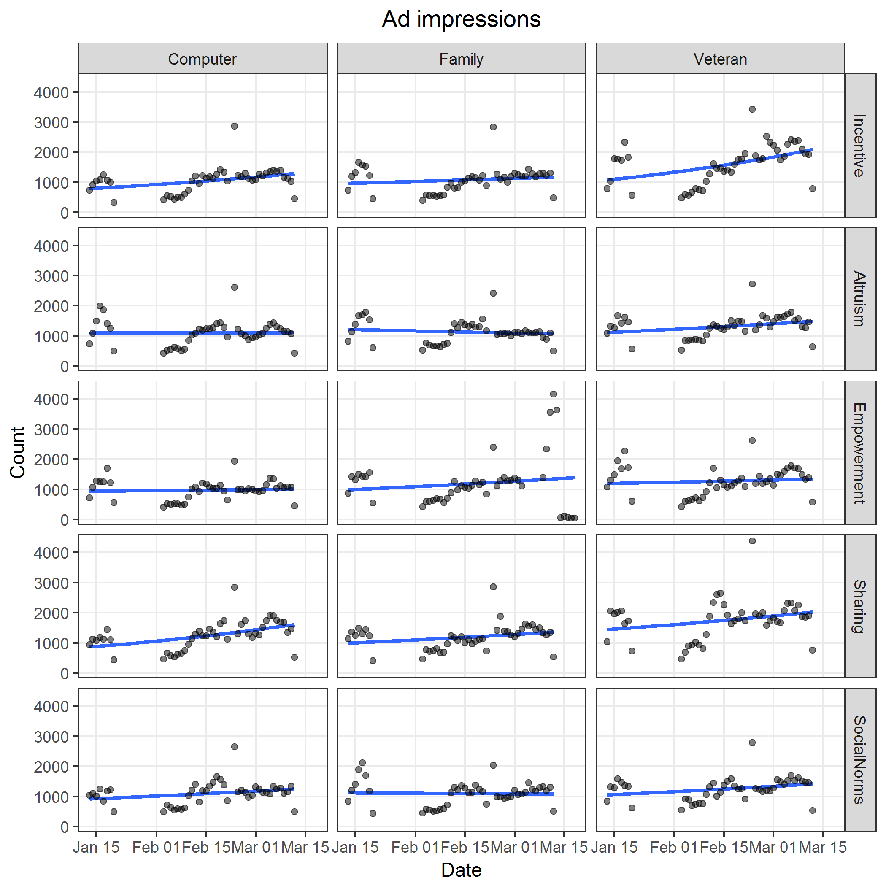
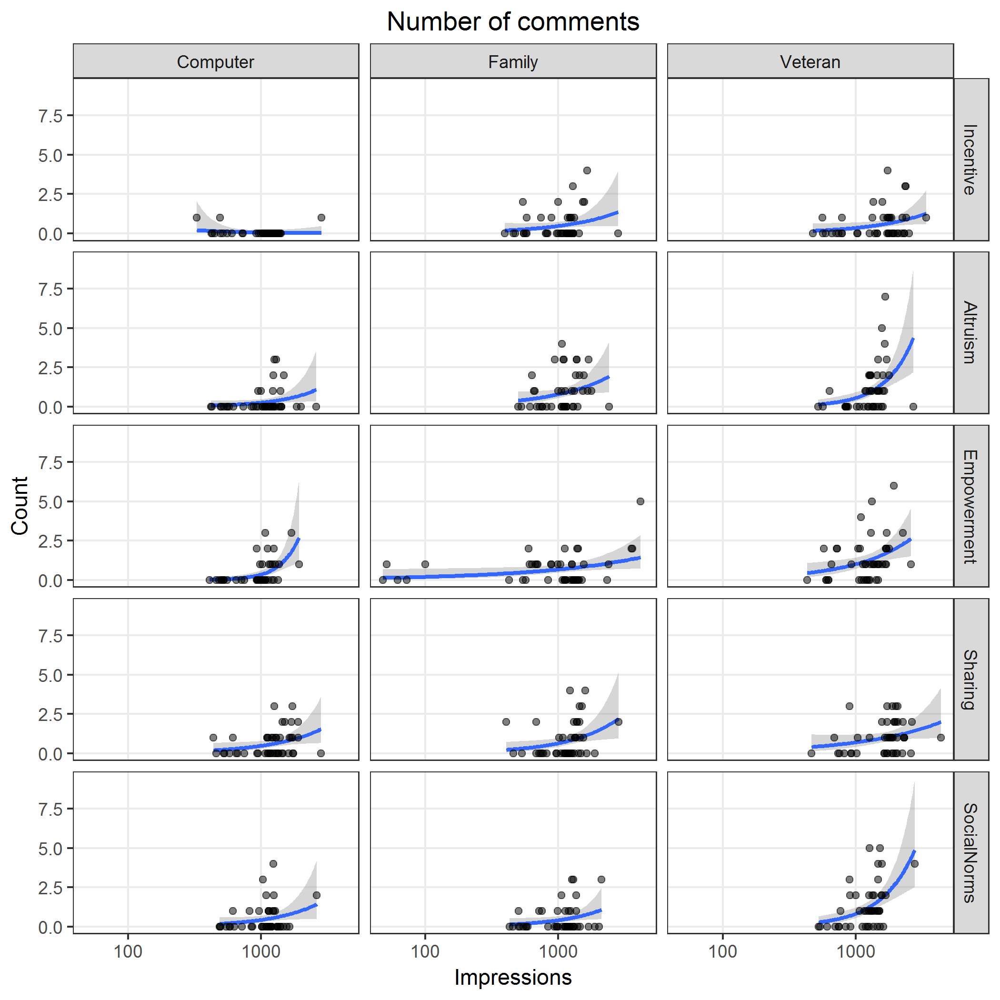
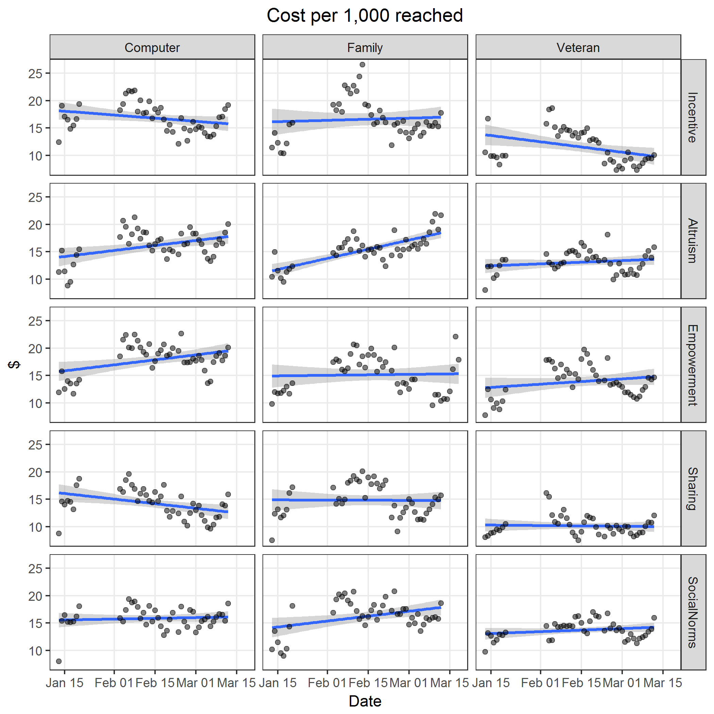
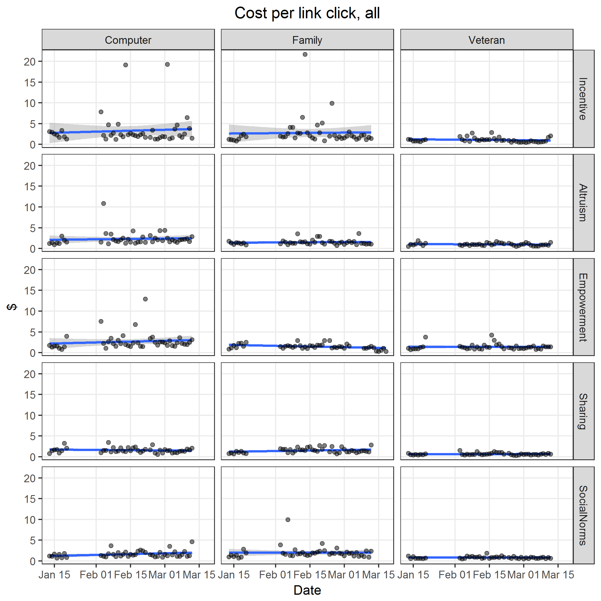

# Preamble

Set working directory and load libraries.


```
## Loading tidyverse: ggplot2
## Loading tidyverse: tibble
## Loading tidyverse: tidyr
## Loading tidyverse: readr
## Loading tidyverse: purrr
## Loading tidyverse: dplyr
```

```
## Conflicts with tidy packages ----------------------------------------------
```

```
## filter(): dplyr, stats
## lag():    dplyr, stats
## select(): dplyr, MASS
```

```
## Loading required package: mvtnorm
```

```
## Loading required package: survival
```

```
## Loading required package: TH.data
```

```
## 
## Attaching package: 'TH.data'
```

```
## The following object is masked from 'package:MASS':
## 
##     geyser
```

Reproducibility steps.


```
## R version 3.3.3 (2017-03-06)
## Platform: x86_64-w64-mingw32/x64 (64-bit)
## Running under: Windows 7 x64 (build 7601) Service Pack 1
## 
## attached base packages:
## [1] tools     stats     graphics  grDevices utils     datasets  base     
## 
## other attached packages:
##  [1] multcomp_1.4-6   TH.data_1.0-8    survival_2.41-2  mvtnorm_1.0-6   
##  [5] broom_0.4.2      svglite_1.2.0    dplyr_0.5.0      purrr_0.2.2     
##  [9] readr_1.1.0      tidyr_0.6.1      tibble_1.2       ggplot2_2.2.1   
## [13] tidyverse_1.1.1  magrittr_1.5     readxl_0.1.1     MASS_7.3-45     
## [17] rmarkdown_1.4    knitr_1.15.1     checkpoint_0.4.0
## 
## loaded via a namespace (and not attached):
##  [1] Rcpp_0.12.10     plyr_1.8.4       methods_3.3.3    forcats_0.2.0   
##  [5] digest_0.6.12    lubridate_1.6.0  jsonlite_1.3     evaluate_0.10   
##  [9] nlme_3.1-131     gtable_0.2.0     lattice_0.20-35  Matrix_1.2-8    
## [13] psych_1.7.3.21   DBI_0.6          parallel_3.3.3   haven_1.0.0     
## [17] xml2_1.1.1       stringr_1.2.0    httr_1.2.1       gdtools_0.1.4   
## [21] hms_0.3          rprojroot_1.2    grid_3.3.3       R6_2.2.0        
## [25] foreign_0.8-67   modelr_0.1.0     reshape2_1.4.2   codetools_0.2-15
## [29] splines_3.3.3    backports_1.0.5  scales_0.4.1     htmltools_0.3.5 
## [33] rvest_0.3.2      assertthat_0.1   mnormt_1.5-5     colorspace_1.3-2
## [37] sandwich_2.3-4   stringi_1.1.3    lazyeval_0.2.0   munsell_0.4.3   
## [41] zoo_1.7-14
```

References

* Zeileis, A., Kleiber, C., & Jackman, S. (2008). Regression Models for Count Data in R. Journal of Statistical Software, 27(8), 1 - 25. doi:[http://dx.doi.org/10.18637/jss.v027.i08](http://dx.doi.org/10.18637/jss.v027.i08)


```
## 
## To cite R in publications use:
## 
##   R Core Team (2017). R: A language and environment for
##   statistical computing. R Foundation for Statistical Computing,
##   Vienna, Austria. URL https://www.R-project.org/.
## 
## A BibTeX entry for LaTeX users is
## 
##   @Manual{,
##     title = {R: A Language and Environment for Statistical Computing},
##     author = {{R Core Team}},
##     organization = {R Foundation for Statistical Computing},
##     address = {Vienna, Austria},
##     year = {2017},
##     url = {https://www.R-project.org/},
##   }
## 
## We have invested a lot of time and effort in creating R, please
## cite it when using it for data analysis. See also
## 'citation("pkgname")' for citing R packages.
```

```
## 
## To cite the MASS package in publications use:
## 
##   Venables, W. N. & Ripley, B. D. (2002) Modern Applied Statistics
##   with S. Fourth Edition. Springer, New York. ISBN 0-387-95457-0
## 
## A BibTeX entry for LaTeX users is
## 
##   @Book{,
##     title = {Modern Applied Statistics with S},
##     author = {W. N. Venables and B. D. Ripley},
##     publisher = {Springer},
##     edition = {Fourth},
##     address = {New York},
##     year = {2002},
##     note = {ISBN 0-387-95457-0},
##     url = {http://www.stats.ox.ac.uk/pub/MASS4},
##   }
```

```
## 
## Please cite the multcomp package by the following reference:
## 
##   Torsten Hothorn, Frank Bretz and Peter Westfall (2008).
##   Simultaneous Inference in General Parametric Models. Biometrical
##   Journal 50(3), 346--363.
## 
## A BibTeX entry for LaTeX users is
## 
##   @Article{,
##     title = {Simultaneous Inference in General Parametric Models},
##     author = {Torsten Hothorn and Frank Bretz and Peter Westfall},
##     journal = {Biometrical Journal},
##     year = {2008},
##     volume = {50},
##     number = {3},
##     pages = {346--363},
##   }
```

Source user-defined functions.


```
##         ../lib/contrastHeatmap.R ../lib/contrastTable.R
## value   ?                        ?                     
## visible FALSE                    FALSE                 
##         ../lib/modelBinomial.R ../lib/modelCost.R ../lib/modelCounts.R
## value   ?                      ?                  ?                   
## visible FALSE                  FALSE              FALSE               
##         ../lib/plotCost.R ../lib/plotRates.R ../lib/plotResid.R
## value   ?                 ?                  ?                 
## visible FALSE             FALSE              FALSE             
##         ../lib/predictDichotomousRiskFactor.R
## value   ?                                    
## visible FALSE
```
# Read data


## Facebook ad metrics data


Column name mapping.


|old                                    |new                    |
|:--------------------------------------|:----------------------|
|Reporting                              |date                   |
|Ad                                     |ad                     |
|Cost                                   |cost                   |
|Reach                                  |reach                  |
|Cost.per.1.000.People.Reached..USD.    |costPerKReached        |
|Impressions                            |impressions            |
|CPM..Cost.per.1.000.Impressions...USD. |costPerImpression      |
|Link.Clicks                            |linkClicks             |
|CTR..Link.Click.Through.Rate.          |clickThroughRate       |
|CPC..Cost.per.Link.Click...USD.        |costPerLinkClick       |
|Unique.Link.Clicks                     |uniqueLinkClicks       |
|Unique.CTR..Link.Click.Through.Rate.   |uniqueCTR              |
|Cost.per.Unique.Link.Click..USD.       |costPerUniqueLinkClick |
|Clicks..All.                           |clicksAll              |
|CTR..All.                              |clickThroughRateAll    |
|CPC..All...USD.                        |costPerLinkClickAll    |
|Unique.Clicks..All.                    |uniqueClicksAll        |
|Unique.CTR..All.                       |uniqueCTRAll           |
|Cost.per.Unique.Click..All...USD.      |costPerUniqueClickAll  |
|Post.Reactions                         |reactions              |
|Post.Comments                          |comments               |
|Post.Shares                            |shares                 |
|NA                                     |image                  |
|NA                                     |text                   |

Summarize.


|image    |text        | nDays|minDate    |maxDate    |
|:--------|:-----------|-----:|:----------|:----------|
|Computer |Incentive   |    45|2017-01-13 |2017-03-12 |
|Computer |Altruism    |    45|2017-01-13 |2017-03-12 |
|Computer |Empowerment |    45|2017-01-13 |2017-03-12 |
|Computer |Sharing     |    45|2017-01-13 |2017-03-12 |
|Computer |SocialNorms |    45|2017-01-13 |2017-03-12 |
|Family   |Incentive   |    45|2017-01-13 |2017-03-12 |
|Family   |Altruism    |    45|2017-01-13 |2017-03-12 |
|Family   |Empowerment |    46|2017-01-13 |2017-03-18 |
|Family   |Sharing     |    45|2017-01-13 |2017-03-12 |
|Family   |SocialNorms |    45|2017-01-13 |2017-03-12 |
|Veteran  |Incentive   |    45|2017-01-13 |2017-03-12 |
|Veteran  |Altruism    |    45|2017-01-13 |2017-03-12 |
|Veteran  |Empowerment |    45|2017-01-13 |2017-03-12 |
|Veteran  |Sharing     |    45|2017-01-13 |2017-03-12 |
|Veteran  |SocialNorms |    45|2017-01-13 |2017-03-12 |


## Survey data

Notes on the REDCap identifier variables:

* If `[consent] == 1`, they started the eligibility survey; 
  * if `== 0` or `== NA`, they didn't.
* If `[consent_and_eligibility_complete] == 2`, they finished the screener (whether eligible or ineligible); 
  * if `== 0`, they dropped out or never started.
* If `[eligible] == 1`, they completed the screener and were eligible; 
  * if `== 0`, they completed and were ineligible;
  * if `== NA` , they dropped out or never started.
* If `[veterans_and_social_media_use_co] == 2`, they finished the survey; 
  * if `== 0`, they dropped out or never started (this includes people who were ineligible or didn't consent).
* If `[analytic_sample] == 0`, they completed the survey but were disqualified for data quality reasons; 
  * if `== 1`, they completed survey and was not disqualified for data quality reasons;
  * if `== NA`, they didn't complete the survey.


| consent| consent_and_eligibility_complete| eligible| veterans_and_social_media_use_co| analytic_sample|   n|
|-------:|--------------------------------:|--------:|--------------------------------:|---------------:|---:|
|       0|                                0|       NA|                                0|              NA|   8|
|       0|                                2|        0|                                0|              NA|   7|
|       1|                                0|       NA|                                0|              NA|  84|
|       1|                                2|        0|                                0|              NA| 534|
|       1|                                2|        1|                                0|              NA| 106|
|       1|                                2|        1|                                2|               0|  18|
|       1|                                2|        1|                                2|               1| 587|
|      NA|                                0|       NA|                                0|              NA|  96|

Inclusion criteria

* Respondents who consented
* Eligible, ineligible, or missing eligibility indicator

**Number included: n = 1329**

Cleaning

* Parse out `fba` into 2 separate variables for `image` and `text`
* Assign indicator for survey participation, `indSurveyParticipation`
  * `analytic_sample == 1`: Participant completed survey and was not disqualified for data quality reasons
* Assign indicator for eligibility screener participation, `indScreenerParticipation`
  * `eligible == 1`: Participant completed eligibility screener and was eligible to participate in full survey
* Score the DSI-SS inventory
  * See [Joiner 2002](http://www.sciencedirect.com/science/article/pii/S0005796701000171)
  * *Scores on each item range from 0 to 3 and, for the inventory, from 0 to 12, with higher scores reflecting greater severity of suicidal ideation.*


|image    |text        |   n|
|:--------|:-----------|---:|
|Computer |Incentive   |  41|
|Computer |Altruism    |  45|
|Computer |Empowerment |  12|
|Computer |Sharing     |  81|
|Computer |SocialNorms |  88|
|Family   |Incentive   |  36|
|Family   |Altruism    |  20|
|Family   |Empowerment |  36|
|Family   |Sharing     |  46|
|Family   |SocialNorms |  47|
|Veteran  |Incentive   | 283|
|Veteran  |Altruism    |  57|
|Veteran  |Empowerment |  63|
|Veteran  |Sharing     | 217|
|Veteran  |SocialNorms | 251|
|NA       |NA          |   6|


| analytic_sample|indSurveyParticipation |   n|
|---------------:|:----------------------|---:|
|               0|FALSE                  |  18|
|               1|TRUE                   | 587|
|              NA|FALSE                  | 724|


| eligible|indScreenerParticipation |   n|
|--------:|:------------------------|---:|
|        0|FALSE                    | 534|
|        1|TRUE                     | 711|
|       NA|FALSE                    |  84|


|indSurveyParticipation |indScreenerParticipation |   n|
|:----------------------|:------------------------|---:|
|FALSE                  |FALSE                    | 618|
|FALSE                  |TRUE                     | 124|
|TRUE                   |TRUE                     | 587|

### Use of VA health services


|desc            | va_ever_enrolled| va_use_12mo|   n|
|:---------------|----------------:|-----------:|---:|
|Before recoding |                0|          NA| 163|
|Before recoding |                1|           0| 139|
|Before recoding |                1|           1| 281|
|Before recoding |                1|           9|   2|
|Before recoding |                1|          NA|   1|
|Before recoding |                9|           0|  33|
|Before recoding |                9|           1|   2|
|Before recoding |                9|           9|   5|
|Before recoding |               NA|          NA| 703|

Recoding logic

* Primary analysis will code `9` (not sure) as `0` (No)
* Sensitivity analysis will exclude the `9` values from the analysis
* If `va_ever_enrolled == FALSE` & `is.na(va_use_12mo)`, then recode `va_use_12mo` to `FALSE`
* If `va_use_12mo == TRUE` & `va_ever_enrolled == FALSE`, then recode `va_ever_enrolled` to `TRUE`
* Code indicators `indVANeverEnrolled` and `indVANotUse12mo` as the logical opposites of `va_ever_enrolled` and `va_use_12mo`


|desc           |va_ever_enrolled |va_use_12mo |indVANeverEnrolled |indVANotUse12mo |   n|
|:--------------|:----------------|:-----------|:------------------|:---------------|---:|
|After recoding |FALSE            |FALSE       |TRUE               |TRUE            | 201|
|After recoding |TRUE             |FALSE       |FALSE              |TRUE            | 141|
|After recoding |TRUE             |TRUE        |FALSE              |FALSE           | 283|
|After recoding |TRUE             |NA          |FALSE              |NA              |   1|
|After recoding |NA               |NA          |NA                 |NA              | 703|

### Presence of suicidality

DSI-SS score $\ge$ 2 (this cut-off score was chosen based on recommendations for population-based samples noted in [von Glischinski M Clin Psychol Psychotherapy 2015]


|indDSISS | dsiss|   n|
|:--------|-----:|---:|
|FALSE    |     0| 439|
|FALSE    |     1|  43|
|TRUE     |     2|  29|
|TRUE     |     3|  37|
|TRUE     |     4|  28|
|TRUE     |     5|  22|
|TRUE     |     6|   6|
|TRUE     |     7|   7|
|TRUE     |     8|   3|
|TRUE     |     9|   2|


|indDSISS |   n|  freq|
|:--------|---:|-----:|
|FALSE    | 482| 0.782|
|TRUE     | 134| 0.218|
# Correlate Facebook metrics data


|                 | impressions| reach| clicksAll| linkClicks| uniqueClicksAll| uniqueLinkClicks| reactions| comments| shares|
|:----------------|-----------:|-----:|---------:|----------:|---------------:|----------------:|---------:|--------:|------:|
|impressions      |           1|     1|      0.71|       0.64|            0.72|             0.64|      0.24|     0.20|   0.39|
|reach            |          NA|     1|      0.71|       0.64|            0.72|             0.64|      0.24|     0.20|   0.39|
|clicksAll        |          NA|    NA|      1.00|       0.83|            0.99|             0.83|      0.42|     0.32|   0.65|
|linkClicks       |          NA|    NA|        NA|       1.00|            0.83|             1.00|      0.00|     0.18|   0.31|
|uniqueClicksAll  |          NA|    NA|        NA|         NA|            1.00|             0.83|      0.43|     0.29|   0.64|
|uniqueLinkClicks |          NA|    NA|        NA|         NA|              NA|             1.00|      0.00|     0.18|   0.31|
|reactions        |          NA|    NA|        NA|         NA|              NA|               NA|      1.00|     0.19|   0.25|
|comments         |          NA|    NA|        NA|         NA|              NA|               NA|        NA|     1.00|   0.09|
|shares           |          NA|    NA|        NA|         NA|              NA|               NA|        NA|       NA|   1.00|

Check correlation between `impressions` and `reach`.


# Model Facebook ad metrics

* Use negative binomial model
* Factors
  * Ad `image`
  * Ad `text`
* Include full factorial interaction

**Model**

Define the linear predictor as $\eta$, where

$$
\begin{align*}
\eta = & \beta_0 + \\\\
       & \beta_1 x_\text{image: Family} + 
         \beta_2 x_\text{image: Veteran} + \\\\
       & \beta_3 x_\text{text: Altruism} + 
         \beta_4 x_\text{text: Empowerment} + 
         \beta_5 x_\text{text: Sharing} + 
         \beta_6 x_\text{text: Social norms} + \\\\
       & \gamma_1 x_\text{image: Family} x_\text{text: Altruism} + 
         \gamma_2 x_\text{image: Family} x_\text{text: Empowerment} +  \\\\
       & \gamma_3 x_\text{image: Family} x_\text{text: Sharing} + 
         \gamma_4 x_\text{image: Family} x_\text{text: Social norms} + \\\\
       & \gamma_5 x_\text{image: Veteran} x_\text{text: Altruism} + 
         \gamma_6 x_\text{image: Veteran} x_\text{text: Empowerment} +  \\\\
       & \gamma_7 x_\text{image: Veteran} x_\text{text: Sharing} + 
         \gamma_8 x_\text{image: Veteran} x_\text{text: Social norms}
\end{align*}
$$

The model for impressions and reach is

$$
\log(y) = \eta
$$

Clicks, unique clicks, total link clicks, unique link clicks are bounded by and related to the number of impressions.
The model for these dependent variables uses impressions as an offset and is specified as

$$
\log(y) = \eta + \log(x_\text{impressions})
$$

Reactions, comments, and shares are bounded by and related to the number of clicks.
The model for these dependent variables uses all clicks as an offset and is specified as

$$
\log(y) = \eta + \log(x_\text{clicksAll})
$$


## Impressions

Image files saved as [PNG](../figures/impressions.png), [SVG](../figures/impressions.svg)




```
## Saving 7 x 7 in image
## Saving 7 x 7 in image
```

```
## impressions ~ image + text + image * text
## 
## 
## |image    |text        |    pred| predLower| predUpper|
## |:--------|:-----------|-------:|---------:|---------:|
## |Veteran  |Sharing     | 1757.73|   1559.21|   1981.54|
## |Veteran  |Incentive   | 1602.71|   1421.67|   1806.81|
## |Veteran  |Altruism    | 1312.31|   1164.01|   1479.50|
## |Veteran  |Empowerment | 1275.38|   1131.25|   1437.87|
## |Computer |Sharing     | 1256.49|   1114.49|   1416.58|
## |Veteran  |SocialNorms | 1250.96|   1109.58|   1410.35|
## |Family   |Empowerment | 1194.50|   1060.88|   1344.95|
## |Family   |Sharing     | 1193.04|   1058.20|   1345.08|
## |Family   |Altruism    | 1125.38|    998.16|   1268.81|
## |Computer |SocialNorms | 1099.00|    974.76|   1239.08|
## |Computer |Altruism    | 1097.71|    973.61|   1237.63|
## |Family   |SocialNorms | 1093.20|    969.61|   1232.54|
## |Family   |Incentive   | 1080.02|    957.92|   1217.69|
## |Computer |Incentive   | 1056.07|    936.66|   1190.69|
## |Computer |Empowerment |  977.13|    866.63|   1101.72|
## 
## 
## |         |Computer | Family| Veteran|
## |:--------|:--------|------:|-------:|
## |Computer |NA       |  0.796|       0|
## |Family   |NA       |     NA|       0|
## |Veteran  |NA       |     NA|      NA|
## 
## |            |Incentive | Altruism| Empowerment| Sharing| SocialNorms|
## |:-----------|:---------|--------:|-----------:|-------:|-----------:|
## |Incentive   |NA        |    0.655|       0.370|   0.045|       0.645|
## |Altruism    |NA        |       NA|       0.179|   0.119|       0.989|
## |Empowerment |NA        |       NA|          NA|   0.004|       0.175|
## |Sharing     |NA        |       NA|          NA|      NA|       0.122|
## |SocialNorms |NA        |       NA|          NA|      NA|          NA|
## 
## |        |Com-Inc | Com-Alt| Com-Emp| Com-Sha| Com-Soc| Fam-Inc| Fam-Alt| Fam-Emp| Fam-Sha| Fam-Soc| Vet-Inc| Vet-Alt| Vet-Emp| Vet-Sha| Vet-Soc|
## |:-------|:-------|-------:|-------:|-------:|-------:|-------:|-------:|-------:|-------:|-------:|-------:|-------:|-------:|-------:|-------:|
## |Com-Inc |NA      |   0.655|   0.370|   0.045|   0.645|   0.796|   0.463|   0.152|   0.159|   0.690|   0.000|   0.012|   0.029|   0.000|   0.050|
## |Com-Alt |NA      |      NA|   0.179|   0.119|   0.989|   0.851|   0.774|   0.326|   0.336|   0.962|   0.000|   0.039|   0.083|   0.000|   0.131|
## |Com-Emp |NA      |      NA|      NA|   0.004|   0.175|   0.248|   0.103|   0.020|   0.021|   0.195|   0.000|   0.001|   0.002|   0.000|   0.004|
## |Com-Sha |NA      |      NA|      NA|      NA|   0.122|   0.080|   0.203|   0.557|   0.549|   0.108|   0.005|   0.615|   0.863|   0.000|   0.959|
## |Com-Soc |NA      |      NA|      NA|      NA|      NA|   0.841|   0.784|   0.333|   0.343|   0.951|   0.000|   0.040|   0.085|   0.000|   0.135|
## |Fam-Inc |NA      |      NA|      NA|      NA|      NA|      NA|   0.635|   0.242|   0.250|   0.889|   0.000|   0.024|   0.055|   0.000|   0.090|
## |Fam-Alt |NA      |      NA|      NA|      NA|      NA|      NA|      NA|   0.489|   0.500|   0.738|   0.000|   0.076|   0.148|   0.000|   0.222|
## |Fam-Emp |NA      |      NA|      NA|      NA|      NA|      NA|      NA|      NA|   0.989|   0.303|   0.001|   0.274|   0.447|   0.000|   0.592|
## |Fam-Sha |NA      |      NA|      NA|      NA|      NA|      NA|      NA|      NA|      NA|   0.180|   0.001|   0.271|   0.441|   0.000|   0.584|
## |Fam-Soc |NA      |      NA|      NA|      NA|      NA|      NA|      NA|      NA|      NA|      NA|   0.000|   0.035|   0.075|   0.000|   0.119|
## |Vet-Inc |NA      |      NA|      NA|      NA|      NA|      NA|      NA|      NA|      NA|      NA|      NA|   0.021|   0.008|   0.286|   0.004|
## |Vet-Alt |NA      |      NA|      NA|      NA|      NA|      NA|      NA|      NA|      NA|      NA|      NA|      NA|   0.741|   0.001|   0.580|
## |Vet-Emp |NA      |      NA|      NA|      NA|      NA|      NA|      NA|      NA|      NA|      NA|      NA|      NA|      NA|   0.000|   0.823|
## |Vet-Sha |NA      |      NA|      NA|      NA|      NA|      NA|      NA|      NA|      NA|      NA|      NA|      NA|      NA|      NA|   0.000|
## |Vet-Soc |NA      |      NA|      NA|      NA|      NA|      NA|      NA|      NA|      NA|      NA|      NA|      NA|      NA|      NA|      NA|
```

```
## Loading required package: reshape2
```

```
## 
## Attaching package: 'reshape2'
```

```
## The following object is masked from 'package:tidyr':
## 
##     smiths
```

```
## Loading required package: RColorBrewer
```

```
## Saving 7 x 7 in image
## Saving 7 x 7 in image
## Saving 7 x 7 in image
## Saving 7 x 7 in image
## Saving 7 x 7 in image
## Saving 7 x 7 in image
```

```
## 
## Call:
## glm.nb(formula = formula(text), data = df1, init.theta = 5.96351648, 
##     link = log)
## 
## Deviance Residuals: 
##     Min       1Q   Median       3Q      Max  
## -5.1220  -0.6081   0.0731   0.4132   3.8272  
## 
## Coefficients:
##                               Estimate Std. Error z value Pr(>|z|)    
## (Intercept)                   6.962307   0.061216 113.733  < 2e-16 ***
## imageFamily                   0.022430   0.086570   0.259   0.7956    
## imageVeteran                  0.417145   0.086531   4.821 1.43e-06 ***
## textAltruism                  0.038676   0.086568   0.447   0.6550    
## textEmpowerment              -0.077683   0.086582  -0.897   0.3696    
## textSharing                   0.173770   0.086553   2.008   0.0447 *  
## textSocialNorms               0.039849   0.086568   0.460   0.6453    
## imageFamily:textAltruism      0.002461   0.122422   0.020   0.9840    
## imageVeteran:textAltruism    -0.238583   0.122383  -1.949   0.0512 .  
## imageFamily:textEmpowerment   0.178430   0.122094   1.461   0.1439    
## imageVeteran:textEmpowerment -0.150771   0.122395  -1.232   0.2180    
## imageFamily:textSharing      -0.074243   0.122407  -0.607   0.5442    
## imageVeteran:textSharing     -0.081441   0.122355  -0.666   0.5057    
## imageFamily:textSocialNorms  -0.027722   0.122424  -0.226   0.8209    
## imageVeteran:textSocialNorms -0.287638   0.122386  -2.350   0.0188 *  
## ---
## Signif. codes:  0 '***' 0.001 '**' 0.01 '*' 0.05 '.' 0.1 ' ' 1
## 
## (Dispersion parameter for Negative Binomial(5.9635) family taken to be 1)
## 
##     Null deviance: 792.85  on 675  degrees of freedom
## Residual deviance: 696.21  on 661  degrees of freedom
## AIC: 10266
## 
## Number of Fisher Scoring iterations: 1
## 
## 
##               Theta:  5.964 
##           Std. Err.:  0.318 
## 
##  2 x log-likelihood:  -10234.076
```

```
## Saving 7 x 7 in image
## Saving 7 x 7 in image
```


## Reach

Image files saved as [PNG](../figures/reach.png), [SVG](../figures/reach.svg)


```
## Saving 7 x 7 in image
## Saving 7 x 7 in image
```

```
## reach ~ image + text + image * text
## 
## 
## |image    |text        |    pred| predLower| predUpper|
## |:--------|:-----------|-------:|---------:|---------:|
## |Veteran  |Sharing     | 1752.78|   1555.30|   1975.34|
## |Veteran  |Incentive   | 1596.22|   1416.35|   1798.94|
## |Veteran  |Altruism    | 1307.96|   1160.51|   1474.13|
## |Veteran  |Empowerment | 1271.02|   1127.73|   1432.52|
## |Computer |Sharing     | 1252.44|   1111.24|   1411.59|
## |Veteran  |SocialNorms | 1247.20|   1106.59|   1405.68|
## |Family   |Sharing     | 1189.13|   1055.05|   1340.25|
## |Family   |Empowerment | 1189.04|   1056.35|   1338.40|
## |Family   |Altruism    | 1121.07|    994.64|   1263.56|
## |Computer |SocialNorms | 1094.47|    971.04|   1233.59|
## |Computer |Altruism    | 1092.84|    969.60|   1231.76|
## |Family   |SocialNorms | 1089.00|    966.18|   1227.43|
## |Family   |Incentive   | 1075.53|    954.23|   1212.25|
## |Computer |Incentive   | 1051.13|    932.58|   1184.76|
## |Computer |Empowerment |  971.80|    862.17|   1095.37|
## 
## 
## |         |Computer | Family| Veteran|
## |:--------|:--------|------:|-------:|
## |Computer |NA       |   0.79|       0|
## |Family   |NA       |     NA|       0|
## |Veteran  |NA       |     NA|      NA|
## 
## |            |Incentive | Altruism| Empowerment| Sharing| SocialNorms|
## |:-----------|:---------|--------:|-----------:|-------:|-----------:|
## |Incentive   |NA        |    0.652|       0.364|   0.042|       0.640|
## |Altruism    |NA        |       NA|       0.174|   0.114|       0.986|
## |Empowerment |NA        |       NA|          NA|   0.003|       0.169|
## |Sharing     |NA        |       NA|          NA|      NA|       0.118|
## |SocialNorms |NA        |       NA|          NA|      NA|          NA|
## 
## |        |Com-Inc | Com-Alt| Com-Emp| Com-Sha| Com-Soc| Fam-Inc| Fam-Alt| Fam-Emp| Fam-Sha| Fam-Soc| Vet-Inc| Vet-Alt| Vet-Emp| Vet-Sha| Vet-Soc|
## |:-------|:-------|-------:|-------:|-------:|-------:|-------:|-------:|-------:|-------:|-------:|-------:|-------:|-------:|-------:|-------:|
## |Com-Inc |NA      |   0.652|   0.364|   0.042|   0.640|   0.790|   0.456|   0.151|   0.153|   0.682|   0.000|   0.011|   0.028|   0.000|   0.048|
## |Com-Alt |NA      |      NA|   0.174|   0.114|   0.986|   0.853|   0.768|   0.326|   0.328|   0.967|   0.000|   0.037|   0.080|   0.000|   0.126|
## |Com-Emp |NA      |      NA|      NA|   0.003|   0.169|   0.240|   0.098|   0.019|   0.019|   0.187|   0.000|   0.001|   0.002|   0.000|   0.004|
## |Com-Sha |NA      |      NA|      NA|      NA|   0.118|   0.078|   0.199|   0.545|   0.548|   0.105|   0.005|   0.615|   0.865|   0.000|   0.961|
## |Com-Soc |NA      |      NA|      NA|      NA|      NA|   0.840|   0.781|   0.334|   0.337|   0.954|   0.000|   0.039|   0.083|   0.000|   0.130|
## |Fam-Inc |NA      |      NA|      NA|      NA|      NA|      NA|   0.631|   0.243|   0.245|   0.885|   0.000|   0.023|   0.053|   0.000|   0.086|
## |Fam-Alt |NA      |      NA|      NA|      NA|      NA|      NA|      NA|   0.493|   0.495|   0.737|   0.000|   0.074|   0.146|   0.000|   0.217|
## |Fam-Emp |NA      |      NA|      NA|      NA|      NA|      NA|      NA|      NA|   0.999|   0.306|   0.001|   0.267|   0.437|   0.000|   0.578|
## |Fam-Sha |NA      |      NA|      NA|      NA|      NA|      NA|      NA|      NA|      NA|   0.175|   0.001|   0.270|   0.440|   0.000|   0.581|
## |Fam-Soc |NA      |      NA|      NA|      NA|      NA|      NA|      NA|      NA|      NA|      NA|   0.000|   0.034|   0.073|   0.000|   0.116|
## |Vet-Inc |NA      |      NA|      NA|      NA|      NA|      NA|      NA|      NA|      NA|      NA|      NA|   0.021|   0.008|   0.278|   0.004|
## |Vet-Alt |NA      |      NA|      NA|      NA|      NA|      NA|      NA|      NA|      NA|      NA|      NA|      NA|   0.740|   0.001|   0.582|
## |Vet-Emp |NA      |      NA|      NA|      NA|      NA|      NA|      NA|      NA|      NA|      NA|      NA|      NA|      NA|   0.000|   0.826|
## |Vet-Sha |NA      |      NA|      NA|      NA|      NA|      NA|      NA|      NA|      NA|      NA|      NA|      NA|      NA|      NA|   0.000|
## |Vet-Soc |NA      |      NA|      NA|      NA|      NA|      NA|      NA|      NA|      NA|      NA|      NA|      NA|      NA|      NA|      NA|
```

```
## Saving 7 x 7 in image
## Saving 7 x 7 in image
## Saving 7 x 7 in image
## Saving 7 x 7 in image
## Saving 7 x 7 in image
## Saving 7 x 7 in image
```

```
## 
## Call:
## glm.nb(formula = formula(text), data = df1, init.theta = 5.994674917, 
##     link = log)
## 
## Deviance Residuals: 
##     Min       1Q   Median       3Q      Max  
## -5.1300  -0.6036   0.0751   0.4047   3.8146  
## 
## Coefficients:
##                               Estimate Std. Error z value Pr(>|z|)    
## (Intercept)                   6.957624   0.061058 113.950  < 2e-16 ***
## imageFamily                   0.022948   0.086347   0.266   0.7904    
## imageVeteran                  0.417771   0.086308   4.840  1.3e-06 ***
## textAltruism                  0.038915   0.086345   0.451   0.6522    
## textEmpowerment              -0.078474   0.086360  -0.909   0.3635    
## textSharing                   0.175228   0.086330   2.030   0.0424 *  
## textSocialNorms               0.040398   0.086345   0.468   0.6399    
## imageFamily:textAltruism      0.002549   0.122106   0.021   0.9833    
## imageVeteran:textAltruism    -0.238089   0.122067  -1.950   0.0511 .  
## imageFamily:textEmpowerment   0.178807   0.121780   1.468   0.1420    
## imageVeteran:textEmpowerment -0.149344   0.122079  -1.223   0.2212    
## imageFamily:textSharing      -0.074820   0.122091  -0.613   0.5400    
## imageVeteran:textSharing     -0.081666   0.122039  -0.669   0.5034    
## imageFamily:textSocialNorms  -0.027955   0.122109  -0.229   0.8189    
## imageVeteran:textSocialNorms -0.287137   0.122070  -2.352   0.0187 *  
## ---
## Signif. codes:  0 '***' 0.001 '**' 0.01 '*' 0.05 '.' 0.1 ' ' 1
## 
## (Dispersion parameter for Negative Binomial(5.9947) family taken to be 1)
## 
##     Null deviance: 793.83  on 675  degrees of freedom
## Residual deviance: 696.13  on 661  degrees of freedom
## AIC: 10258
## 
## Number of Fisher Scoring iterations: 1
## 
## 
##               Theta:  5.995 
##           Std. Err.:  0.320 
## 
##  2 x log-likelihood:  -10225.767
```

```
## Saving 7 x 7 in image
## Saving 7 x 7 in image
```


## Clicks, all

Image files saved as [PNG](../figures/clicksAll.png), [SVG](../figures/clicksAll.svg)


```
## Saving 7 x 7 in image
## Saving 7 x 7 in image
```

```
## clicksAll ~ image + text + image * text + offset(log(impressions))
## 
## 
## |image    |text        | impressions|  pred| predLower| predUpper|
## |:--------|:-----------|-----------:|-----:|---------:|---------:|
## |Veteran  |SocialNorms |        1000| 18.14|     16.74|     19.65|
## |Veteran  |Sharing     |        1000| 16.68|     15.47|     17.97|
## |Veteran  |Altruism    |        1000| 14.34|     13.17|     15.61|
## |Veteran  |Incentive   |        1000| 12.66|     11.64|     13.77|
## |Veteran  |Empowerment |        1000| 11.29|     10.28|     12.39|
## |Family   |Altruism    |        1000| 11.25|     10.21|     12.40|
## |Computer |SocialNorms |        1000| 11.09|     10.04|     12.24|
## |Family   |Sharing     |        1000| 10.68|      9.69|     11.77|
## |Family   |Empowerment |        1000| 10.21|      9.23|     11.30|
## |Family   |SocialNorms |        1000|  9.85|      8.89|     10.93|
## |Computer |Sharing     |        1000|  9.71|      8.79|     10.72|
## |Computer |Empowerment |        1000|  8.64|      7.71|      9.68|
## |Family   |Incentive   |        1000|  8.52|      7.63|      9.50|
## |Computer |Altruism    |        1000|  8.25|      7.39|      9.21|
## |Computer |Incentive   |        1000|  7.33|      6.52|      8.25|
## 
## 
## |         |Computer | Family| Veteran|
## |:--------|:--------|------:|-------:|
## |Computer |NA       |  0.069|       0|
## |Family   |NA       |     NA|       0|
## |Veteran  |NA       |     NA|      NA|
## 
## |            |Incentive | Altruism| Empowerment| Sharing| SocialNorms|
## |:-----------|:---------|--------:|-----------:|-------:|-----------:|
## |Incentive   |NA        |    0.154|       0.049|   0.000|       0.000|
## |Altruism    |NA        |       NA|       0.566|   0.032|       0.000|
## |Empowerment |NA        |       NA|          NA|   0.129|       0.001|
## |Sharing     |NA        |       NA|          NA|      NA|       0.062|
## |SocialNorms |NA        |       NA|          NA|      NA|          NA|
## 
## |        |Com-Inc | Com-Alt| Com-Emp| Com-Sha| Com-Soc| Fam-Inc| Fam-Alt| Fam-Emp| Fam-Sha| Fam-Soc| Vet-Inc| Vet-Alt| Vet-Emp| Vet-Sha| Vet-Soc|
## |:-------|:-------|-------:|-------:|-------:|-------:|-------:|-------:|-------:|-------:|-------:|-------:|-------:|-------:|-------:|-------:|
## |Com-Inc |NA      |   0.154|   0.049|   0.000|   0.000|   0.069|   0.000|   0.000|   0.000|   0.000|   0.000|   0.000|   0.000|   0.000|   0.000|
## |Com-Alt |NA      |      NA|   0.566|   0.032|   0.000|   0.689|   0.000|   0.005|   0.001|   0.021|   0.000|   0.000|   0.000|   0.000|   0.000|
## |Com-Emp |NA      |      NA|      NA|   0.129|   0.001|   0.857|   0.001|   0.031|   0.005|   0.093|   0.000|   0.000|   0.000|   0.000|   0.000|
## |Com-Sha |NA      |      NA|      NA|      NA|   0.062|   0.083|   0.037|   0.480|   0.176|   0.836|   0.000|   0.000|   0.030|   0.000|   0.000|
## |Com-Soc |NA      |      NA|      NA|      NA|      NA|   0.000|   0.835|   0.255|   0.598|   0.106|   0.044|   0.000|   0.796|   0.000|   0.000|
## |Fam-Inc |NA      |      NA|      NA|      NA|      NA|      NA|   0.000|   0.017|   0.002|   0.058|   0.000|   0.000|   0.000|   0.000|   0.000|
## |Fam-Alt |NA      |      NA|      NA|      NA|      NA|      NA|      NA|   0.176|   0.459|   0.067|   0.071|   0.000|   0.962|   0.000|   0.000|
## |Fam-Emp |NA      |      NA|      NA|      NA|      NA|      NA|      NA|      NA|   0.530|   0.627|   0.001|   0.000|   0.154|   0.000|   0.000|
## |Fam-Sha |NA      |      NA|      NA|      NA|      NA|      NA|      NA|      NA|      NA|   0.734|   0.009|   0.000|   0.422|   0.000|   0.000|
## |Fam-Soc |NA      |      NA|      NA|      NA|      NA|      NA|      NA|      NA|      NA|      NA|   0.000|   0.000|   0.056|   0.000|   0.000|
## |Vet-Inc |NA      |      NA|      NA|      NA|      NA|      NA|      NA|      NA|      NA|      NA|      NA|   0.041|   0.072|   0.000|   0.000|
## |Vet-Alt |NA      |      NA|      NA|      NA|      NA|      NA|      NA|      NA|      NA|      NA|      NA|      NA|   0.000|   0.009|   0.000|
## |Vet-Emp |NA      |      NA|      NA|      NA|      NA|      NA|      NA|      NA|      NA|      NA|      NA|      NA|      NA|   0.000|   0.000|
## |Vet-Sha |NA      |      NA|      NA|      NA|      NA|      NA|      NA|      NA|      NA|      NA|      NA|      NA|      NA|      NA|   0.133|
## |Vet-Soc |NA      |      NA|      NA|      NA|      NA|      NA|      NA|      NA|      NA|      NA|      NA|      NA|      NA|      NA|      NA|
```

```
## Saving 7 x 7 in image
## Saving 7 x 7 in image
## Saving 7 x 7 in image
## Saving 7 x 7 in image
## Saving 7 x 7 in image
## Saving 7 x 7 in image
```

```
## 
## Call:
## glm.nb(formula = formula(text), data = df1, init.theta = 33.93522219, 
##     link = log)
## 
## Deviance Residuals: 
##     Min       1Q   Median       3Q      Max  
## -3.2316  -0.7114  -0.0379   0.6036   2.7668  
## 
## Coefficients:
##                               Estimate Std. Error z value Pr(>|z|)    
## (Intercept)                  -4.915234   0.060013 -81.903  < 2e-16 ***
## imageFamily                   0.149384   0.082128   1.819 0.068925 .  
## imageVeteran                  0.545986   0.073650   7.413 1.23e-13 ***
## textAltruism                  0.117563   0.082369   1.427 0.153500    
## textEmpowerment               0.163881   0.083338   1.966 0.049245 *  
## textSharing                   0.280302   0.078391   3.576 0.000349 ***
## textSocialNorms               0.413173   0.078326   5.275 1.33e-07 ***
## imageFamily:textAltruism      0.160905   0.111301   1.446 0.148268    
## imageVeteran:textAltruism     0.006924   0.102365   0.068 0.946075    
## imageFamily:textEmpowerment   0.017931   0.112834   0.159 0.873738    
## imageVeteran:textEmpowerment -0.278756   0.105004  -2.655 0.007938 ** 
## imageFamily:textSharing      -0.053705   0.108361  -0.496 0.620166    
## imageVeteran:textSharing     -0.004891   0.097122  -0.050 0.959835    
## imageFamily:textSocialNorms  -0.267137   0.109827  -2.432 0.015001 *  
## imageVeteran:textSocialNorms -0.053572   0.098128  -0.546 0.585106    
## ---
## Signif. codes:  0 '***' 0.001 '**' 0.01 '*' 0.05 '.' 0.1 ' ' 1
## 
## (Dispersion parameter for Negative Binomial(33.9352) family taken to be 1)
## 
##     Null deviance: 1111.83  on 675  degrees of freedom
## Residual deviance:  686.74  on 661  degrees of freedom
## AIC: 3850.7
## 
## Number of Fisher Scoring iterations: 1
## 
## 
##               Theta:  33.94 
##           Std. Err.:  6.11 
## 
##  2 x log-likelihood:  -3818.726
```

```
## Saving 7 x 7 in image
## Saving 7 x 7 in image
```


## Unique clicks, all

Image files saved as [PNG](../figures/uniqueClicksAll.png), [SVG](../figures/uniqueClicksAll.svg)


```
## Saving 7 x 7 in image
## Saving 7 x 7 in image
```

```
## uniqueClicksAll ~ image + text + image * text + offset(log(impressions))
## 
## 
## |image    |text        | impressions|  pred| predLower| predUpper|
## |:--------|:-----------|-----------:|-----:|---------:|---------:|
## |Veteran  |SocialNorms |        1000| 16.61|     15.38|     17.94|
## |Veteran  |Sharing     |        1000| 15.29|     14.24|     16.42|
## |Veteran  |Altruism    |        1000| 13.58|     12.52|     14.73|
## |Veteran  |Incentive   |        1000| 11.78|     10.87|     12.76|
## |Family   |Altruism    |        1000| 10.72|      9.76|     11.78|
## |Veteran  |Empowerment |        1000| 10.58|      9.66|     11.58|
## |Family   |Sharing     |        1000| 10.00|      9.09|     11.00|
## |Computer |SocialNorms |        1000| 10.00|      9.06|     11.03|
## |Family   |Empowerment |        1000|  9.33|      8.45|     10.30|
## |Family   |SocialNorms |        1000|  9.31|      8.41|     10.30|
## |Computer |Sharing     |        1000|  8.89|      8.06|      9.80|
## |Computer |Empowerment |        1000|  8.10|      7.24|      9.06|
## |Family   |Incentive   |        1000|  8.01|      7.19|      8.93|
## |Computer |Altruism    |        1000|  7.85|      7.04|      8.75|
## |Computer |Incentive   |        1000|  7.05|      6.28|      7.91|
## 
## 
## |         |Computer | Family| Veteran|
## |:--------|:--------|------:|-------:|
## |Computer |NA       |  0.113|       0|
## |Family   |NA       |     NA|       0|
## |Veteran  |NA       |     NA|      NA|
## 
## |            |Incentive | Altruism| Empowerment| Sharing| SocialNorms|
## |:-----------|:---------|--------:|-----------:|-------:|-----------:|
## |Incentive   |NA        |    0.183|       0.091|   0.003|       0.000|
## |Altruism    |NA        |       NA|       0.696|   0.097|       0.001|
## |Empowerment |NA        |       NA|          NA|   0.223|       0.006|
## |Sharing     |NA        |       NA|          NA|      NA|       0.095|
## |SocialNorms |NA        |       NA|          NA|      NA|          NA|
## 
## |        |Com-Inc | Com-Alt| Com-Emp| Com-Sha| Com-Soc| Fam-Inc| Fam-Alt| Fam-Emp| Fam-Sha| Fam-Soc| Vet-Inc| Vet-Alt| Vet-Emp| Vet-Sha| Vet-Soc|
## |:-------|:-------|-------:|-------:|-------:|-------:|-------:|-------:|-------:|-------:|-------:|-------:|-------:|-------:|-------:|-------:|
## |Com-Inc |NA      |   0.183|   0.091|   0.003|   0.000|   0.113|   0.000|   0.000|   0.000|   0.000|   0.000|   0.000|   0.000|   0.000|   0.000|
## |Com-Alt |NA      |      NA|   0.696|   0.097|   0.001|   0.794|   0.000|   0.022|   0.001|   0.025|   0.000|   0.000|   0.000|   0.000|   0.000|
## |Com-Emp |NA      |      NA|      NA|   0.223|   0.006|   0.893|   0.000|   0.065|   0.005|   0.071|   0.000|   0.000|   0.000|   0.000|   0.000|
## |Com-Sha |NA      |      NA|      NA|      NA|   0.095|   0.166|   0.007|   0.493|   0.089|   0.515|   0.000|   0.000|   0.010|   0.000|   0.000|
## |Com-Soc |NA      |      NA|      NA|      NA|      NA|   0.003|   0.313|   0.330|   0.997|   0.323|   0.011|   0.000|   0.408|   0.000|   0.000|
## |Fam-Inc |NA      |      NA|      NA|      NA|      NA|      NA|   0.000|   0.043|   0.003|   0.048|   0.000|   0.000|   0.000|   0.000|   0.000|
## |Fam-Alt |NA      |      NA|      NA|      NA|      NA|      NA|      NA|   0.046|   0.307|   0.046|   0.137|   0.000|   0.838|   0.000|   0.000|
## |Fam-Emp |NA      |      NA|      NA|      NA|      NA|      NA|      NA|      NA|   0.321|   0.979|   0.000|   0.000|   0.066|   0.000|   0.000|
## |Fam-Sha |NA      |      NA|      NA|      NA|      NA|      NA|      NA|      NA|      NA|   0.839|   0.010|   0.000|   0.402|   0.000|   0.000|
## |Fam-Soc |NA      |      NA|      NA|      NA|      NA|      NA|      NA|      NA|      NA|      NA|   0.000|   0.000|   0.066|   0.000|   0.000|
## |Vet-Inc |NA      |      NA|      NA|      NA|      NA|      NA|      NA|      NA|      NA|      NA|      NA|   0.014|   0.081|   0.000|   0.000|
## |Vet-Alt |NA      |      NA|      NA|      NA|      NA|      NA|      NA|      NA|      NA|      NA|      NA|      NA|   0.000|   0.031|   0.000|
## |Vet-Emp |NA      |      NA|      NA|      NA|      NA|      NA|      NA|      NA|      NA|      NA|      NA|      NA|      NA|   0.000|   0.000|
## |Vet-Sha |NA      |      NA|      NA|      NA|      NA|      NA|      NA|      NA|      NA|      NA|      NA|      NA|      NA|      NA|   0.121|
## |Vet-Soc |NA      |      NA|      NA|      NA|      NA|      NA|      NA|      NA|      NA|      NA|      NA|      NA|      NA|      NA|      NA|
```

```
## Saving 7 x 7 in image
## Saving 7 x 7 in image
## Saving 7 x 7 in image
## Saving 7 x 7 in image
## Saving 7 x 7 in image
## Saving 7 x 7 in image
```

```
## 
## Call:
## glm.nb(formula = formula(text), data = df1, init.theta = 50.16660122, 
##     link = log)
## 
## Deviance Residuals: 
##     Min       1Q   Median       3Q      Max  
## -3.2231  -0.6994  -0.0381   0.6233   2.9732  
## 
## Coefficients:
##                               Estimate Std. Error z value Pr(>|z|)    
## (Intercept)                  -4.954922   0.059032 -83.937  < 2e-16 ***
## imageFamily                   0.128345   0.080924   1.586  0.11274    
## imageVeteran                  0.513454   0.071836   7.148 8.83e-13 ***
## textAltruism                  0.107851   0.080997   1.332  0.18301    
## textEmpowerment               0.139039   0.082319   1.689  0.09121 .  
## textSharing                   0.231548   0.077253   2.997  0.00272 ** 
## textSocialNorms               0.349450   0.077407   4.514 6.35e-06 ***
## imageFamily:textAltruism      0.183334   0.109299   1.677  0.09347 .  
## imageVeteran:textAltruism     0.034731   0.099764   0.348  0.72774    
## imageFamily:textEmpowerment   0.012814   0.111321   0.115  0.90836    
## imageVeteran:textEmpowerment -0.246631   0.102892  -2.397  0.01653 *  
## imageFamily:textSharing      -0.010187   0.106672  -0.096  0.92392    
## imageVeteran:textSharing      0.029412   0.094630   0.311  0.75594    
## imageFamily:textSocialNorms  -0.199535   0.108308  -1.842  0.06543 .  
## imageVeteran:textSocialNorms -0.005741   0.095965  -0.060  0.95229    
## ---
## Signif. codes:  0 '***' 0.001 '**' 0.01 '*' 0.05 '.' 0.1 ' ' 1
## 
## (Dispersion parameter for Negative Binomial(50.1666) family taken to be 1)
## 
##     Null deviance: 1090.02  on 675  degrees of freedom
## Residual deviance:  666.55  on 661  degrees of freedom
## AIC: 3716.1
## 
## Number of Fisher Scoring iterations: 1
## 
## 
##               Theta:  50.2 
##           Std. Err.:  12.1 
## 
##  2 x log-likelihood:  -3684.118
```

```
## Saving 7 x 7 in image
## Saving 7 x 7 in image
```


## Total link clicks

Image files saved as [PNG](../figures/linkClicks.png), [SVG](../figures/linkClicks.svg)


```
## Saving 7 x 7 in image
```

```
## Warning: Removed 10 rows containing non-finite values (stat_smooth).
```

```
## Warning: Removed 10 rows containing missing values (geom_point).
```

```
## Saving 7 x 7 in image
```

```
## Warning: Removed 10 rows containing non-finite values (stat_smooth).

## Warning: Removed 10 rows containing missing values (geom_point).
```

```
## linkClicks ~ image + text + image * text + offset(log(impressions))
## 
## 
## |image    |text        | impressions|  pred| predLower| predUpper|
## |:--------|:-----------|-----------:|-----:|---------:|---------:|
## |Veteran  |SocialNorms |        1000| 11.48|     10.49|     12.56|
## |Veteran  |Incentive   |        1000|  8.58|      7.82|      9.41|
## |Veteran  |Sharing     |        1000|  7.89|      7.20|      8.64|
## |Computer |SocialNorms |        1000|  6.31|      5.59|      7.12|
## |Family   |SocialNorms |        1000|  5.21|      4.57|      5.94|
## |Veteran  |Empowerment |        1000|  5.19|      4.59|      5.88|
## |Computer |Sharing     |        1000|  5.01|      4.42|      5.68|
## |Computer |Incentive   |        1000|  5.00|      4.35|      5.73|
## |Family   |Sharing     |        1000|  4.92|      4.32|      5.60|
## |Computer |Empowerment |        1000|  4.77|      4.13|      5.51|
## |Family   |Empowerment |        1000|  4.57|      4.00|      5.23|
## |Family   |Altruism    |        1000|  4.56|      3.98|      5.23|
## |Computer |Altruism    |        1000|  4.52|      3.91|      5.21|
## |Family   |Incentive   |        1000|  4.43|      3.84|      5.10|
## |Veteran  |Altruism    |        1000|  4.24|      3.71|      4.84|
## 
## 
## |         |Computer | Family| Veteran|
## |:--------|:--------|------:|-------:|
## |Computer |NA       |  0.233|       0|
## |Family   |NA       |     NA|       0|
## |Veteran  |NA       |     NA|      NA|
## 
## |            |Incentive | Altruism| Empowerment| Sharing| SocialNorms|
## |:-----------|:---------|--------:|-----------:|-------:|-----------:|
## |Incentive   |NA        |     0.32|       0.651|   0.974|       0.013|
## |Altruism    |NA        |       NA|       0.594|   0.284|       0.000|
## |Empowerment |NA        |       NA|          NA|   0.614|       0.003|
## |Sharing     |NA        |       NA|          NA|      NA|       0.010|
## |SocialNorms |NA        |       NA|          NA|      NA|          NA|
## 
## |        |Com-Inc | Com-Alt| Com-Emp| Com-Sha| Com-Soc| Fam-Inc| Fam-Alt| Fam-Emp| Fam-Sha| Fam-Soc| Vet-Inc| Vet-Alt| Vet-Emp| Vet-Sha| Vet-Soc|
## |:-------|:-------|-------:|-------:|-------:|-------:|-------:|-------:|-------:|-------:|-------:|-------:|-------:|-------:|-------:|-------:|
## |Com-Inc |NA      |    0.32|   0.651|   0.974|   0.013|   0.233|   0.360|   0.369|   0.870|   0.669|       0|   0.091|   0.680|   0.000|       0|
## |Com-Alt |NA      |      NA|   0.594|   0.284|   0.000|   0.850|   0.921|   0.900|   0.388|   0.151|       0|   0.521|   0.147|   0.000|       0|
## |Com-Emp |NA      |      NA|      NA|   0.614|   0.003|   0.469|   0.657|   0.672|   0.760|   0.377|       0|   0.232|   0.379|   0.000|       0|
## |Com-Sha |NA      |      NA|      NA|      NA|   0.010|   0.202|   0.322|   0.330|   0.838|   0.678|       0|   0.071|   0.690|   0.000|       0|
## |Com-Soc |NA      |      NA|      NA|      NA|      NA|   0.000|   0.001|   0.000|   0.006|   0.035|       0|   0.000|   0.027|   0.004|       0|
## |Fam-Inc |NA      |      NA|      NA|      NA|      NA|      NA|   0.770|   0.749|   0.287|   0.101|       0|   0.654|   0.097|   0.000|       0|
## |Fam-Alt |NA      |      NA|      NA|      NA|      NA|      NA|      NA|   0.980|   0.436|   0.172|       0|   0.448|   0.168|   0.000|       0|
## |Fam-Emp |NA      |      NA|      NA|      NA|      NA|      NA|      NA|      NA|   0.447|   0.176|       0|   0.428|   0.172|   0.000|       0|
## |Fam-Sha |NA      |      NA|      NA|      NA|      NA|      NA|      NA|      NA|      NA|   0.432|       0|   0.116|   0.550|   0.000|       0|
## |Fam-Soc |NA      |      NA|      NA|      NA|      NA|      NA|      NA|      NA|      NA|      NA|       0|   0.030|   0.977|   0.000|       0|
## |Vet-Inc |NA      |      NA|      NA|      NA|      NA|      NA|      NA|      NA|      NA|      NA|      NA|   0.000|   0.000|   0.204|       0|
## |Vet-Alt |NA      |      NA|      NA|      NA|      NA|      NA|      NA|      NA|      NA|      NA|      NA|      NA|   0.027|   0.000|       0|
## |Vet-Emp |NA      |      NA|      NA|      NA|      NA|      NA|      NA|      NA|      NA|      NA|      NA|      NA|      NA|   0.000|       0|
## |Vet-Sha |NA      |      NA|      NA|      NA|      NA|      NA|      NA|      NA|      NA|      NA|      NA|      NA|      NA|      NA|       0|
## |Vet-Soc |NA      |      NA|      NA|      NA|      NA|      NA|      NA|      NA|      NA|      NA|      NA|      NA|      NA|      NA|      NA|
```

```
## Saving 7 x 7 in image
## Saving 7 x 7 in image
## Saving 7 x 7 in image
## Saving 7 x 7 in image
## Saving 7 x 7 in image
## Saving 7 x 7 in image
```

```
## 
## Call:
## glm.nb(formula = formula(text), data = df1, init.theta = 42.5657724, 
##     link = log)
## 
## Deviance Residuals: 
##      Min        1Q    Median        3Q       Max  
## -2.85259  -0.73762  -0.07106   0.53888   2.73552  
## 
## Coefficients:
##                              Estimate Std. Error z value Pr(>|z|)    
## (Intercept)                  -5.29917    0.07038 -75.293  < 2e-16 ***
## imageFamily                  -0.12032    0.10093  -1.192 0.233229    
## imageVeteran                  0.54117    0.08475   6.385 1.71e-10 ***
## textAltruism                 -0.10094    0.10144  -0.995 0.319721    
## textEmpowerment              -0.04592    0.10145  -0.453 0.650803    
## textSharing                   0.00311    0.09522   0.033 0.973941    
## textSocialNorms               0.23337    0.09345   2.497 0.012508 *  
## imageFamily:textAltruism      0.13039    0.14292   0.912 0.361578    
## imageVeteran:textAltruism    -0.60497    0.13068  -4.629 3.67e-06 ***
## imageFamily:textEmpowerment   0.07787    0.14229   0.547 0.584219    
## imageVeteran:textEmpowerment -0.45629    0.12846  -3.552 0.000382 ***
## imageFamily:textSharing       0.10143    0.13679   0.741 0.458397    
## imageVeteran:textSharing     -0.08747    0.11609  -0.753 0.451197    
## imageFamily:textSocialNorms  -0.07150    0.13584  -0.526 0.598655    
## imageVeteran:textSocialNorms  0.05721    0.11432   0.500 0.616762    
## ---
## Signif. codes:  0 '***' 0.001 '**' 0.01 '*' 0.05 '.' 0.1 ' ' 1
## 
## (Dispersion parameter for Negative Binomial(42.5658) family taken to be 1)
## 
##     Null deviance: 1041.03  on 665  degrees of freedom
## Residual deviance:  633.16  on 651  degrees of freedom
##   (10 observations deleted due to missingness)
## AIC: 3179.4
## 
## Number of Fisher Scoring iterations: 1
## 
## 
##               Theta:  42.6 
##           Std. Err.:  14.3 
## 
##  2 x log-likelihood:  -3147.411
```

```
## Error in mutate_impl(.data, dots): wrong result size (666), expected 676 or 1
```


## Unique link clicks

Image files saved as [PNG](../figures/uniqueLinkClicks.png), [SVG](../figures/uniqueLinkClicks.svg)


```
## Saving 7 x 7 in image
```

```
## Warning: Removed 10 rows containing non-finite values (stat_smooth).
```

```
## Warning: Removed 10 rows containing missing values (geom_point).
```

```
## Saving 7 x 7 in image
```

```
## Warning: Removed 10 rows containing non-finite values (stat_smooth).

## Warning: Removed 10 rows containing missing values (geom_point).
```

```
## uniqueLinkClicks ~ image + text + image * text + offset(log(impressions))
## 
## 
## |image    |text        | impressions|  pred| predLower| predUpper|
## |:--------|:-----------|-----------:|-----:|---------:|---------:|
## |Veteran  |SocialNorms |        1000| 11.32|     10.35|     12.38|
## |Veteran  |Incentive   |        1000|  8.55|      7.80|      9.37|
## |Veteran  |Sharing     |        1000|  7.78|      7.11|      8.52|
## |Computer |SocialNorms |        1000|  6.18|      5.48|      6.97|
## |Family   |SocialNorms |        1000|  5.17|      4.53|      5.89|
## |Veteran  |Empowerment |        1000|  5.11|      4.52|      5.78|
## |Computer |Sharing     |        1000|  4.96|      4.37|      5.62|
## |Computer |Incentive   |        1000|  4.95|      4.31|      5.68|
## |Family   |Sharing     |        1000|  4.88|      4.29|      5.56|
## |Computer |Empowerment |        1000|  4.75|      4.12|      5.48|
## |Family   |Empowerment |        1000|  4.55|      3.98|      5.20|
## |Family   |Altruism    |        1000|  4.52|      3.94|      5.19|
## |Computer |Altruism    |        1000|  4.49|      3.89|      5.18|
## |Family   |Incentive   |        1000|  4.43|      3.85|      5.10|
## |Veteran  |Altruism    |        1000|  4.20|      3.68|      4.80|
## 
## 
## |         |Computer | Family| Veteran|
## |:--------|:--------|------:|-------:|
## |Computer |NA       |  0.267|       0|
## |Family   |NA       |     NA|       0|
## |Veteran  |NA       |     NA|      NA|
## 
## |            |Incentive | Altruism| Empowerment| Sharing| SocialNorms|
## |:-----------|:---------|--------:|-----------:|-------:|-----------:|
## |Incentive   |NA        |    0.335|       0.679|   0.993|       0.018|
## |Altruism    |NA        |       NA|       0.589|   0.311|       0.001|
## |Empowerment |NA        |       NA|          NA|   0.660|       0.006|
## |Sharing     |NA        |       NA|          NA|      NA|       0.013|
## |SocialNorms |NA        |       NA|          NA|      NA|          NA|
## 
## |        |Com-Inc | Com-Alt| Com-Emp| Com-Sha| Com-Soc| Fam-Inc| Fam-Alt| Fam-Emp| Fam-Sha| Fam-Soc| Vet-Inc| Vet-Alt| Vet-Emp| Vet-Sha| Vet-Soc|
## |:-------|:-------|-------:|-------:|-------:|-------:|-------:|-------:|-------:|-------:|-------:|-------:|-------:|-------:|-------:|-------:|
## |Com-Inc |NA      |   0.335|   0.679|   0.993|   0.018|   0.267|   0.360|   0.389|   0.881|   0.658|       0|   0.092|   0.739|   0.000|       0|
## |Com-Alt |NA      |      NA|   0.589|   0.311|   0.001|   0.891|   0.947|   0.896|   0.399|   0.155|       0|   0.503|   0.181|   0.000|       0|
## |Com-Emp |NA      |      NA|      NA|   0.660|   0.006|   0.496|   0.628|   0.670|   0.781|   0.391|       0|   0.219|   0.447|   0.000|       0|
## |Com-Sha |NA      |      NA|      NA|      NA|   0.013|   0.243|   0.334|   0.363|   0.868|   0.649|       0|   0.076|   0.734|   0.000|       0|
## |Com-Soc |NA      |      NA|      NA|      NA|      NA|   0.000|   0.001|   0.001|   0.009|   0.049|       0|   0.000|   0.031|   0.003|       0|
## |Fam-Inc |NA      |      NA|      NA|      NA|      NA|      NA|   0.836|   0.785|   0.321|   0.116|       0|   0.595|   0.135|   0.000|       0|
## |Fam-Alt |NA      |      NA|      NA|      NA|      NA|      NA|      NA|   0.948|   0.428|   0.167|       0|   0.451|   0.194|   0.000|       0|
## |Fam-Emp |NA      |      NA|      NA|      NA|      NA|      NA|      NA|      NA|   0.462|   0.183|       0|   0.408|   0.213|   0.000|       0|
## |Fam-Sha |NA      |      NA|      NA|      NA|      NA|      NA|      NA|      NA|      NA|   0.459|       0|   0.114|   0.616|   0.000|       0|
## |Fam-Soc |NA      |      NA|      NA|      NA|      NA|      NA|      NA|      NA|      NA|      NA|       0|   0.029|   0.901|   0.000|       0|
## |Vet-Inc |NA      |      NA|      NA|      NA|      NA|      NA|      NA|      NA|      NA|      NA|      NA|   0.000|   0.000|   0.152|       0|
## |Vet-Alt |NA      |      NA|      NA|      NA|      NA|      NA|      NA|      NA|      NA|      NA|      NA|      NA|   0.034|   0.000|       0|
## |Vet-Emp |NA      |      NA|      NA|      NA|      NA|      NA|      NA|      NA|      NA|      NA|      NA|      NA|      NA|   0.000|       0|
## |Vet-Sha |NA      |      NA|      NA|      NA|      NA|      NA|      NA|      NA|      NA|      NA|      NA|      NA|      NA|      NA|       0|
## |Vet-Soc |NA      |      NA|      NA|      NA|      NA|      NA|      NA|      NA|      NA|      NA|      NA|      NA|      NA|      NA|      NA|
```

```
## Saving 7 x 7 in image
## Saving 7 x 7 in image
## Saving 7 x 7 in image
## Saving 7 x 7 in image
## Saving 7 x 7 in image
## Saving 7 x 7 in image
```

```
## 
## Call:
## glm.nb(formula = formula(text), data = df1, init.theta = 46.82279171, 
##     link = log)
## 
## Deviance Residuals: 
##      Min        1Q    Median        3Q       Max  
## -2.86429  -0.73910  -0.06779   0.55042   2.75073  
## 
## Coefficients:
##                                Estimate Std. Error z value Pr(>|z|)    
## (Intercept)                  -5.3080121  0.0702629 -75.545  < 2e-16 ***
## imageFamily                  -0.1115727  0.1005923  -1.109 0.267362    
## imageVeteran                  0.5462357  0.0843762   6.474 9.56e-11 ***
## textAltruism                 -0.0975011  0.1012115  -0.963 0.335377    
## textEmpowerment              -0.0418497  0.1012260  -0.413 0.679292    
## textSharing                   0.0008362  0.0950654   0.009 0.992982    
## textSocialNorms               0.2215610  0.0934394   2.371 0.017732 *  
## imageFamily:textAltruism      0.1182841  0.1425204   0.830 0.406570    
## imageVeteran:textAltruism    -0.6126853  0.1302498  -4.704 2.55e-06 ***
## imageFamily:textEmpowerment   0.0689589  0.1417903   0.486 0.626723    
## imageVeteran:textEmpowerment -0.4729422  0.1281082  -3.692 0.000223 ***
## imageFamily:textSharing       0.0963049  0.1364049   0.706 0.480174    
## imageVeteran:textSharing     -0.0950886  0.1156337  -0.822 0.410892    
## imageFamily:textSocialNorms  -0.0670964  0.1355569  -0.495 0.620622    
## imageVeteran:textSocialNorms  0.0589075  0.1139810   0.517 0.605282    
## ---
## Signif. codes:  0 '***' 0.001 '**' 0.01 '*' 0.05 '.' 0.1 ' ' 1
## 
## (Dispersion parameter for Negative Binomial(46.8228) family taken to be 1)
## 
##     Null deviance: 1036.90  on 665  degrees of freedom
## Residual deviance:  630.18  on 651  degrees of freedom
##   (10 observations deleted due to missingness)
## AIC: 3162.2
## 
## Number of Fisher Scoring iterations: 1
## 
## 
##               Theta:  46.8 
##           Std. Err.:  17.1 
## 
##  2 x log-likelihood:  -3130.202
```

```
## Error in mutate_impl(.data, dots): wrong result size (666), expected 676 or 1
```


## Reactions

Image files saved as [PNG](../figures/reactions.png), [SVG](../figures/reactions.svg)


## Comments

Image files saved as [PNG](../figures/comments.png), [SVG](../figures/comments.svg)




## Shares

Image files saved as [PNG](../figures/shares.png), [SVG](../figures/shares.svg)


# Model participant engagement


## Primary Outcomes
  
* Survey participation (i.e., completed the full survey and eligible for analysis)
  * `indSurveyParticipation == 1`
* Eligibility screener participation (i.e., completed the first part of the survey assessing eligibility)
  * `indScreenerParticipation == 1`
* Rationale: These outcomes represents the highest level of engagement involving an "action step outside of Facebook" as described in the spectrum of Facebook engagement outcomes described by [Platt T 2016]
* Proportion of survey participants who screen positive for suicidality 
* Proportion of survey participants who used VA health services in the prior 12 months

**Model**

* Use logistic regression model
* Predictor variables
  * Ad `image`
  * Ad `text`
* Include full factorial interaction

Define the linear predictor as $\eta$, where

$$
\begin{align*}
\eta = & \beta_0 + \\\\
       & \beta_1 x_\text{image: Family} + 
         \beta_2 x_\text{image: Veteran} + \\\\
       & \beta_3 x_\text{text: Altruism} + 
         \beta_4 x_\text{text: Empowerment} + 
         \beta_5 x_\text{text: Sharing} + 
         \beta_6 x_\text{text: Social norms} + \\\\
       & \gamma_1 x_\text{image: Family} x_\text{text: Altruism} + 
         \gamma_2 x_\text{image: Family} x_\text{text: Empowerment} +  \\\\
       & \gamma_3 x_\text{image: Family} x_\text{text: Sharing} + 
         \gamma_4 x_\text{image: Family} x_\text{text: Social norms} + \\\\
       & \gamma_5 x_\text{image: Veteran} x_\text{text: Altruism} + 
         \gamma_6 x_\text{image: Veteran} x_\text{text: Empowerment} +  \\\\
       & \gamma_7 x_\text{image: Veteran} x_\text{text: Sharing} + 
         \gamma_8 x_\text{image: Veteran} x_\text{text: Social norms}
\end{align*}
$$

The model for survey and screener participation is

$$
\text{logit}(y) = \eta
$$


### Survey participation


```
## indSurveyParticipation ~ image + text + image * text
```


|image    |text        | pred| predLower| predUpper|
|:--------|:-----------|----:|---------:|---------:|
|Veteran  |Sharing     | 0.59|      0.53|      0.66|
|Family   |Sharing     | 0.57|      0.42|      0.70|
|Family   |Incentive   | 0.56|      0.39|      0.71|
|Veteran  |Incentive   | 0.55|      0.49|      0.61|
|Computer |Sharing     | 0.54|      0.43|      0.65|
|Computer |Incentive   | 0.49|      0.34|      0.64|
|Veteran  |Altruism    | 0.46|      0.33|      0.59|
|Family   |Altruism    | 0.45|      0.25|      0.66|
|Family   |Empowerment | 0.44|      0.29|      0.61|
|Computer |Altruism    | 0.40|      0.27|      0.55|
|Veteran  |Empowerment | 0.40|      0.28|      0.52|
|Computer |Empowerment | 0.33|      0.13|      0.62|
|Family   |SocialNorms | 0.28|      0.17|      0.42|
|Computer |SocialNorms | 0.25|      0.17|      0.35|
|Veteran  |SocialNorms | 0.23|      0.18|      0.28|


|         |Computer | Family| Veteran|
|:--------|:--------|------:|-------:|
|Computer |NA       |  0.553|   0.447|
|Family   |NA       |     NA|   0.961|
|Veteran  |NA       |     NA|      NA|

|            |Incentive | Altruism| Empowerment| Sharing| SocialNorms|
|:-----------|:---------|--------:|-----------:|-------:|-----------:|
|Incentive   |NA        |    0.413|       0.349|   0.563|       0.008|
|Altruism    |NA        |       NA|       0.674|   0.125|       0.077|
|Empowerment |NA        |       NA|          NA|   0.184|       0.539|
|Sharing     |NA        |       NA|          NA|      NA|       0.000|
|SocialNorms |NA        |       NA|          NA|      NA|          NA|

Ad hoc testing

**Incentive, Sharing, Altruism, or Empowerment vs Social Norms** regardless of `image`


|term        | estimate| std.error| statistic| p.value|
|:-----------|--------:|---------:|---------:|-------:|
|(Intercept) |   -1.154|     0.118|    -9.753|       0|
|xTRUE       |    1.258|     0.135|     9.309|       0|


|x     | pred| predLower| predUpper|
|:-----|----:|---------:|---------:|
|TRUE  | 0.53|      0.49|      0.56|
|FALSE | 0.24|      0.20|      0.28|


### Screener participation


```
## indScreenerParticipation ~ image + text + image * text
```


|image    |text        | pred| predLower| predUpper|
|:--------|:-----------|----:|---------:|---------:|
|Family   |Incentive   | 0.72|      0.56|      0.84|
|Computer |Sharing     | 0.70|      0.60|      0.79|
|Veteran  |Sharing     | 0.69|      0.62|      0.74|
|Veteran  |Incentive   | 0.64|      0.58|      0.69|
|Family   |Sharing     | 0.63|      0.48|      0.76|
|Computer |Incentive   | 0.59|      0.43|      0.72|
|Computer |Empowerment | 0.58|      0.31|      0.82|
|Veteran  |Altruism    | 0.58|      0.45|      0.70|
|Veteran  |Empowerment | 0.57|      0.45|      0.69|
|Family   |Empowerment | 0.56|      0.39|      0.71|
|Family   |Altruism    | 0.55|      0.34|      0.75|
|Computer |Altruism    | 0.42|      0.29|      0.57|
|Computer |SocialNorms | 0.33|      0.24|      0.43|
|Family   |SocialNorms | 0.32|      0.20|      0.46|
|Veteran  |SocialNorms | 0.29|      0.24|      0.35|


|         |Computer | Family| Veteran|
|:--------|:--------|------:|-------:|
|Computer |NA       |  0.212|   0.531|
|Family   |NA       |     NA|   0.311|
|Veteran  |NA       |     NA|      NA|

|            |Incentive | Altruism| Empowerment| Sharing| SocialNorms|
|:-----------|:---------|--------:|-----------:|-------:|-----------:|
|Incentive   |NA        |    0.132|       0.990|   0.193|       0.007|
|Altruism    |NA        |       NA|       0.324|   0.002|       0.293|
|Empowerment |NA        |       NA|          NA|   0.405|       0.096|
|Sharing     |NA        |       NA|          NA|      NA|       0.000|
|SocialNorms |NA        |       NA|          NA|      NA|          NA|

Ad hoc testing

**Incentive or Sharing vs Empowerment, Altruism, or Social Norms** regardless of `image`


|term        | estimate| std.error| statistic| p.value|
|:-----------|--------:|---------:|---------:|-------:|
|(Intercept) |   -0.432|     0.082|    -5.279|       0|
|xTRUE       |    1.098|     0.114|     9.614|       0|


|x     | pred| predLower| predUpper|
|:-----|----:|---------:|---------:|
|TRUE  | 0.66|      0.62|      0.69|
|FALSE | 0.39|      0.36|      0.43|


### Suicidality 


```
## indDSISS ~ image + text + image * text
```


|image    |text        | pred| predLower| predUpper|
|:--------|:-----------|----:|---------:|---------:|
|Family   |Empowerment | 0.47|      0.26|      0.70|
|Computer |Incentive   | 0.43|      0.24|      0.64|
|Computer |Sharing     | 0.29|      0.18|      0.43|
|Computer |Altruism    | 0.28|      0.12|      0.52|
|Veteran  |SocialNorms | 0.25|      0.15|      0.37|
|Family   |SocialNorms | 0.23|      0.08|      0.52|
|Family   |Altruism    | 0.22|      0.06|      0.58|
|Veteran  |Sharing     | 0.21|      0.15|      0.29|
|Computer |Empowerment | 0.20|      0.03|      0.69|
|Family   |Incentive   | 0.20|      0.08|      0.43|
|Veteran  |Altruism    | 0.19|      0.08|      0.39|
|Computer |SocialNorms | 0.19|      0.07|      0.41|
|Veteran  |Incentive   | 0.17|      0.12|      0.23|
|Family   |Sharing     | 0.15|      0.06|      0.35|
|Veteran  |Empowerment | 0.15|      0.06|      0.33|


|         |Computer | Family| Veteran|
|:--------|:--------|------:|-------:|
|Computer |NA       |  0.123|   0.007|
|Family   |NA       |     NA|   0.717|
|Veteran  |NA       |     NA|      NA|

|            |Incentive | Altruism| Empowerment| Sharing| SocialNorms|
|:-----------|:---------|--------:|-----------:|-------:|-----------:|
|Incentive   |NA        |    0.331|       0.361|   0.247|       0.102|
|Altruism    |NA        |       NA|       0.727|   0.949|       0.521|
|Empowerment |NA        |       NA|          NA|   0.686|       0.961|
|Sharing     |NA        |       NA|          NA|      NA|       0.407|
|SocialNorms |NA        |       NA|          NA|      NA|          NA|

Ad hoc testing

**Family-Empowerment or Computer-Incentive vs other**


|term        | estimate| std.error| statistic| p.value|
|:-----------|--------:|---------:|---------:|-------:|
|(Intercept) |   -1.367|     0.104|   -13.198|   0.000|
|xTRUE       |    1.156|     0.342|     3.376|   0.001|


|x     | pred| predLower| predUpper|
|:-----|----:|---------:|---------:|
|TRUE  | 0.45|      0.30|      0.61|
|FALSE | 0.20|      0.17|      0.24|

**Computer vs Family or Veteran** regardless of `text`


|term        | estimate| std.error| statistic| p.value|
|:-----------|--------:|---------:|---------:|-------:|
|(Intercept) |   -1.374|     0.111|   -12.334|   0.000|
|xTRUE       |    0.476|     0.235|     2.028|   0.043|


|x     | pred| predLower| predUpper|
|:-----|----:|---------:|---------:|
|TRUE  | 0.29|      0.21|      0.38|
|FALSE | 0.20|      0.17|      0.24|


### VA enrollment


```
## indVANeverEnrolled ~ image + text + image * text
```


|image    |text        | pred| predLower| predUpper|
|:--------|:-----------|----:|---------:|---------:|
|Computer |Incentive   | 0.45|      0.26|      0.66|
|Family   |SocialNorms | 0.38|      0.17|      0.66|
|Family   |Sharing     | 0.38|      0.22|      0.58|
|Veteran  |Incentive   | 0.37|      0.30|      0.44|
|Family   |Altruism    | 0.33|      0.11|      0.67|
|Veteran  |SocialNorms | 0.33|      0.22|      0.45|
|Veteran  |Sharing     | 0.31|      0.24|      0.40|
|Family   |Incentive   | 0.30|      0.14|      0.53|
|Veteran  |Empowerment | 0.29|      0.15|      0.48|
|Computer |Sharing     | 0.29|      0.18|      0.43|
|Computer |Altruism    | 0.28|      0.12|      0.52|
|Veteran  |Altruism    | 0.23|      0.11|      0.43|
|Family   |Empowerment | 0.22|      0.09|      0.46|
|Computer |Empowerment | 0.20|      0.03|      0.69|
|Computer |SocialNorms | 0.17|      0.07|      0.38|


|         |Computer | Family| Veteran|
|:--------|:--------|------:|-------:|
|Computer |NA       |  0.306|   0.426|
|Family   |NA       |     NA|   0.557|
|Veteran  |NA       |     NA|      NA|

|            |Incentive | Altruism| Empowerment| Sharing| SocialNorms|
|:-----------|:---------|--------:|-----------:|-------:|-----------:|
|Incentive   |NA        |    0.254|       0.315|   0.168|       0.048|
|Altruism    |NA        |       NA|       0.727|   0.949|       0.429|
|Empowerment |NA        |       NA|          NA|   0.686|       0.890|
|Sharing     |NA        |       NA|          NA|      NA|       0.312|
|SocialNorms |NA        |       NA|          NA|      NA|          NA|


### Use of VA health services 


```
## indVANotUse12mo ~ image + text + image * text
```


|image    |text        | pred| predLower| predUpper|
|:--------|:-----------|----:|---------:|---------:|
|Family   |Altruism    | 0.78|      0.42|      0.94|
|Veteran  |Incentive   | 0.64|      0.57|      0.71|
|Computer |Incentive   | 0.59|      0.38|      0.77|
|Veteran  |SocialNorms | 0.57|      0.45|      0.69|
|Computer |Sharing     | 0.57|      0.43|      0.70|
|Veteran  |Sharing     | 0.54|      0.46|      0.62|
|Veteran  |Empowerment | 0.50|      0.32|      0.68|
|Computer |Altruism    | 0.50|      0.28|      0.72|
|Family   |SocialNorms | 0.46|      0.22|      0.72|
|Veteran  |Altruism    | 0.46|      0.28|      0.65|
|Family   |Incentive   | 0.45|      0.25|      0.66|
|Computer |SocialNorms | 0.39|      0.22|      0.60|
|Family   |Empowerment | 0.39|      0.20|      0.62|
|Family   |Sharing     | 0.38|      0.22|      0.58|
|Computer |Empowerment | 0.20|      0.03|      0.69|


|         |Computer | Family| Veteran|
|:--------|:--------|------:|-------:|
|Computer |NA       |  0.363|   0.634|
|Family   |NA       |     NA|   0.099|
|Veteran  |NA       |     NA|      NA|

|            |Incentive | Altruism| Empowerment| Sharing| SocialNorms|
|:-----------|:---------|--------:|-----------:|-------:|-----------:|
|Incentive   |NA        |    0.566|       0.144|   0.878|       0.184|
|Altruism    |NA        |       NA|       0.253|   0.603|       0.487|
|Empowerment |NA        |       NA|          NA|   0.147|       0.430|
|Sharing     |NA        |       NA|          NA|      NA|       0.157|
|SocialNorms |NA        |       NA|          NA|      NA|          NA|


## Secondary Outcomes

**Not sure how to analyze these; these variables do not appear in the REDCap survey data set**

* Link clicks (survey only)
* Link clicks (total)
# Model Facebook ad costs

* Use linear model
* Factors
  * Ad `image`
  * Ad `text`
* Include full factorial interaction

**Model**

Define the linear predictor as $\eta$, where

$$
\begin{align*}
\eta = & \beta_0 + \\\\
       & \beta_1 x_\text{image: Family} + 
         \beta_2 x_\text{image: Veteran} + \\\\
       & \beta_3 x_\text{text: Altruism} + 
         \beta_4 x_\text{text: Empowerment} + 
         \beta_5 x_\text{text: Sharing} + 
         \beta_6 x_\text{text: Social norms} + \\\\
       & \gamma_1 x_\text{image: Family} x_\text{text: Altruism} + 
         \gamma_2 x_\text{image: Family} x_\text{text: Empowerment} +  \\\\
       & \gamma_3 x_\text{image: Family} x_\text{text: Sharing} + 
         \gamma_4 x_\text{image: Family} x_\text{text: Social norms} + \\\\
       & \gamma_5 x_\text{image: Veteran} x_\text{text: Altruism} + 
         \gamma_6 x_\text{image: Veteran} x_\text{text: Empowerment} +  \\\\
       & \gamma_7 x_\text{image: Veteran} x_\text{text: Sharing} + 
         \gamma_8 x_\text{image: Veteran} x_\text{text: Social norms}
\end{align*}
$$

The model for ad costs per unit is

$$
y = \eta
$$


## Cost per impressions

Image files saved as [PNG](../figures/costPerImpression.png), [SVG](../figures/costPerImpression.svg)


```
## Saving 7 x 7 in image
## Saving 7 x 7 in image
```

```
## costPerImpression ~ image + text + image * text
## 
## 
## |image    |text        |  pred| predLower| predUpper|
## |:--------|:-----------|-----:|---------:|---------:|
## |Computer |Empowerment | 17.79|     17.00|     18.58|
## |Computer |Incentive   | 16.73|     15.94|     17.52|
## |Family   |Incentive   | 16.54|     15.75|     17.33|
## |Family   |SocialNorms | 16.21|     15.42|     17.00|
## |Computer |Altruism    | 16.11|     15.32|     16.90|
## |Computer |SocialNorms | 15.79|     15.00|     16.57|
## |Family   |Altruism    | 15.44|     14.65|     16.23|
## |Family   |Empowerment | 15.09|     14.31|     15.87|
## |Family   |Sharing     | 14.77|     13.98|     15.56|
## |Computer |Sharing     | 14.15|     13.36|     14.94|
## |Veteran  |Empowerment | 13.87|     13.08|     14.66|
## |Veteran  |SocialNorms | 13.67|     12.88|     14.46|
## |Veteran  |Altruism    | 13.05|     12.26|     13.84|
## |Veteran  |Incentive   | 11.50|     10.71|     12.29|
## |Veteran  |Sharing     | 10.10|      9.31|     10.89|
## 
## 
## |         |Computer | Family| Veteran|
## |:--------|:--------|------:|-------:|
## |Computer |NA       |   0.74|       0|
## |Family   |NA       |     NA|       0|
## |Veteran  |NA       |     NA|      NA|
## 
## |            |Incentive | Altruism| Empowerment| Sharing| SocialNorms|
## |:-----------|:---------|--------:|-----------:|-------:|-----------:|
## |Incentive   |NA        |    0.278|       0.063|   0.000|       0.099|
## |Altruism    |NA        |       NA|       0.003|   0.001|       0.570|
## |Empowerment |NA        |       NA|          NA|   0.000|       0.000|
## |Sharing     |NA        |       NA|          NA|      NA|       0.004|
## |SocialNorms |NA        |       NA|          NA|      NA|          NA|
## 
## |        |Com-Inc | Com-Alt| Com-Emp| Com-Sha| Com-Soc| Fam-Inc| Fam-Alt| Fam-Emp| Fam-Sha| Fam-Soc| Vet-Inc| Vet-Alt| Vet-Emp| Vet-Sha| Vet-Soc|
## |:-------|:-------|-------:|-------:|-------:|-------:|-------:|-------:|-------:|-------:|-------:|-------:|-------:|-------:|-------:|-------:|
## |Com-Inc |NA      |   0.278|   0.063|   0.000|   0.098|   0.740|   0.024|   0.004|   0.001|   0.361|       0|   0.000|   0.000|   0.000|   0.000|
## |Com-Alt |NA      |      NA|   0.003|   0.001|   0.570|   0.451|   0.241|   0.072|   0.019|   0.864|       0|   0.000|   0.000|   0.000|   0.000|
## |Com-Emp |NA      |      NA|      NA|   0.000|   0.000|   0.028|   0.000|   0.000|   0.000|   0.006|       0|   0.000|   0.000|   0.000|   0.000|
## |Com-Sha |NA      |      NA|      NA|      NA|   0.004|   0.000|   0.024|   0.098|   0.276|   0.000|       0|   0.054|   0.621|   0.000|   0.397|
## |Com-Soc |NA      |      NA|      NA|      NA|      NA|   0.186|   0.545|   0.218|   0.075|   0.459|       0|   0.000|   0.001|   0.000|   0.000|
## |Fam-Inc |NA      |      NA|      NA|      NA|      NA|      NA|   0.054|   0.010|   0.002|   0.560|       0|   0.000|   0.000|   0.000|   0.000|
## |Fam-Alt |NA      |      NA|      NA|      NA|      NA|      NA|      NA|   0.534|   0.240|   0.179|       0|   0.000|   0.006|   0.000|   0.002|
## |Fam-Emp |NA      |      NA|      NA|      NA|      NA|      NA|      NA|      NA|   0.576|   0.048|       0|   0.000|   0.031|   0.000|   0.012|
## |Fam-Sha |NA      |      NA|      NA|      NA|      NA|      NA|      NA|      NA|      NA|   0.006|       0|   0.003|   0.113|   0.000|   0.053|
## |Fam-Soc |NA      |      NA|      NA|      NA|      NA|      NA|      NA|      NA|      NA|      NA|       0|   0.000|   0.000|   0.000|   0.000|
## |Vet-Inc |NA      |      NA|      NA|      NA|      NA|      NA|      NA|      NA|      NA|      NA|      NA|   0.007|   0.000|   0.014|   0.000|
## |Vet-Alt |NA      |      NA|      NA|      NA|      NA|      NA|      NA|      NA|      NA|      NA|      NA|      NA|   0.151|   0.000|   0.278|
## |Vet-Emp |NA      |      NA|      NA|      NA|      NA|      NA|      NA|      NA|      NA|      NA|      NA|      NA|      NA|   0.000|   0.725|
## |Vet-Sha |NA      |      NA|      NA|      NA|      NA|      NA|      NA|      NA|      NA|      NA|      NA|      NA|      NA|      NA|   0.000|
## |Vet-Soc |NA      |      NA|      NA|      NA|      NA|      NA|      NA|      NA|      NA|      NA|      NA|      NA|      NA|      NA|      NA|
```

```
## Saving 7 x 7 in image
## Saving 7 x 7 in image
## Saving 7 x 7 in image
## Saving 7 x 7 in image
## Saving 7 x 7 in image
## Saving 7 x 7 in image
```

```
## 
## Call:
## glm(formula = formula(text), family = "gaussian", data = df1)
## 
## Deviance Residuals: 
##     Min       1Q   Median       3Q      Max  
## -7.8177  -1.7005  -0.0481   1.7873   9.9084  
## 
## Coefficients:
##                              Estimate Std. Error t value Pr(>|t|)    
## (Intercept)                   16.7275     0.4028  41.524  < 2e-16 ***
## imageFamily                   -0.1890     0.5697  -0.332 0.740205    
## imageVeteran                  -5.2232     0.5697  -9.168  < 2e-16 ***
## textAltruism                  -0.6185     0.5697  -1.086 0.277999    
## textEmpowerment                1.0593     0.5697   1.859 0.063420 .  
## textSharing                   -2.5773     0.5697  -4.524  7.2e-06 ***
## textSocialNorms               -0.9424     0.5697  -1.654 0.098579 .  
## imageFamily:textAltruism      -0.4796     0.8057  -0.595 0.551863    
## imageVeteran:textAltruism      2.1645     0.8057   2.686 0.007402 ** 
## imageFamily:textEmpowerment   -2.5100     0.8035  -3.124 0.001863 ** 
## imageVeteran:textEmpowerment   1.3052     0.8057   1.620 0.105714    
## imageFamily:textSharing        0.8094     0.8057   1.005 0.315423    
## imageVeteran:textSharing       1.1734     0.8057   1.456 0.145760    
## imageFamily:textSocialNorms    0.6106     0.8057   0.758 0.448817    
## imageVeteran:textSocialNorms   3.1062     0.8057   3.855 0.000127 ***
## ---
## Signif. codes:  0 '***' 0.001 '**' 0.01 '*' 0.05 '.' 0.1 ' ' 1
## 
## (Dispersion parameter for gaussian family taken to be 7.30267)
## 
##     Null deviance: 7495.6  on 675  degrees of freedom
## Residual deviance: 4827.1  on 661  degrees of freedom
## AIC: 3279.3
## 
## Number of Fisher Scoring iterations: 2
```

```
## Saving 7 x 7 in image
## Saving 7 x 7 in image
```


## Cost per reach

Image files saved as [PNG](../figures/costPerKReached.png), [SVG](../figures/costPerKReached.svg)




```
## Saving 7 x 7 in image
## Saving 7 x 7 in image
```

```
## costPerKReached ~ image + text + image * text
## 
## 
## |image    |text        |  pred| predLower| predUpper|
## |:--------|:-----------|-----:|---------:|---------:|
## |Computer |Empowerment | 17.88|     17.09|     18.67|
## |Computer |Incentive   | 16.80|     16.01|     17.59|
## |Family   |Incentive   | 16.60|     15.81|     17.39|
## |Family   |SocialNorms | 16.27|     15.48|     17.06|
## |Computer |Altruism    | 16.17|     15.38|     16.96|
## |Computer |SocialNorms | 15.84|     15.05|     16.63|
## |Family   |Altruism    | 15.50|     14.71|     16.29|
## |Family   |Empowerment | 15.13|     14.35|     15.91|
## |Family   |Sharing     | 14.81|     14.02|     15.60|
## |Computer |Sharing     | 14.19|     13.40|     14.98|
## |Veteran  |Empowerment | 13.91|     13.12|     14.70|
## |Veteran  |SocialNorms | 13.70|     12.91|     14.49|
## |Veteran  |Altruism    | 13.09|     12.30|     13.88|
## |Veteran  |Incentive   | 11.54|     10.75|     12.33|
## |Veteran  |Sharing     | 10.12|      9.33|     10.91|
## 
## 
## |         |Computer | Family| Veteran|
## |:--------|:--------|------:|-------:|
## |Computer |NA       |  0.735|       0|
## |Family   |NA       |     NA|       0|
## |Veteran  |NA       |     NA|      NA|
## 
## |            |Incentive | Altruism| Empowerment| Sharing| SocialNorms|
## |:-----------|:---------|--------:|-----------:|-------:|-----------:|
## |Incentive   |NA        |    0.274|       0.057|   0.000|       0.095|
## |Altruism    |NA        |       NA|       0.003|   0.001|       0.565|
## |Empowerment |NA        |       NA|          NA|   0.000|       0.000|
## |Sharing     |NA        |       NA|          NA|      NA|       0.004|
## |SocialNorms |NA        |       NA|          NA|      NA|          NA|
## 
## |        |Com-Inc | Com-Alt| Com-Emp| Com-Sha| Com-Soc| Fam-Inc| Fam-Alt| Fam-Emp| Fam-Sha| Fam-Soc| Vet-Inc| Vet-Alt| Vet-Emp| Vet-Sha| Vet-Soc|
## |:-------|:-------|-------:|-------:|-------:|-------:|-------:|-------:|-------:|-------:|-------:|-------:|-------:|-------:|-------:|-------:|
## |Com-Inc |NA      |   0.274|   0.057|   0.000|   0.095|   0.734|   0.023|   0.003|   0.001|   0.354|       0|   0.000|   0.000|   0.000|   0.000|
## |Com-Alt |NA      |      NA|   0.003|   0.001|   0.565|   0.451|   0.238|   0.066|   0.017|   0.867|       0|   0.000|   0.000|   0.000|   0.000|
## |Com-Emp |NA      |      NA|      NA|   0.000|   0.000|   0.025|   0.000|   0.000|   0.000|   0.005|       0|   0.000|   0.000|   0.000|   0.000|
## |Com-Sha |NA      |      NA|      NA|      NA|   0.004|   0.000|   0.022|   0.098|   0.275|   0.000|       0|   0.054|   0.621|   0.000|   0.394|
## |Com-Soc |NA      |      NA|      NA|      NA|      NA|   0.183|   0.545|   0.208|   0.071|   0.457|       0|   0.000|   0.001|   0.000|   0.000|
## |Fam-Inc |NA      |      NA|      NA|      NA|      NA|      NA|   0.053|   0.009|   0.002|   0.557|       0|   0.000|   0.000|   0.000|   0.000|
## |Fam-Alt |NA      |      NA|      NA|      NA|      NA|      NA|      NA|   0.515|   0.229|   0.177|       0|   0.000|   0.005|   0.000|   0.002|
## |Fam-Emp |NA      |      NA|      NA|      NA|      NA|      NA|      NA|      NA|   0.577|   0.045|       0|   0.000|   0.031|   0.000|   0.012|
## |Fam-Sha |NA      |      NA|      NA|      NA|      NA|      NA|      NA|      NA|      NA|   0.006|       0|   0.003|   0.113|   0.000|   0.052|
## |Fam-Soc |NA      |      NA|      NA|      NA|      NA|      NA|      NA|      NA|      NA|      NA|       0|   0.000|   0.000|   0.000|   0.000|
## |Vet-Inc |NA      |      NA|      NA|      NA|      NA|      NA|      NA|      NA|      NA|      NA|      NA|   0.007|   0.000|   0.013|   0.000|
## |Vet-Alt |NA      |      NA|      NA|      NA|      NA|      NA|      NA|      NA|      NA|      NA|      NA|      NA|   0.153|   0.000|   0.283|
## |Vet-Emp |NA      |      NA|      NA|      NA|      NA|      NA|      NA|      NA|      NA|      NA|      NA|      NA|      NA|   0.000|   0.721|
## |Vet-Sha |NA      |      NA|      NA|      NA|      NA|      NA|      NA|      NA|      NA|      NA|      NA|      NA|      NA|      NA|   0.000|
## |Vet-Soc |NA      |      NA|      NA|      NA|      NA|      NA|      NA|      NA|      NA|      NA|      NA|      NA|      NA|      NA|      NA|
```

```
## Saving 7 x 7 in image
## Saving 7 x 7 in image
## Saving 7 x 7 in image
## Saving 7 x 7 in image
## Saving 7 x 7 in image
## Saving 7 x 7 in image
```

```
## 
## Call:
## glm(formula = formula(text), family = "gaussian", data = df1)
## 
## Deviance Residuals: 
##     Min       1Q   Median       3Q      Max  
## -7.8760  -1.6776  -0.0428   1.8080   9.9744  
## 
## Coefficients:
##                              Estimate Std. Error t value Pr(>|t|)    
## (Intercept)                   16.7958     0.4033  41.645  < 2e-16 ***
## imageFamily                   -0.1935     0.5704  -0.339 0.734519    
## imageVeteran                  -5.2558     0.5704  -9.215  < 2e-16 ***
## textAltruism                  -0.6239     0.5704  -1.094 0.274437    
## textEmpowerment                1.0864     0.5704   1.905 0.057255 .  
## textSharing                   -2.6064     0.5704  -4.570 5.83e-06 ***
## textSocialNorms               -0.9524     0.5704  -1.670 0.095437 .  
## imageFamily:textAltruism      -0.4801     0.8066  -0.595 0.551883    
## imageVeteran:textAltruism      2.1751     0.8066   2.697 0.007183 ** 
## imageFamily:textEmpowerment   -2.5598     0.8044  -3.182 0.001530 ** 
## imageVeteran:textEmpowerment   1.2809     0.8066   1.588 0.112766    
## imageFamily:textSharing        0.8163     0.8066   1.012 0.311893    
## imageVeteran:textSharing       1.1904     0.8066   1.476 0.140490    
## imageFamily:textSocialNorms    0.6176     0.8066   0.766 0.444148    
## imageVeteran:textSocialNorms   3.1157     0.8066   3.863 0.000123 ***
## ---
## Signif. codes:  0 '***' 0.001 '**' 0.01 '*' 0.05 '.' 0.1 ' ' 1
## 
## (Dispersion parameter for gaussian family taken to be 7.319617)
## 
##     Null deviance: 7548.5  on 675  degrees of freedom
## Residual deviance: 4838.3  on 661  degrees of freedom
## AIC: 3280.9
## 
## Number of Fisher Scoring iterations: 2
```

```
## Saving 7 x 7 in image
## Saving 7 x 7 in image
```


## Cost per link click

Image files saved as [PNG](../figures/costPerLinkClick.png), [SVG](../figures/costPerLinkClick.svg)


```
## Saving 7 x 7 in image
```

```
## Warning: Removed 10 rows containing non-finite values (stat_smooth).
```

```
## Warning: Removed 10 rows containing missing values (geom_point).
```

```
## Saving 7 x 7 in image
```

```
## Warning: Removed 10 rows containing non-finite values (stat_smooth).

## Warning: Removed 10 rows containing missing values (geom_point).
```

```
## costPerLinkClick ~ image + text + image * text
```


|image    |text        | pred| predLower| predUpper|
|:--------|:-----------|----:|---------:|---------:|
|Family   |Incentive   | 5.44|      4.71|      6.16|
|Computer |Empowerment | 4.62|      3.89|      5.35|
|Computer |Incentive   | 4.49|      3.75|      5.23|
|Family   |Altruism    | 4.32|      3.60|      5.05|
|Family   |SocialNorms | 4.26|      3.54|      4.99|
|Computer |Altruism    | 4.03|      3.28|      4.78|
|Veteran  |Altruism    | 4.01|      3.29|      4.74|
|Family   |Sharing     | 3.91|      3.18|      4.65|
|Family   |Empowerment | 3.38|      2.64|      4.11|
|Computer |Sharing     | 3.29|      2.57|      4.02|
|Veteran  |Empowerment | 3.14|      2.40|      3.87|
|Computer |SocialNorms | 2.88|      2.16|      3.61|
|Veteran  |Incentive   | 1.67|      0.93|      2.40|
|Veteran  |Sharing     | 1.42|      0.70|      2.15|
|Veteran  |SocialNorms | 1.31|      0.59|      2.04|


|         |Computer | Family| Veteran|
|:--------|:--------|------:|-------:|
|Computer |NA       |  0.075|       0|
|Family   |NA       |     NA|       0|
|Veteran  |NA       |     NA|      NA|

|            |Incentive | Altruism| Empowerment| Sharing| SocialNorms|
|:-----------|:---------|--------:|-----------:|-------:|-----------:|
|Incentive   |NA        |    0.393|       0.808|   0.024|       0.002|
|Altruism    |NA        |       NA|       0.269|   0.167|       0.031|
|Empowerment |NA        |       NA|          NA|   0.011|       0.001|
|Sharing     |NA        |       NA|          NA|      NA|       0.432|
|SocialNorms |NA        |       NA|          NA|      NA|          NA|

|        |Com-Inc | Com-Alt| Com-Emp| Com-Sha| Com-Soc| Fam-Inc| Fam-Alt| Fam-Emp| Fam-Sha| Fam-Soc| Vet-Inc| Vet-Alt| Vet-Emp| Vet-Sha| Vet-Soc|
|:-------|:-------|-------:|-------:|-------:|-------:|-------:|-------:|-------:|-------:|-------:|-------:|-------:|-------:|-------:|-------:|
|Com-Inc |NA      |   0.393|   0.808|   0.024|   0.002|   0.075|   0.750|   0.036|   0.277|   0.664|   0.000|   0.366|   0.011|   0.000|   0.000|
|Com-Alt |NA      |      NA|   0.269|   0.167|   0.031|   0.008|   0.584|   0.222|   0.826|   0.665|   0.000|   0.973|   0.096|   0.000|   0.000|
|Com-Emp |NA      |      NA|      NA|   0.011|   0.001|   0.119|   0.570|   0.018|   0.179|   0.494|   0.000|   0.246|   0.005|   0.000|   0.000|
|Com-Sha |NA      |      NA|      NA|      NA|   0.432|   0.000|   0.049|   0.875|   0.240|   0.065|   0.002|   0.170|   0.767|   0.000|   0.000|
|Com-Soc |NA      |      NA|      NA|      NA|      NA|   0.000|   0.006|   0.348|   0.050|   0.008|   0.021|   0.031|   0.627|   0.005|   0.003|
|Fam-Inc |NA      |      NA|      NA|      NA|      NA|      NA|   0.034|   0.000|   0.004|   0.025|   0.000|   0.007|   0.000|   0.000|   0.000|
|Fam-Alt |NA      |      NA|      NA|      NA|      NA|      NA|      NA|   0.072|   0.436|   0.907|   0.000|   0.554|   0.024|   0.000|   0.000|
|Fam-Emp |NA      |      NA|      NA|      NA|      NA|      NA|      NA|      NA|   0.311|   0.093|   0.001|   0.227|   0.653|   0.000|   0.000|
|Fam-Sha |NA      |      NA|      NA|      NA|      NA|      NA|      NA|      NA|      NA|   0.188|   0.000|   0.850|   0.143|   0.000|   0.000|
|Fam-Soc |NA      |      NA|      NA|      NA|      NA|      NA|      NA|      NA|      NA|      NA|   0.000|   0.635|   0.033|   0.000|   0.000|
|Vet-Inc |NA      |      NA|      NA|      NA|      NA|      NA|      NA|      NA|      NA|      NA|      NA|   0.000|   0.005|   0.644|   0.502|
|Vet-Alt |NA      |      NA|      NA|      NA|      NA|      NA|      NA|      NA|      NA|      NA|      NA|      NA|   0.097|   0.000|   0.000|
|Vet-Emp |NA      |      NA|      NA|      NA|      NA|      NA|      NA|      NA|      NA|      NA|      NA|      NA|      NA|   0.001|   0.001|
|Vet-Sha |NA      |      NA|      NA|      NA|      NA|      NA|      NA|      NA|      NA|      NA|      NA|      NA|      NA|      NA|   0.834|
|Vet-Soc |NA      |      NA|      NA|      NA|      NA|      NA|      NA|      NA|      NA|      NA|      NA|      NA|      NA|      NA|      NA|

```
## Saving 7 x 7 in image
## Saving 7 x 7 in image
## Saving 7 x 7 in image
## Saving 7 x 7 in image
## Saving 7 x 7 in image
## Saving 7 x 7 in image
```

```
## 
## Call:
## glm(formula = formula(text), family = "gaussian", data = df1)
## 
## Deviance Residuals: 
##     Min       1Q   Median       3Q      Max  
## -4.1518  -1.2592  -0.4344   0.4510  16.6783  
## 
## Coefficients:
##                              Estimate Std. Error t value Pr(>|t|)    
## (Intercept)                    4.4916     0.3789  11.854  < 2e-16 ***
## imageFamily                    0.9448     0.5299   1.783 0.075043 .  
## imageVeteran                  -2.8261     0.5328  -5.304 1.55e-07 ***
## textAltruism                  -0.4608     0.5390  -0.855 0.392994    
## textEmpowerment                0.1285     0.5299   0.242 0.808482    
## textSharing                   -1.1981     0.5299  -2.261 0.024085 *  
## textSocialNorms               -1.6101     0.5299  -3.039 0.002472 ** 
## imageFamily:textAltruism      -0.6528     0.7516  -0.868 0.385457    
## imageVeteran:textAltruism      2.8079     0.7537   3.726 0.000212 ***
## imageFamily:textEmpowerment   -2.1888     0.7472  -2.929 0.003515 ** 
## imageVeteran:textEmpowerment   1.3436     0.7493   1.793 0.073392 .  
## imageFamily:textSharing       -0.3255     0.7472  -0.436 0.663269    
## imageVeteran:textSharing       0.9543     0.7472   1.277 0.201983    
## imageFamily:textSocialNorms    0.4354     0.7451   0.584 0.559222    
## imageVeteran:textSocialNorms   1.2566     0.7472   1.682 0.093083 .  
## ---
## Signif. codes:  0 '***' 0.001 '**' 0.01 '*' 0.05 '.' 0.1 ' ' 1
## 
## (Dispersion parameter for gaussian family taken to be 6.173765)
## 
##     Null deviance: 4957.4  on 665  degrees of freedom
## Residual deviance: 4019.1  on 651  degrees of freedom
##   (10 observations deleted due to missingness)
## AIC: 3119.2
## 
## Number of Fisher Scoring iterations: 2
```


## Cost per link click, all

Image files saved as [PNG](../figures/costPerLinkClickAll.png), [SVG](../figures/costPerLinkClickAll.svg)




```
## Saving 7 x 7 in image
## Saving 7 x 7 in image
```

```
## costPerLinkClickAll ~ image + text + image * text
```


|image    |text        | pred| predLower| predUpper|
|:--------|:-----------|----:|---------:|---------:|
|Computer |Incentive   | 3.28|      2.82|      3.73|
|Family   |Incentive   | 2.75|      2.29|      3.20|
|Computer |Empowerment | 2.66|      2.20|      3.11|
|Computer |Altruism    | 2.30|      1.84|      2.75|
|Family   |SocialNorms | 1.99|      1.53|      2.44|
|Computer |SocialNorms | 1.64|      1.19|      2.10|
|Computer |Sharing     | 1.58|      1.13|      2.04|
|Family   |Sharing     | 1.51|      1.06|      1.97|
|Family   |Altruism    | 1.49|      1.03|      1.94|
|Family   |Empowerment | 1.45|      1.00|      1.90|
|Veteran  |Empowerment | 1.37|      0.92|      1.83|
|Veteran  |Incentive   | 1.05|      0.59|      1.50|
|Veteran  |Altruism    | 0.98|      0.53|      1.44|
|Veteran  |SocialNorms | 0.81|      0.35|      1.26|
|Veteran  |Sharing     | 0.65|      0.20|      1.11|


|         |Computer | Family| Veteran|
|:--------|:--------|------:|-------:|
|Computer |NA       |  0.107|       0|
|Family   |NA       |     NA|       0|
|Veteran  |NA       |     NA|      NA|

|            |Incentive | Altruism| Empowerment| Sharing| SocialNorms|
|:-----------|:---------|--------:|-----------:|-------:|-----------:|
|Incentive   |NA        |    0.003|       0.059|   0.000|       0.000|
|Altruism    |NA        |       NA|       0.272|   0.029|       0.046|
|Empowerment |NA        |       NA|          NA|   0.001|       0.002|
|Sharing     |NA        |       NA|          NA|      NA|       0.852|
|SocialNorms |NA        |       NA|          NA|      NA|          NA|

|        |Com-Inc | Com-Alt| Com-Emp| Com-Sha| Com-Soc| Fam-Inc| Fam-Alt| Fam-Emp| Fam-Sha| Fam-Soc| Vet-Inc| Vet-Alt| Vet-Emp| Vet-Sha| Vet-Soc|
|:-------|:-------|-------:|-------:|-------:|-------:|-------:|-------:|-------:|-------:|-------:|-------:|-------:|-------:|-------:|-------:|
|Com-Inc |NA      |   0.003|   0.058|   0.000|   0.000|   0.106|   0.000|   0.000|   0.000|   0.000|   0.000|   0.000|   0.000|   0.000|   0.000|
|Com-Alt |NA      |      NA|   0.272|   0.029|   0.046|   0.169|   0.014|   0.010|   0.017|   0.346|   0.000|   0.000|   0.005|   0.000|   0.000|
|Com-Emp |NA      |      NA|      NA|   0.001|   0.002|   0.781|   0.000|   0.000|   0.000|   0.041|   0.000|   0.000|   0.000|   0.000|   0.000|
|Com-Sha |NA      |      NA|      NA|      NA|   0.852|   0.000|   0.775|   0.690|   0.830|   0.216|   0.105|   0.067|   0.523|   0.005|   0.018|
|Com-Soc |NA      |      NA|      NA|      NA|      NA|   0.001|   0.637|   0.557|   0.688|   0.293|   0.071|   0.044|   0.409|   0.003|   0.011|
|Fam-Inc |NA      |      NA|      NA|      NA|      NA|      NA|   0.000|   0.000|   0.000|   0.020|   0.000|   0.000|   0.000|   0.000|   0.000|
|Fam-Alt |NA      |      NA|      NA|      NA|      NA|      NA|      NA|   0.910|   0.944|   0.128|   0.182|   0.122|   0.724|   0.011|   0.038|
|Fam-Emp |NA      |      NA|      NA|      NA|      NA|      NA|      NA|      NA|   0.855|   0.100|   0.218|   0.149|   0.808|   0.015|   0.048|
|Fam-Sha |NA      |      NA|      NA|      NA|      NA|      NA|      NA|      NA|      NA|   0.197|   0.160|   0.106|   0.672|   0.009|   0.032|
|Fam-Soc |NA      |      NA|      NA|      NA|      NA|      NA|      NA|      NA|      NA|      NA|   0.004|   0.002|   0.061|   0.000|   0.000|
|Vet-Inc |NA      |      NA|      NA|      NA|      NA|      NA|      NA|      NA|      NA|      NA|      NA|   0.834|   0.326|   0.230|   0.460|
|Vet-Alt |NA      |      NA|      NA|      NA|      NA|      NA|      NA|      NA|      NA|      NA|      NA|      NA|   0.233|   0.322|   0.597|
|Vet-Emp |NA      |      NA|      NA|      NA|      NA|      NA|      NA|      NA|      NA|      NA|      NA|      NA|      NA|   0.029|   0.085|
|Vet-Sha |NA      |      NA|      NA|      NA|      NA|      NA|      NA|      NA|      NA|      NA|      NA|      NA|      NA|      NA|   0.644|
|Vet-Soc |NA      |      NA|      NA|      NA|      NA|      NA|      NA|      NA|      NA|      NA|      NA|      NA|      NA|      NA|      NA|

```
## Saving 7 x 7 in image
## Saving 7 x 7 in image
## Saving 7 x 7 in image
## Saving 7 x 7 in image
## Saving 7 x 7 in image
## Saving 7 x 7 in image
```

```
## 
## Call:
## glm(formula = formula(text), family = "gaussian", data = df1)
## 
## Deviance Residuals: 
##     Min       1Q   Median       3Q      Max  
## -2.0723  -0.5194  -0.1631   0.1481  18.9112  
## 
## Coefficients:
##                              Estimate Std. Error t value Pr(>|t|)    
## (Intercept)                    3.2790     0.2322  14.124  < 2e-16 ***
## imageFamily                   -0.5302     0.3283  -1.615  0.10680    
## imageVeteran                  -2.2297     0.3283  -6.791 2.48e-11 ***
## textAltruism                  -0.9818     0.3283  -2.991  0.00289 ** 
## textEmpowerment               -0.6213     0.3283  -1.892  0.05886 .  
## textSharing                   -1.6974     0.3283  -5.170 3.11e-07 ***
## textSocialNorms               -1.6362     0.3283  -4.984 7.98e-07 ***
## imageFamily:textAltruism      -0.2790     0.4643  -0.601  0.54811    
## imageVeteran:textAltruism      0.9128     0.4643   1.966  0.04972 *  
## imageFamily:textEmpowerment   -0.6762     0.4630  -1.460  0.14466    
## imageVeteran:textEmpowerment   0.9439     0.4643   2.033  0.04246 *  
## imageFamily:textSharing        0.4596     0.4643   0.990  0.32257    
## imageVeteran:textSharing       1.3029     0.4643   2.806  0.00516 ** 
## imageFamily:textSocialNorms    0.8753     0.4643   1.885  0.05985 .  
## imageVeteran:textSocialNorms   1.3936     0.4643   3.001  0.00279 ** 
## ---
## Signif. codes:  0 '***' 0.001 '**' 0.01 '*' 0.05 '.' 0.1 ' ' 1
## 
## (Dispersion parameter for gaussian family taken to be 2.425265)
## 
##     Null deviance: 1965.4  on 675  degrees of freedom
## Residual deviance: 1603.1  on 661  degrees of freedom
## AIC: 2534.1
## 
## Number of Fisher Scoring iterations: 2
```


## Cost per unique link click

Image files saved as [PNG](../figures/costPerUniqueLinkClick.png), [SVG](../figures/costPerUniqueLinkClick.svg)


```
## Saving 7 x 7 in image
```

```
## Warning: Removed 10 rows containing non-finite values (stat_smooth).
```

```
## Warning: Removed 10 rows containing missing values (geom_point).
```

```
## Saving 7 x 7 in image
```

```
## Warning: Removed 10 rows containing non-finite values (stat_smooth).

## Warning: Removed 10 rows containing missing values (geom_point).
```

```
## costPerUniqueLinkClick ~ image + text + image * text
```


|image    |text        | pred| predLower| predUpper|
|:--------|:-----------|----:|---------:|---------:|
|Family   |Incentive   | 5.44|      4.71|      6.16|
|Computer |Empowerment | 4.63|      3.90|      5.35|
|Computer |Incentive   | 4.50|      3.76|      5.24|
|Family   |Altruism    | 4.38|      3.66|      5.11|
|Family   |SocialNorms | 4.28|      3.55|      5.00|
|Computer |Altruism    | 4.04|      3.29|      4.79|
|Veteran  |Altruism    | 4.02|      3.29|      4.75|
|Family   |Sharing     | 3.92|      3.19|      4.65|
|Family   |Empowerment | 3.38|      2.65|      4.12|
|Computer |Sharing     | 3.32|      2.60|      4.05|
|Veteran  |Empowerment | 3.17|      2.43|      3.90|
|Computer |SocialNorms | 2.92|      2.20|      3.65|
|Veteran  |Incentive   | 1.67|      0.93|      2.40|
|Veteran  |Sharing     | 1.45|      0.73|      2.18|
|Veteran  |SocialNorms | 1.32|      0.60|      2.05|


|         |Computer | Family| Veteran|
|:--------|:--------|------:|-------:|
|Computer |NA       |  0.078|       0|
|Family   |NA       |     NA|       0|
|Veteran  |NA       |     NA|      NA|

|            |Incentive | Altruism| Empowerment| Sharing| SocialNorms|
|:-----------|:---------|--------:|-----------:|-------:|-----------:|
|Incentive   |NA        |     0.39|       0.811|   0.026|       0.003|
|Altruism    |NA        |       NA|       0.268|   0.179|       0.036|
|Empowerment |NA        |       NA|          NA|   0.013|       0.001|
|Sharing     |NA        |       NA|          NA|      NA|       0.441|
|SocialNorms |NA        |       NA|          NA|      NA|          NA|

|        |Com-Inc | Com-Alt| Com-Emp| Com-Sha| Com-Soc| Fam-Inc| Fam-Alt| Fam-Emp| Fam-Sha| Fam-Soc| Vet-Inc| Vet-Alt| Vet-Emp| Vet-Sha| Vet-Soc|
|:-------|:-------|-------:|-------:|-------:|-------:|-------:|-------:|-------:|-------:|-------:|-------:|-------:|-------:|-------:|-------:|
|Com-Inc |NA      |    0.39|   0.811|   0.026|   0.003|   0.078|   0.820|   0.036|   0.274|   0.670|   0.000|   0.362|   0.012|   0.000|   0.000|
|Com-Alt |NA      |      NA|   0.268|   0.179|   0.036|   0.009|   0.520|   0.221|   0.825|   0.656|   0.000|   0.971|   0.104|   0.000|   0.000|
|Com-Emp |NA      |      NA|      NA|   0.013|   0.001|   0.123|   0.637|   0.018|   0.178|   0.500|   0.000|   0.244|   0.005|   0.000|   0.000|
|Com-Sha |NA      |      NA|      NA|      NA|   0.441|   0.000|   0.043|   0.908|   0.257|   0.069|   0.002|   0.183|   0.767|   0.000|   0.000|
|Com-Soc |NA      |      NA|      NA|      NA|      NA|   0.000|   0.005|   0.378|   0.057|   0.010|   0.017|   0.036|   0.638|   0.005|   0.002|
|Fam-Inc |NA      |      NA|      NA|      NA|      NA|      NA|   0.044|   0.000|   0.004|   0.027|   0.000|   0.007|   0.000|   0.000|   0.000|
|Fam-Alt |NA      |      NA|      NA|      NA|      NA|      NA|      NA|   0.058|   0.381|   0.840|   0.000|   0.489|   0.021|   0.000|   0.000|
|Fam-Emp |NA      |      NA|      NA|      NA|      NA|      NA|      NA|      NA|   0.311|   0.090|   0.001|   0.227|   0.682|   0.000|   0.000|
|Fam-Sha |NA      |      NA|      NA|      NA|      NA|      NA|      NA|      NA|      NA|   0.201|   0.000|   0.850|   0.155|   0.000|   0.000|
|Fam-Soc |NA      |      NA|      NA|      NA|      NA|      NA|      NA|      NA|      NA|      NA|   0.000|   0.624|   0.035|   0.000|   0.000|
|Vet-Inc |NA      |      NA|      NA|      NA|      NA|      NA|      NA|      NA|      NA|      NA|      NA|   0.000|   0.005|   0.682|   0.514|
|Vet-Alt |NA      |      NA|      NA|      NA|      NA|      NA|      NA|      NA|      NA|      NA|      NA|      NA|   0.105|   0.000|   0.000|
|Vet-Emp |NA      |      NA|      NA|      NA|      NA|      NA|      NA|      NA|      NA|      NA|      NA|      NA|      NA|   0.001|   0.000|
|Vet-Sha |NA      |      NA|      NA|      NA|      NA|      NA|      NA|      NA|      NA|      NA|      NA|      NA|      NA|      NA|   0.807|
|Vet-Soc |NA      |      NA|      NA|      NA|      NA|      NA|      NA|      NA|      NA|      NA|      NA|      NA|      NA|      NA|      NA|

```
## Saving 7 x 7 in image
## Saving 7 x 7 in image
## Saving 7 x 7 in image
## Saving 7 x 7 in image
## Saving 7 x 7 in image
## Saving 7 x 7 in image
```

```
## 
## Call:
## glm(formula = formula(text), family = "gaussian", data = df1)
## 
## Deviance Residuals: 
##     Min       1Q   Median       3Q      Max  
## -4.1518  -1.2679  -0.4427   0.4657  16.6634  
## 
## Coefficients:
##                              Estimate Std. Error t value Pr(>|t|)    
## (Intercept)                    4.5024     0.3785  11.895  < 2e-16 ***
## imageFamily                    0.9340     0.5293   1.765  0.07811 .  
## imageVeteran                  -2.8347     0.5322  -5.326 1.38e-07 ***
## textAltruism                  -0.4632     0.5385  -0.860  0.38994    
## textEmpowerment                0.1268     0.5293   0.240  0.81079    
## textSharing                   -1.1785     0.5293  -2.226  0.02632 *  
## textSocialNorms               -1.5820     0.5293  -2.989  0.00291 ** 
## imageFamily:textAltruism      -0.5911     0.7508  -0.787  0.43145    
## imageVeteran:textAltruism      2.8157     0.7529   3.740  0.00020 ***
## imageFamily:textEmpowerment   -2.1787     0.7464  -2.919  0.00363 ** 
## imageVeteran:textEmpowerment   1.3733     0.7485   1.835  0.06698 .  
## imageFamily:textSharing       -0.3372     0.7464  -0.452  0.65158    
## imageVeteran:textSharing       0.9632     0.7464   1.290  0.19736    
## imageFamily:textSocialNorms    0.4223     0.7443   0.567  0.57069    
## imageVeteran:textSocialNorms   1.2389     0.7464   1.660  0.09742 .  
## ---
## Signif. codes:  0 '***' 0.001 '**' 0.01 '*' 0.05 '.' 0.1 ' ' 1
## 
## (Dispersion parameter for gaussian family taken to be 6.160496)
## 
##     Null deviance: 4945.4  on 665  degrees of freedom
## Residual deviance: 4010.5  on 651  degrees of freedom
##   (10 observations deleted due to missingness)
## AIC: 3117.7
## 
## Number of Fisher Scoring iterations: 2
```
# Using Social Media to Engage Veterans in Health Care: Summary of Analysis

Attribute | Value
:---|:---
Principal investigator | Alan Teo, teoa@ohsu.edu, 503-220-8262 x52461
Main contact | Samuel Liebow, liebow@ohsu.edu
Statistician | Benjamin Chan, chanb@ohsu.edu, 503-494-5491
eIRB # | IRB15797
BDP project # | BDP-25
Date | 2017-08-09 14:54:52


## Objectives

The overall objective of this study is to determine the feasibility of using
Facebook for identifying military veterans at risk for psychiatric problems,
then determine the appropriateness of multiple social media platforms for
engaging, supporting, and assisting these at-risk veterans. In this contract,
we will explore the following aim:

**Aim 1a:** Determine the feasibility of reaching recently deployed military
veterans through Facebook advertising. We will use Facebook ads to recruit
1000 self-reported veterans who have been deployed to Iraq or Afghanistan to
participate in a national online survey. Ad recruitment metrics and level of
social media use will determine feasibility of identifying and engaging
veterans.


## Summary of Facebook Ad Metrics Analysis

* Use negative binomial model
* Factors: ad `image`, ad `text`
* Include full factorial interaction

**Model**

Define the linear predictor as $\eta$, where

$$
\eta = \beta_0 + 
       \beta_1 x_\text{image: Family} + 
       \beta_2 x_\text{image: Veteran} + 
       \beta_3 x_\text{text: Altruism} + 
       \beta_4 x_\text{text: Empowerment} + 
       \beta_5 x_\text{text: Sharing} + 
       \beta_6 x_\text{text: Social norms} + 
       \gamma_1 x_\text{image: Family} x_\text{text: Altruism} + 
       \gamma_2 x_\text{image: Family} x_\text{text: Empowerment} + 
       \gamma_3 x_\text{image: Family} x_\text{text: Sharing} + 
       \gamma_4 x_\text{image: Family} x_\text{text: Social norms} + 
       \gamma_5 x_\text{image: Veteran} x_\text{text: Altruism} + 
       \gamma_6 x_\text{image: Veteran} x_\text{text: Empowerment} + 
       \gamma_7 x_\text{image: Veteran} x_\text{text: Sharing} + 
       \gamma_8 x_\text{image: Veteran} x_\text{text: Social norms}
$$

The model for impressions and reach is

$$
\log(y) = \eta
$$

Clicks, unique clicks, total link clicks, unique link clicks are bounded by and related to the number of impressions.
The model for these dependent variables uses impressions as an offset and is specified as

$$
\log(y) = \eta + \log(x_\text{impressions})
$$

Reactions, comments, and shares are bounded by and related to the number of clicks.
The model for these dependent variables uses all clicks as an offset and is specified as

$$
\log(y) = \eta + \log(x_\text{clicksAll})
$$


### Impressions

Total number of impressions: 827918


```
## impressions ~ image + text + image * text
```

Predicted values.


|image    |text        |    pred| predLower| predUpper|
|:--------|:-----------|-------:|---------:|---------:|
|Veteran  |Sharing     | 1757.73|   1559.21|   1981.54|
|Veteran  |Incentive   | 1602.71|   1421.67|   1806.81|
|Veteran  |Altruism    | 1312.31|   1164.01|   1479.50|
|Veteran  |Empowerment | 1275.38|   1131.25|   1437.87|
|Computer |Sharing     | 1256.49|   1114.49|   1416.58|
|Veteran  |SocialNorms | 1250.96|   1109.58|   1410.35|
|Family   |Empowerment | 1194.50|   1060.88|   1344.95|
|Family   |Sharing     | 1193.04|   1058.20|   1345.08|
|Family   |Altruism    | 1125.38|    998.16|   1268.81|
|Computer |SocialNorms | 1099.00|    974.76|   1239.08|
|Computer |Altruism    | 1097.71|    973.61|   1237.63|
|Family   |SocialNorms | 1093.20|    969.61|   1232.54|
|Family   |Incentive   | 1080.02|    957.92|   1217.69|
|Computer |Incentive   | 1056.07|    936.66|   1190.69|
|Computer |Empowerment |  977.13|    866.63|   1101.72|

P-values comparing main effects.


|         |Computer | Family| Veteran|
|:--------|:--------|------:|-------:|
|Computer |NA       |  0.796|       0|
|Family   |NA       |     NA|       0|
|Veteran  |NA       |     NA|      NA|

|            |Incentive | Altruism| Empowerment| Sharing| SocialNorms|
|:-----------|:---------|--------:|-----------:|-------:|-----------:|
|Incentive   |NA        |    0.655|       0.370|   0.045|       0.645|
|Altruism    |NA        |       NA|       0.179|   0.119|       0.989|
|Empowerment |NA        |       NA|          NA|   0.004|       0.175|
|Sharing     |NA        |       NA|          NA|      NA|       0.122|
|SocialNorms |NA        |       NA|          NA|      NA|          NA|

### Clicks, all

Total number of clicks, all: 9527


```
## clicksAll ~ image + text + image * text + offset(log(impressions))
```

Predicted values.


|image    |text        | impressions|  pred| predLower| predUpper|
|:--------|:-----------|-----------:|-----:|---------:|---------:|
|Veteran  |SocialNorms |        1000| 18.14|     16.74|     19.65|
|Veteran  |Sharing     |        1000| 16.68|     15.47|     17.97|
|Veteran  |Altruism    |        1000| 14.34|     13.17|     15.61|
|Veteran  |Incentive   |        1000| 12.66|     11.64|     13.77|
|Veteran  |Empowerment |        1000| 11.29|     10.28|     12.39|
|Family   |Altruism    |        1000| 11.25|     10.21|     12.40|
|Computer |SocialNorms |        1000| 11.09|     10.04|     12.24|
|Family   |Sharing     |        1000| 10.68|      9.69|     11.77|
|Family   |Empowerment |        1000| 10.21|      9.23|     11.30|
|Family   |SocialNorms |        1000|  9.85|      8.89|     10.93|
|Computer |Sharing     |        1000|  9.71|      8.79|     10.72|
|Computer |Empowerment |        1000|  8.64|      7.71|      9.68|
|Family   |Incentive   |        1000|  8.52|      7.63|      9.50|
|Computer |Altruism    |        1000|  8.25|      7.39|      9.21|
|Computer |Incentive   |        1000|  7.33|      6.52|      8.25|

P-values comparing main effects.


|         |Computer | Family| Veteran|
|:--------|:--------|------:|-------:|
|Computer |NA       |  0.069|       0|
|Family   |NA       |     NA|       0|
|Veteran  |NA       |     NA|      NA|

|            |Incentive | Altruism| Empowerment| Sharing| SocialNorms|
|:-----------|:---------|--------:|-----------:|-------:|-----------:|
|Incentive   |NA        |    0.154|       0.049|   0.000|       0.000|
|Altruism    |NA        |       NA|       0.566|   0.032|       0.000|
|Empowerment |NA        |       NA|          NA|   0.129|       0.001|
|Sharing     |NA        |       NA|          NA|      NA|       0.062|
|SocialNorms |NA        |       NA|          NA|      NA|          NA|

### Total link clicks

Total number of link clicks: 4885


```
## linkClicks ~ image + text + image * text + offset(log(impressions))
```

Predicted values.


|image    |text        | impressions|  pred| predLower| predUpper|
|:--------|:-----------|-----------:|-----:|---------:|---------:|
|Veteran  |SocialNorms |        1000| 11.48|     10.49|     12.56|
|Veteran  |Incentive   |        1000|  8.58|      7.82|      9.41|
|Veteran  |Sharing     |        1000|  7.89|      7.20|      8.64|
|Computer |SocialNorms |        1000|  6.31|      5.59|      7.12|
|Family   |SocialNorms |        1000|  5.21|      4.57|      5.94|
|Veteran  |Empowerment |        1000|  5.19|      4.59|      5.88|
|Computer |Sharing     |        1000|  5.01|      4.42|      5.68|
|Computer |Incentive   |        1000|  5.00|      4.35|      5.73|
|Family   |Sharing     |        1000|  4.92|      4.32|      5.60|
|Computer |Empowerment |        1000|  4.77|      4.13|      5.51|
|Family   |Empowerment |        1000|  4.57|      4.00|      5.23|
|Family   |Altruism    |        1000|  4.56|      3.98|      5.23|
|Computer |Altruism    |        1000|  4.52|      3.91|      5.21|
|Family   |Incentive   |        1000|  4.43|      3.84|      5.10|
|Veteran  |Altruism    |        1000|  4.24|      3.71|      4.84|

P-values comparing main effects.


|         |Computer | Family| Veteran|
|:--------|:--------|------:|-------:|
|Computer |NA       |  0.233|       0|
|Family   |NA       |     NA|       0|
|Veteran  |NA       |     NA|      NA|

|            |Incentive | Altruism| Empowerment| Sharing| SocialNorms|
|:-----------|:---------|--------:|-----------:|-------:|-----------:|
|Incentive   |NA        |     0.32|       0.651|   0.974|       0.013|
|Altruism    |NA        |       NA|       0.594|   0.284|       0.000|
|Empowerment |NA        |       NA|          NA|   0.614|       0.003|
|Sharing     |NA        |       NA|          NA|      NA|       0.010|
|SocialNorms |NA        |       NA|          NA|      NA|          NA|

### Reactions

Total number of reactions: 1787


```
## Warning in theta.ml(Y, mu, sum(w), w, limit = control$maxit, trace =
## control$trace > : iteration limit reached

## Warning in theta.ml(Y, mu, sum(w), w, limit = control$maxit, trace =
## control$trace > : iteration limit reached
```

```
## reactions ~ image + text + image * text + offset(log(clicksAll))
```

Predicted values.


|image    |text        | clicksAll| pred| predLower| predUpper|
|:--------|:-----------|---------:|----:|---------:|---------:|
|Veteran  |Altruism    |        10| 4.51|      4.08|      4.99|
|Family   |Altruism    |        10| 3.87|      3.38|      4.43|
|Family   |Empowerment |        10| 2.44|      2.04|      2.91|
|Computer |Altruism    |        10| 2.27|      1.83|      2.82|
|Family   |Incentive   |        10| 2.20|      1.75|      2.77|
|Computer |Empowerment |        10| 2.20|      1.69|      2.85|
|Veteran  |Empowerment |        10| 2.16|      1.82|      2.56|
|Family   |Sharing     |        10| 1.99|      1.63|      2.43|
|Computer |Incentive   |        10| 1.88|      1.41|      2.52|
|Family   |SocialNorms |        10| 1.85|      1.49|      2.31|
|Computer |SocialNorms |        10| 1.68|      1.33|      2.11|
|Computer |Sharing     |        10| 1.40|      1.10|      1.79|
|Veteran  |Sharing     |        10| 1.36|      1.17|      1.57|
|Veteran  |SocialNorms |        10| 1.27|      1.06|      1.52|
|Veteran  |Incentive   |        10| 1.00|      0.80|      1.24|

P-values comparing main effects.


|         |Computer | Family| Veteran|
|:--------|:--------|------:|-------:|
|Computer |NA       |  0.413|   0.001|
|Family   |NA       |     NA|   0.000|
|Veteran  |NA       |     NA|      NA|

|            |Incentive | Altruism| Empowerment| Sharing| SocialNorms|
|:-----------|:---------|--------:|-----------:|-------:|-----------:|
|Incentive   |NA        |    0.308|       0.442|   0.128|       0.545|
|Altruism    |NA        |       NA|       0.840|   0.004|       0.059|
|Empowerment |NA        |       NA|          NA|   0.014|       0.131|
|Sharing     |NA        |       NA|          NA|      NA|       0.292|
|SocialNorms |NA        |       NA|          NA|      NA|          NA|


## Summary of REDCap Survey Analysis

Inclusion criteria

* Respondents who consented
* Eligible, ineligible, or missing eligibility indicator

**Number included: n = 1329**


**Model**

* Use logistic regression model
* Factors: ad `image`, ad `text`
* Include full factorial interaction

Define the linear predictor as $\eta$, where

$$
\eta = \beta_0 + 
       \beta_1 x_\text{image: Family} + 
       \beta_2 x_\text{image: Veteran} + 
       \beta_3 x_\text{text: Altruism} + 
       \beta_4 x_\text{text: Empowerment} + 
       \beta_5 x_\text{text: Sharing} + 
       \beta_6 x_\text{text: Social norms} + 
       \gamma_1 x_\text{image: Family} x_\text{text: Altruism} + 
       \gamma_2 x_\text{image: Family} x_\text{text: Empowerment} + 
       \gamma_3 x_\text{image: Family} x_\text{text: Sharing} + 
       \gamma_4 x_\text{image: Family} x_\text{text: Social norms} + 
       \gamma_5 x_\text{image: Veteran} x_\text{text: Altruism} + 
       \gamma_6 x_\text{image: Veteran} x_\text{text: Empowerment} + 
       \gamma_7 x_\text{image: Veteran} x_\text{text: Sharing} + 
       \gamma_8 x_\text{image: Veteran} x_\text{text: Social norms}
$$

The model for survey and screener participation is

$$
\text{logit}(y) = \eta
$$


### Survey participation

Total number of survey completers: 587


```
## indSurveyParticipation ~ image + text + image * text
```

Predicted values.


|image    |text        | pred| predLower| predUpper|
|:--------|:-----------|----:|---------:|---------:|
|Veteran  |Sharing     | 0.59|      0.53|      0.66|
|Family   |Sharing     | 0.57|      0.42|      0.70|
|Family   |Incentive   | 0.56|      0.39|      0.71|
|Veteran  |Incentive   | 0.55|      0.49|      0.61|
|Computer |Sharing     | 0.54|      0.43|      0.65|
|Computer |Incentive   | 0.49|      0.34|      0.64|
|Veteran  |Altruism    | 0.46|      0.33|      0.59|
|Family   |Altruism    | 0.45|      0.25|      0.66|
|Family   |Empowerment | 0.44|      0.29|      0.61|
|Computer |Altruism    | 0.40|      0.27|      0.55|
|Veteran  |Empowerment | 0.40|      0.28|      0.52|
|Computer |Empowerment | 0.33|      0.13|      0.62|
|Family   |SocialNorms | 0.28|      0.17|      0.42|
|Computer |SocialNorms | 0.25|      0.17|      0.35|
|Veteran  |SocialNorms | 0.23|      0.18|      0.28|

P-values comparing main effects.


|         |Computer | Family| Veteran|
|:--------|:--------|------:|-------:|
|Computer |NA       |  0.553|   0.447|
|Family   |NA       |     NA|   0.961|
|Veteran  |NA       |     NA|      NA|

|            |Incentive | Altruism| Empowerment| Sharing| SocialNorms|
|:-----------|:---------|--------:|-----------:|-------:|-----------:|
|Incentive   |NA        |    0.413|       0.349|   0.563|       0.008|
|Altruism    |NA        |       NA|       0.674|   0.125|       0.077|
|Empowerment |NA        |       NA|          NA|   0.184|       0.539|
|Sharing     |NA        |       NA|          NA|      NA|       0.000|
|SocialNorms |NA        |       NA|          NA|      NA|          NA|


### Screener participation

Total number of screening completers: 711


```
## indScreenerParticipation ~ image + text + image * text
```

Predicted values.


|image    |text        | pred| predLower| predUpper|
|:--------|:-----------|----:|---------:|---------:|
|Family   |Incentive   | 0.72|      0.56|      0.84|
|Computer |Sharing     | 0.70|      0.60|      0.79|
|Veteran  |Sharing     | 0.69|      0.62|      0.74|
|Veteran  |Incentive   | 0.64|      0.58|      0.69|
|Family   |Sharing     | 0.63|      0.48|      0.76|
|Computer |Incentive   | 0.59|      0.43|      0.72|
|Computer |Empowerment | 0.58|      0.31|      0.82|
|Veteran  |Altruism    | 0.58|      0.45|      0.70|
|Veteran  |Empowerment | 0.57|      0.45|      0.69|
|Family   |Empowerment | 0.56|      0.39|      0.71|
|Family   |Altruism    | 0.55|      0.34|      0.75|
|Computer |Altruism    | 0.42|      0.29|      0.57|
|Computer |SocialNorms | 0.33|      0.24|      0.43|
|Family   |SocialNorms | 0.32|      0.20|      0.46|
|Veteran  |SocialNorms | 0.29|      0.24|      0.35|

P-values comparing main effects.


|         |Computer | Family| Veteran|
|:--------|:--------|------:|-------:|
|Computer |NA       |  0.212|   0.531|
|Family   |NA       |     NA|   0.311|
|Veteran  |NA       |     NA|      NA|

|            |Incentive | Altruism| Empowerment| Sharing| SocialNorms|
|:-----------|:---------|--------:|-----------:|-------:|-----------:|
|Incentive   |NA        |    0.132|       0.990|   0.193|       0.007|
|Altruism    |NA        |       NA|       0.324|   0.002|       0.293|
|Empowerment |NA        |       NA|          NA|   0.405|       0.096|
|Sharing     |NA        |       NA|          NA|      NA|       0.000|
|SocialNorms |NA        |       NA|          NA|      NA|          NA|


### Suicidality 

Total number with DSI-SS >= 2: 134


```
## indDSISS ~ image + text + image * text
```

Predicted values.


|image    |text        | pred| predLower| predUpper|
|:--------|:-----------|----:|---------:|---------:|
|Family   |Empowerment | 0.47|      0.26|      0.70|
|Computer |Incentive   | 0.43|      0.24|      0.64|
|Computer |Sharing     | 0.29|      0.18|      0.43|
|Computer |Altruism    | 0.28|      0.12|      0.52|
|Veteran  |SocialNorms | 0.25|      0.15|      0.37|
|Family   |SocialNorms | 0.23|      0.08|      0.52|
|Family   |Altruism    | 0.22|      0.06|      0.58|
|Veteran  |Sharing     | 0.21|      0.15|      0.29|
|Computer |Empowerment | 0.20|      0.03|      0.69|
|Family   |Incentive   | 0.20|      0.08|      0.43|
|Veteran  |Altruism    | 0.19|      0.08|      0.39|
|Computer |SocialNorms | 0.19|      0.07|      0.41|
|Veteran  |Incentive   | 0.17|      0.12|      0.23|
|Family   |Sharing     | 0.15|      0.06|      0.35|
|Veteran  |Empowerment | 0.15|      0.06|      0.33|

P-values comparing main effects.


|         |Computer | Family| Veteran|
|:--------|:--------|------:|-------:|
|Computer |NA       |  0.123|   0.007|
|Family   |NA       |     NA|   0.717|
|Veteran  |NA       |     NA|      NA|

|            |Incentive | Altruism| Empowerment| Sharing| SocialNorms|
|:-----------|:---------|--------:|-----------:|-------:|-----------:|
|Incentive   |NA        |    0.331|       0.361|   0.247|       0.102|
|Altruism    |NA        |       NA|       0.727|   0.949|       0.521|
|Empowerment |NA        |       NA|          NA|   0.686|       0.961|
|Sharing     |NA        |       NA|          NA|      NA|       0.407|
|SocialNorms |NA        |       NA|          NA|      NA|          NA|


### Never enrolled in VA

Total number never enrolled in VA: 201


```
## indVANeverEnrolled ~ image + text + image * text
```

Predicted values.


|image    |text        | pred| predLower| predUpper|
|:--------|:-----------|----:|---------:|---------:|
|Computer |Incentive   | 0.45|      0.26|      0.66|
|Family   |SocialNorms | 0.38|      0.17|      0.66|
|Family   |Sharing     | 0.38|      0.22|      0.58|
|Veteran  |Incentive   | 0.37|      0.30|      0.44|
|Family   |Altruism    | 0.33|      0.11|      0.67|
|Veteran  |SocialNorms | 0.33|      0.22|      0.45|
|Veteran  |Sharing     | 0.31|      0.24|      0.40|
|Family   |Incentive   | 0.30|      0.14|      0.53|
|Veteran  |Empowerment | 0.29|      0.15|      0.48|
|Computer |Sharing     | 0.29|      0.18|      0.43|
|Computer |Altruism    | 0.28|      0.12|      0.52|
|Veteran  |Altruism    | 0.23|      0.11|      0.43|
|Family   |Empowerment | 0.22|      0.09|      0.46|
|Computer |Empowerment | 0.20|      0.03|      0.69|
|Computer |SocialNorms | 0.17|      0.07|      0.38|

P-values comparing main effects.


|         |Computer | Family| Veteran|
|:--------|:--------|------:|-------:|
|Computer |NA       |  0.306|   0.426|
|Family   |NA       |     NA|   0.557|
|Veteran  |NA       |     NA|      NA|

|            |Incentive | Altruism| Empowerment| Sharing| SocialNorms|
|:-----------|:---------|--------:|-----------:|-------:|-----------:|
|Incentive   |NA        |    0.254|       0.315|   0.168|       0.048|
|Altruism    |NA        |       NA|       0.727|   0.949|       0.429|
|Empowerment |NA        |       NA|          NA|   0.686|       0.890|
|Sharing     |NA        |       NA|          NA|      NA|       0.312|
|SocialNorms |NA        |       NA|          NA|      NA|          NA|


### Did not use VA health services in prior 12 months

Total number who did not use VA health services in prior 12 months: 342


```
## indVANotUse12mo ~ image + text + image * text
```

Predicted values.


|image    |text        | pred| predLower| predUpper|
|:--------|:-----------|----:|---------:|---------:|
|Family   |Altruism    | 0.78|      0.42|      0.94|
|Veteran  |Incentive   | 0.64|      0.57|      0.71|
|Computer |Incentive   | 0.59|      0.38|      0.77|
|Veteran  |SocialNorms | 0.57|      0.45|      0.69|
|Computer |Sharing     | 0.57|      0.43|      0.70|
|Veteran  |Sharing     | 0.54|      0.46|      0.62|
|Veteran  |Empowerment | 0.50|      0.32|      0.68|
|Computer |Altruism    | 0.50|      0.28|      0.72|
|Family   |SocialNorms | 0.46|      0.22|      0.72|
|Veteran  |Altruism    | 0.46|      0.28|      0.65|
|Family   |Incentive   | 0.45|      0.25|      0.66|
|Computer |SocialNorms | 0.39|      0.22|      0.60|
|Family   |Empowerment | 0.39|      0.20|      0.62|
|Family   |Sharing     | 0.38|      0.22|      0.58|
|Computer |Empowerment | 0.20|      0.03|      0.69|

P-values comparing main effects.


|         |Computer | Family| Veteran|
|:--------|:--------|------:|-------:|
|Computer |NA       |  0.363|   0.634|
|Family   |NA       |     NA|   0.099|
|Veteran  |NA       |     NA|      NA|

|            |Incentive | Altruism| Empowerment| Sharing| SocialNorms|
|:-----------|:---------|--------:|-----------:|-------:|-----------:|
|Incentive   |NA        |    0.566|       0.144|   0.878|       0.184|
|Altruism    |NA        |       NA|       0.253|   0.603|       0.487|
|Empowerment |NA        |       NA|          NA|   0.147|       0.430|
|Sharing     |NA        |       NA|          NA|      NA|       0.157|
|SocialNorms |NA        |       NA|          NA|      NA|          NA|


## Summary of Facebook Ad Cost Analysis

* Use linear regression model
* Factors: ad `image`, ad `text`
* Include full factorial interaction

**Model**

Define the linear predictor as $\eta$, where

$$
\eta = \beta_0 + 
       \beta_1 x_\text{image: Family} + 
       \beta_2 x_\text{image: Veteran} + 
       \beta_3 x_\text{text: Altruism} + 
       \beta_4 x_\text{text: Empowerment} + 
       \beta_5 x_\text{text: Sharing} + 
       \beta_6 x_\text{text: Social norms} + 
       \gamma_1 x_\text{image: Family} x_\text{text: Altruism} + 
       \gamma_2 x_\text{image: Family} x_\text{text: Empowerment} + 
       \gamma_3 x_\text{image: Family} x_\text{text: Sharing} + 
       \gamma_4 x_\text{image: Family} x_\text{text: Social norms} + 
       \gamma_5 x_\text{image: Veteran} x_\text{text: Altruism} + 
       \gamma_6 x_\text{image: Veteran} x_\text{text: Empowerment} + 
       \gamma_7 x_\text{image: Veteran} x_\text{text: Sharing} + 
       \gamma_8 x_\text{image: Veteran} x_\text{text: Social norms}
$$

The model for ad costs per unit is

$$
y = \eta
$$

### Cost per 1,000 impressions


```
## costPerImpression ~ image + text + image * text
```

Predicted values.


|image    |text        |  pred| predLower| predUpper|
|:--------|:-----------|-----:|---------:|---------:|
|Computer |Empowerment | 17.79|     17.00|     18.58|
|Computer |Incentive   | 16.73|     15.94|     17.52|
|Family   |Incentive   | 16.54|     15.75|     17.33|
|Family   |SocialNorms | 16.21|     15.42|     17.00|
|Computer |Altruism    | 16.11|     15.32|     16.90|
|Computer |SocialNorms | 15.79|     15.00|     16.57|
|Family   |Altruism    | 15.44|     14.65|     16.23|
|Family   |Empowerment | 15.09|     14.31|     15.87|
|Family   |Sharing     | 14.77|     13.98|     15.56|
|Computer |Sharing     | 14.15|     13.36|     14.94|
|Veteran  |Empowerment | 13.87|     13.08|     14.66|
|Veteran  |SocialNorms | 13.67|     12.88|     14.46|
|Veteran  |Altruism    | 13.05|     12.26|     13.84|
|Veteran  |Incentive   | 11.50|     10.71|     12.29|
|Veteran  |Sharing     | 10.10|      9.31|     10.89|

P-values comparing main effects.


|         |Computer | Family| Veteran|
|:--------|:--------|------:|-------:|
|Computer |NA       |   0.74|       0|
|Family   |NA       |     NA|       0|
|Veteran  |NA       |     NA|      NA|

|            |Incentive | Altruism| Empowerment| Sharing| SocialNorms|
|:-----------|:---------|--------:|-----------:|-------:|-----------:|
|Incentive   |NA        |    0.278|       0.063|   0.000|       0.099|
|Altruism    |NA        |       NA|       0.003|   0.001|       0.570|
|Empowerment |NA        |       NA|          NA|   0.000|       0.000|
|Sharing     |NA        |       NA|          NA|      NA|       0.004|
|SocialNorms |NA        |       NA|          NA|      NA|          NA|

### Cost per 1,000 link clicks


```
## costPerLinkClick ~ image + text + image * text
```

Predicted values.


|image    |text        | pred| predLower| predUpper|
|:--------|:-----------|----:|---------:|---------:|
|Family   |Incentive   | 5.44|      4.71|      6.16|
|Computer |Empowerment | 4.62|      3.89|      5.35|
|Computer |Incentive   | 4.49|      3.75|      5.23|
|Family   |Altruism    | 4.32|      3.60|      5.05|
|Family   |SocialNorms | 4.26|      3.54|      4.99|
|Computer |Altruism    | 4.03|      3.28|      4.78|
|Veteran  |Altruism    | 4.01|      3.29|      4.74|
|Family   |Sharing     | 3.91|      3.18|      4.65|
|Family   |Empowerment | 3.38|      2.64|      4.11|
|Computer |Sharing     | 3.29|      2.57|      4.02|
|Veteran  |Empowerment | 3.14|      2.40|      3.87|
|Computer |SocialNorms | 2.88|      2.16|      3.61|
|Veteran  |Incentive   | 1.67|      0.93|      2.40|
|Veteran  |Sharing     | 1.42|      0.70|      2.15|
|Veteran  |SocialNorms | 1.31|      0.59|      2.04|

P-values comparing main effects.


|         |Computer | Family| Veteran|
|:--------|:--------|------:|-------:|
|Computer |NA       |  0.075|       0|
|Family   |NA       |     NA|       0|
|Veteran  |NA       |     NA|      NA|

|            |Incentive | Altruism| Empowerment| Sharing| SocialNorms|
|:-----------|:---------|--------:|-----------:|-------:|-----------:|
|Incentive   |NA        |    0.393|       0.808|   0.024|       0.002|
|Altruism    |NA        |       NA|       0.269|   0.167|       0.031|
|Empowerment |NA        |       NA|          NA|   0.011|       0.001|
|Sharing     |NA        |       NA|          NA|      NA|       0.432|
|SocialNorms |NA        |       NA|          NA|      NA|          NA|

### Cost per 1,000 link clicks, all


```
## costPerLinkClickAll ~ image + text + image * text
```

Predicted values.


|image    |text        | pred| predLower| predUpper|
|:--------|:-----------|----:|---------:|---------:|
|Computer |Incentive   | 3.28|      2.82|      3.73|
|Family   |Incentive   | 2.75|      2.29|      3.20|
|Computer |Empowerment | 2.66|      2.20|      3.11|
|Computer |Altruism    | 2.30|      1.84|      2.75|
|Family   |SocialNorms | 1.99|      1.53|      2.44|
|Computer |SocialNorms | 1.64|      1.19|      2.10|
|Computer |Sharing     | 1.58|      1.13|      2.04|
|Family   |Sharing     | 1.51|      1.06|      1.97|
|Family   |Altruism    | 1.49|      1.03|      1.94|
|Family   |Empowerment | 1.45|      1.00|      1.90|
|Veteran  |Empowerment | 1.37|      0.92|      1.83|
|Veteran  |Incentive   | 1.05|      0.59|      1.50|
|Veteran  |Altruism    | 0.98|      0.53|      1.44|
|Veteran  |SocialNorms | 0.81|      0.35|      1.26|
|Veteran  |Sharing     | 0.65|      0.20|      1.11|

P-values comparing main effects.


|         |Computer | Family| Veteran|
|:--------|:--------|------:|-------:|
|Computer |NA       |  0.107|       0|
|Family   |NA       |     NA|       0|
|Veteran  |NA       |     NA|      NA|

|            |Incentive | Altruism| Empowerment| Sharing| SocialNorms|
|:-----------|:---------|--------:|-----------:|-------:|-----------:|
|Incentive   |NA        |    0.003|       0.059|   0.000|       0.000|
|Altruism    |NA        |       NA|       0.272|   0.029|       0.046|
|Empowerment |NA        |       NA|          NA|   0.001|       0.002|
|Sharing     |NA        |       NA|          NA|      NA|       0.852|
|SocialNorms |NA        |       NA|          NA|      NA|          NA|
