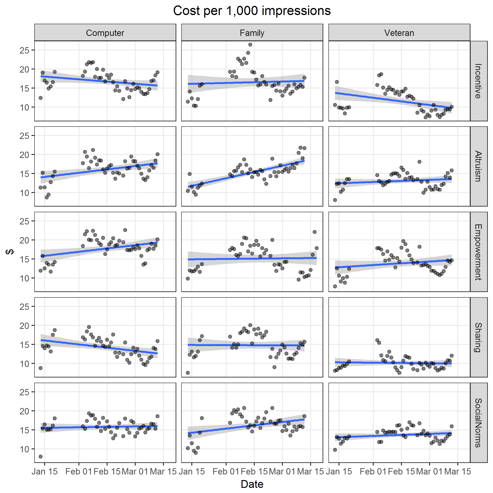
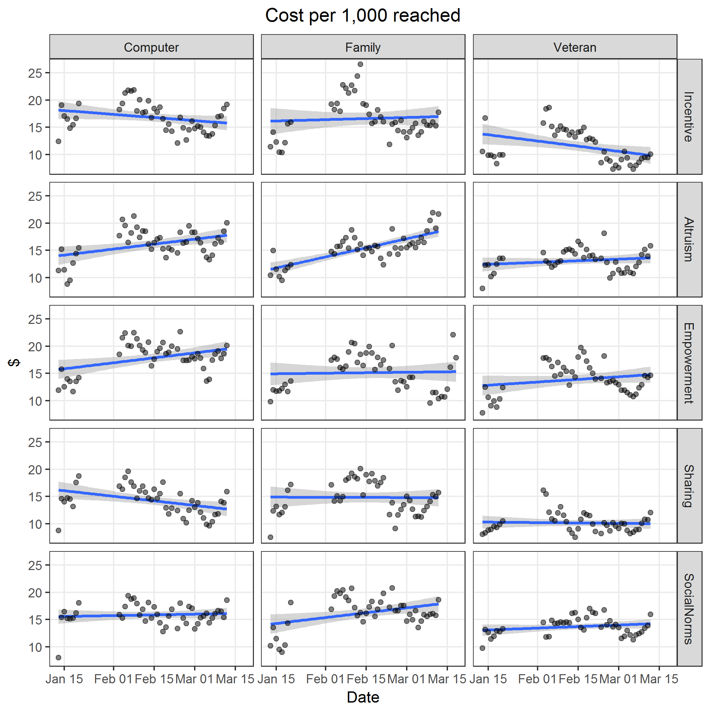
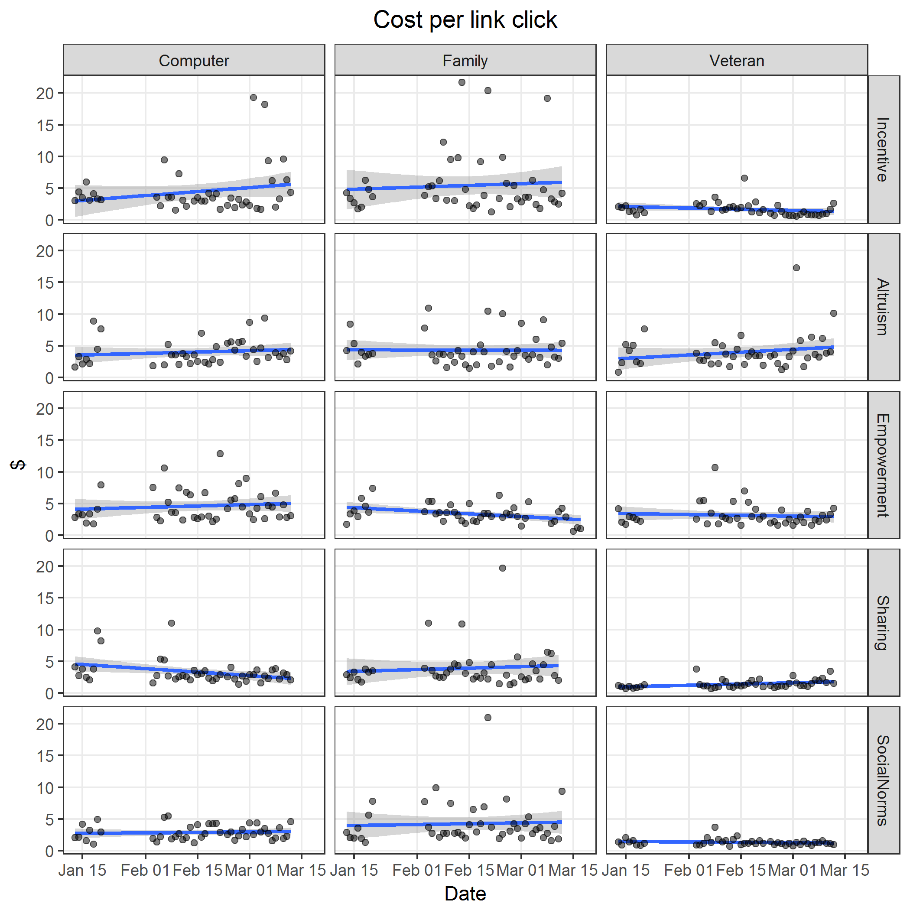
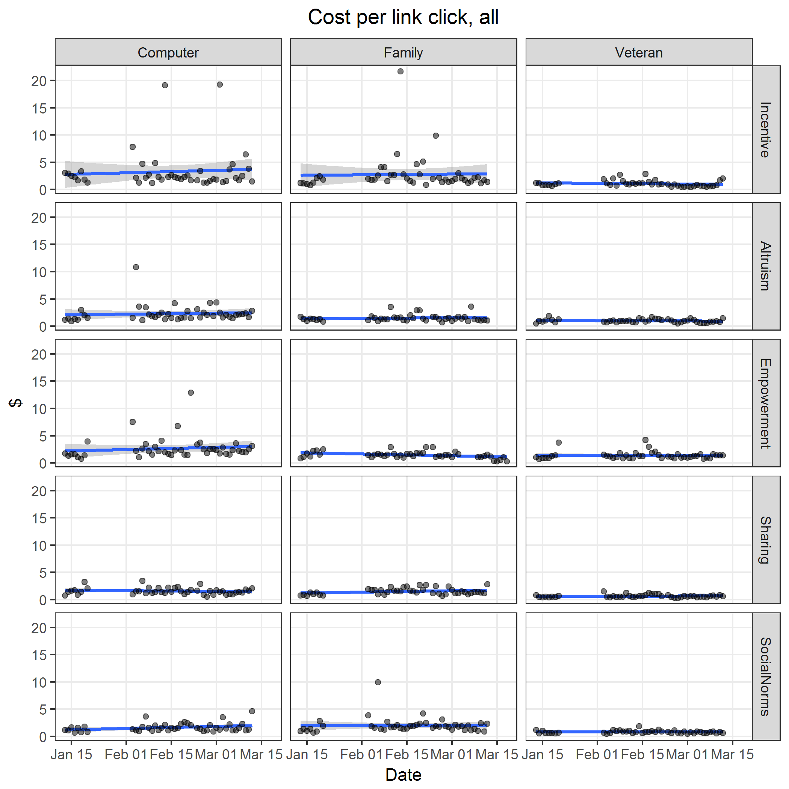
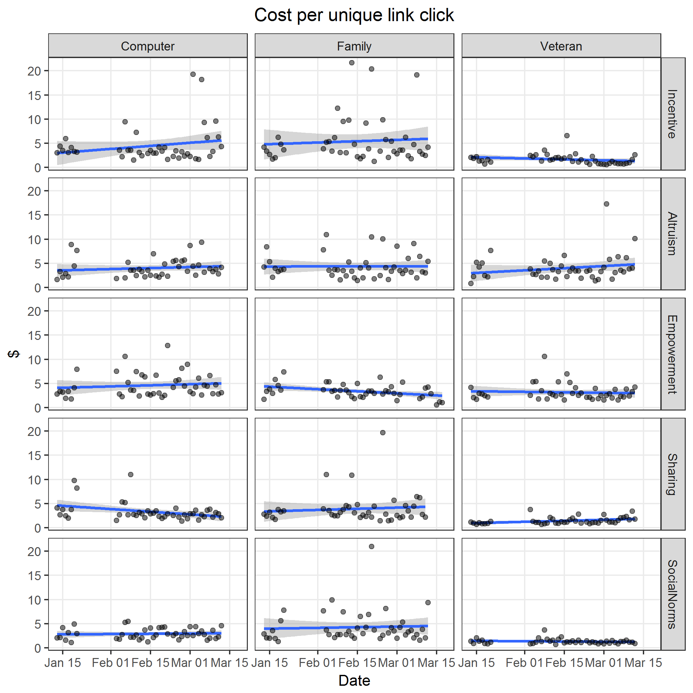

# Model Facebook ad costs

* Use linear model
* Factors
  * Ad `image`
  * Ad `text`
* Include full factorial interaction

**Model**

Define the linear predictor as $\eta$, where

$$
\begin{align*}
\eta = & \beta_0 + \\\\
       & \beta_1 x_\text{image: Family} + 
         \beta_2 x_\text{image: Veteran} + \\\\
       & \beta_3 x_\text{text: Altruism} + 
         \beta_4 x_\text{text: Empowerment} + 
         \beta_5 x_\text{text: Sharing} + 
         \beta_6 x_\text{text: Social norms} + \\\\
       & \gamma_1 x_\text{image: Family} x_\text{text: Altruism} + 
         \gamma_2 x_\text{image: Family} x_\text{text: Empowerment} +  \\\\
       & \gamma_3 x_\text{image: Family} x_\text{text: Sharing} + 
         \gamma_4 x_\text{image: Family} x_\text{text: Social norms} + \\\\
       & \gamma_5 x_\text{image: Veteran} x_\text{text: Altruism} + 
         \gamma_6 x_\text{image: Veteran} x_\text{text: Empowerment} +  \\\\
       & \gamma_7 x_\text{image: Veteran} x_\text{text: Sharing} + 
         \gamma_8 x_\text{image: Veteran} x_\text{text: Social norms}
\end{align*}
$$

The model for ad costs per unit is

$$
y = \eta
$$


## Cost per impressions

Image files saved as [PNG](../figures/costPerImpression.png), [SVG](../figures/costPerImpression.svg)



```{r costPerImpression, fig.show = "hide"}
y <- "costPerImpression"
x <- "date"
title <- "Cost per 1,000 impressions"
source("../scripts/wrapperCost.R", print.eval = TRUE)
```


## Cost per reach

Image files saved as [PNG](../figures/costPerKReached.png), [SVG](../figures/costPerKReached.svg)



```{r costPerKReached, fig.show = "hide"}
y <- "costPerKReached"
x <- "date"
title <- "Cost per 1,000 reached"
source("../scripts/wrapperCost.R", print.eval = TRUE)
```


## Cost per link click

Image files saved as [PNG](../figures/costPerLinkClick.png), [SVG](../figures/costPerLinkClick.svg)



```{r costPerLinkClick, fig.show = "hide"}
y <- "costPerLinkClick"
x <- "date"
title <- "Cost per link click"
plotCost(y, x, y, title)
M <- modelCost(y)
print(M$model, showEnv = FALSE)
M$pred %>% kable(digits = 2)
M[["modelObject"]] %>% contrastTable %>% kable(digits = 3)
M[["modelObject"]] %>% contrastTable %>% .[["contrastImage"]] %>% contrastHeatmap(sprintf("%sContrastHeatmapImage", y))
M[["modelObject"]] %>% contrastTable %>% .[["contrastText"]] %>% contrastHeatmap(sprintf("%sContrastHeatmapText", y))
M[["modelObject"]] %>% contrastTable %>% .[["contrastInteraction"]] %>% contrastHeatmap(sprintf("%sContrastHeatmapInteraction", y))
M$modelObject %>% summary
# plotResid("resid", x, sprintf("%sResid", y), title)  # Returns error
```


## Cost per link click, all

Image files saved as [PNG](../figures/costPerLinkClickAll.png), [SVG](../figures/costPerLinkClickAll.svg)



```{r costPerLinkClickAll, fig.show = "hide"}
y <- "costPerLinkClickAll"
x <- "date"
title <- "Cost per link click, all"
plotCost(y, x, y, title)
M <- modelCost(y)
print(M$model, showEnv = FALSE)
M$pred %>% kable(digits = 2)
M[["modelObject"]] %>% contrastTable %>% kable(digits = 3)
M[["modelObject"]] %>% contrastTable %>% .[["contrastImage"]] %>% contrastHeatmap(sprintf("%sContrastHeatmapImage", y))
M[["modelObject"]] %>% contrastTable %>% .[["contrastText"]] %>% contrastHeatmap(sprintf("%sContrastHeatmapText", y))
M[["modelObject"]] %>% contrastTable %>% .[["contrastInteraction"]] %>% contrastHeatmap(sprintf("%sContrastHeatmapInteraction", y))
M$modelObject %>% summary
# plotResid("resid", x, sprintf("%sResid", y), title)  # Returns error
```


## Cost per unique link click

Image files saved as [PNG](../figures/costPerUniqueLinkClick.png), [SVG](../figures/costPerUniqueLinkClick.svg)



```{r costPerUniqueLinkClick, fig.show = "hide"}
y <- "costPerUniqueLinkClick"
x <- "date"
title <- "Cost per unique link click"
plotCost(y, x, y, title)
M <- modelCost(y)
print(M$model, showEnv = FALSE)
M$pred %>% kable(digits = 2)
M[["modelObject"]] %>% contrastTable %>% kable(digits = 3)
M[["modelObject"]] %>% contrastTable %>% .[["contrastImage"]] %>% contrastHeatmap(sprintf("%sContrastHeatmapImage", y))
M[["modelObject"]] %>% contrastTable %>% .[["contrastText"]] %>% contrastHeatmap(sprintf("%sContrastHeatmapText", y))
M[["modelObject"]] %>% contrastTable %>% .[["contrastInteraction"]] %>% contrastHeatmap(sprintf("%sContrastHeatmapInteraction", y))
M$modelObject %>% summary
# plotResid("resid", x, sprintf("%sResid", y), title)  # Returns error
```
