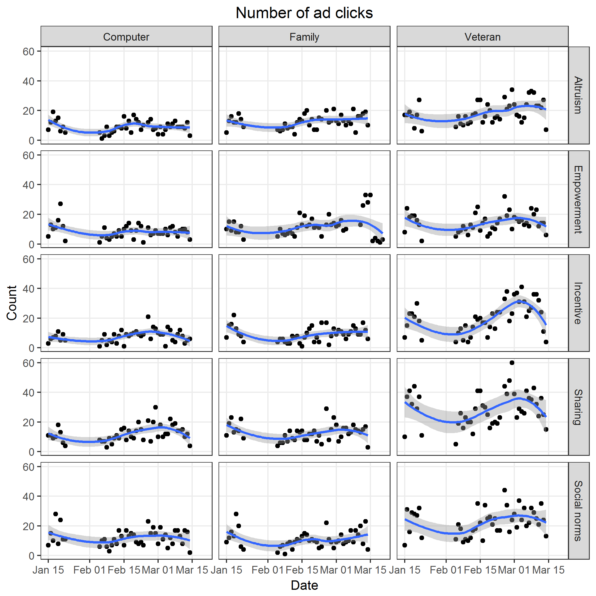
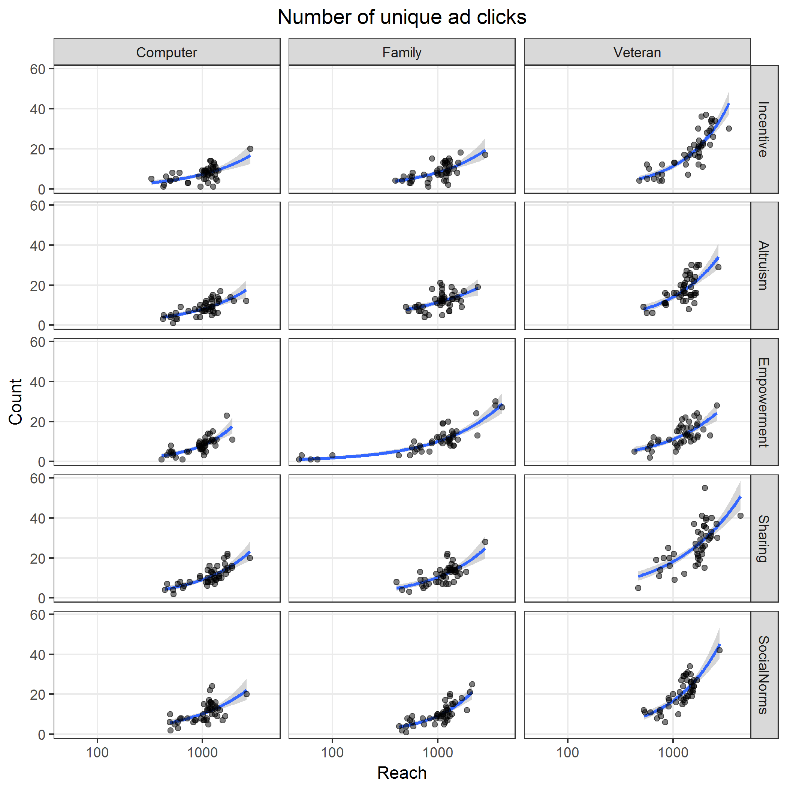
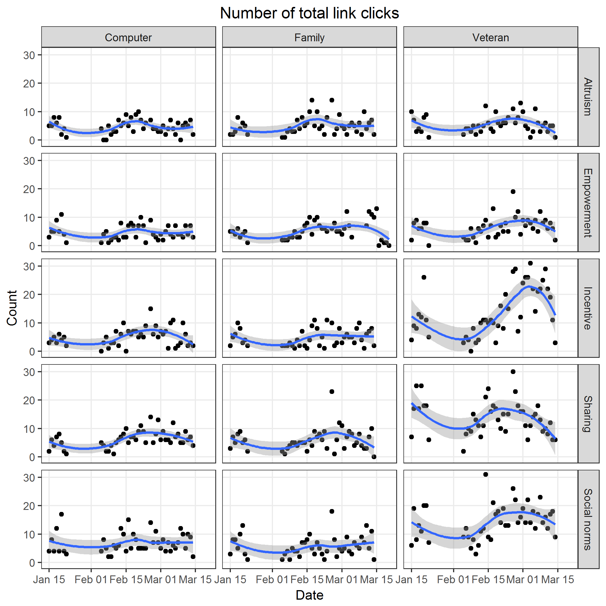
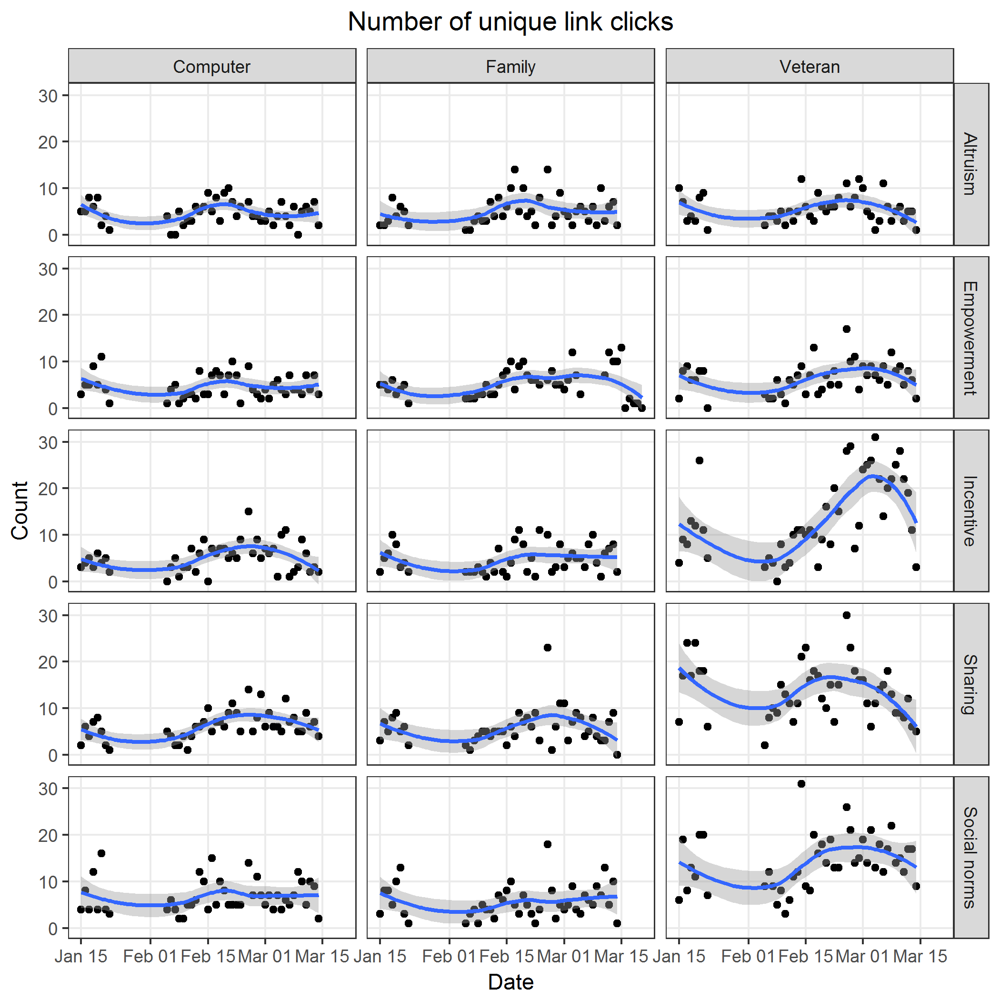
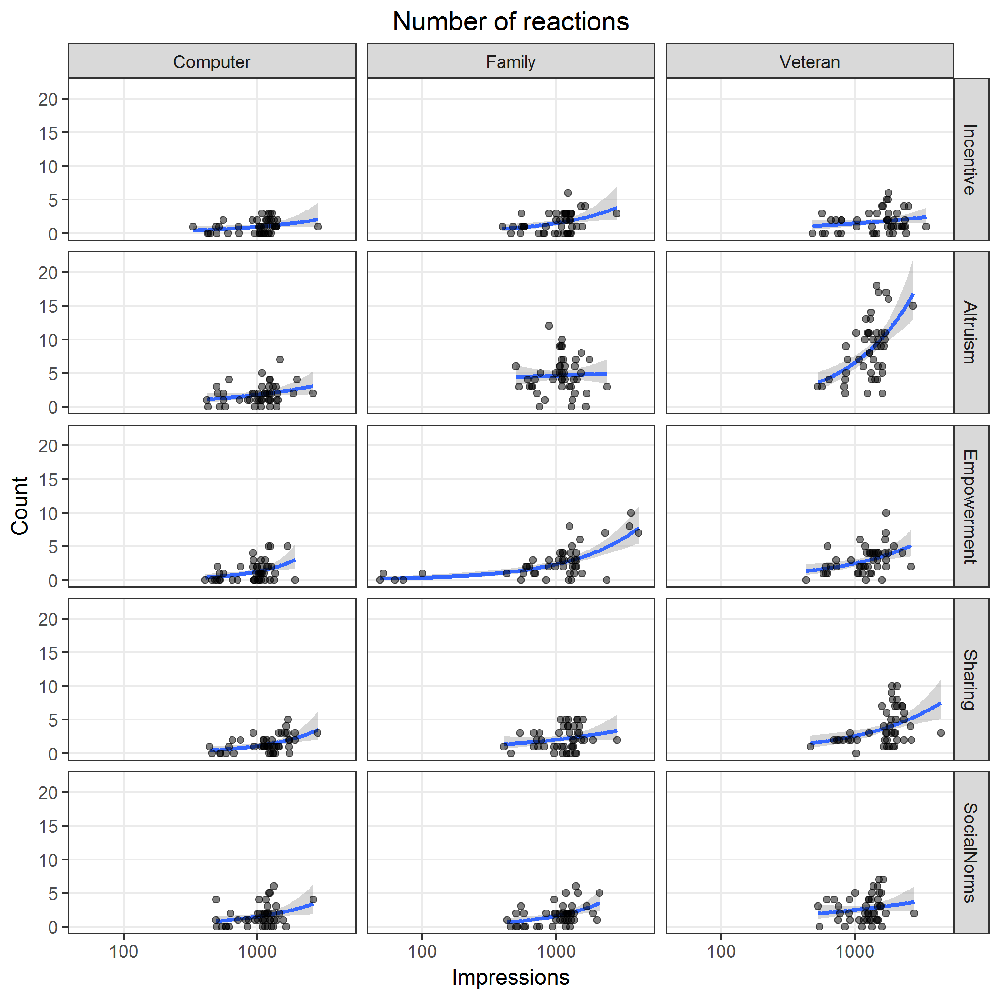
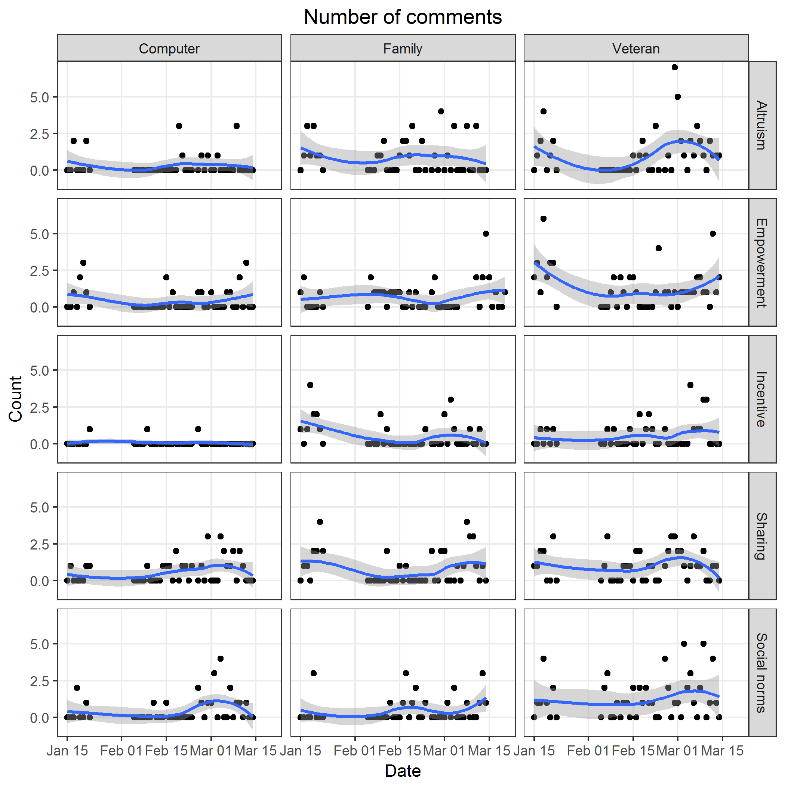
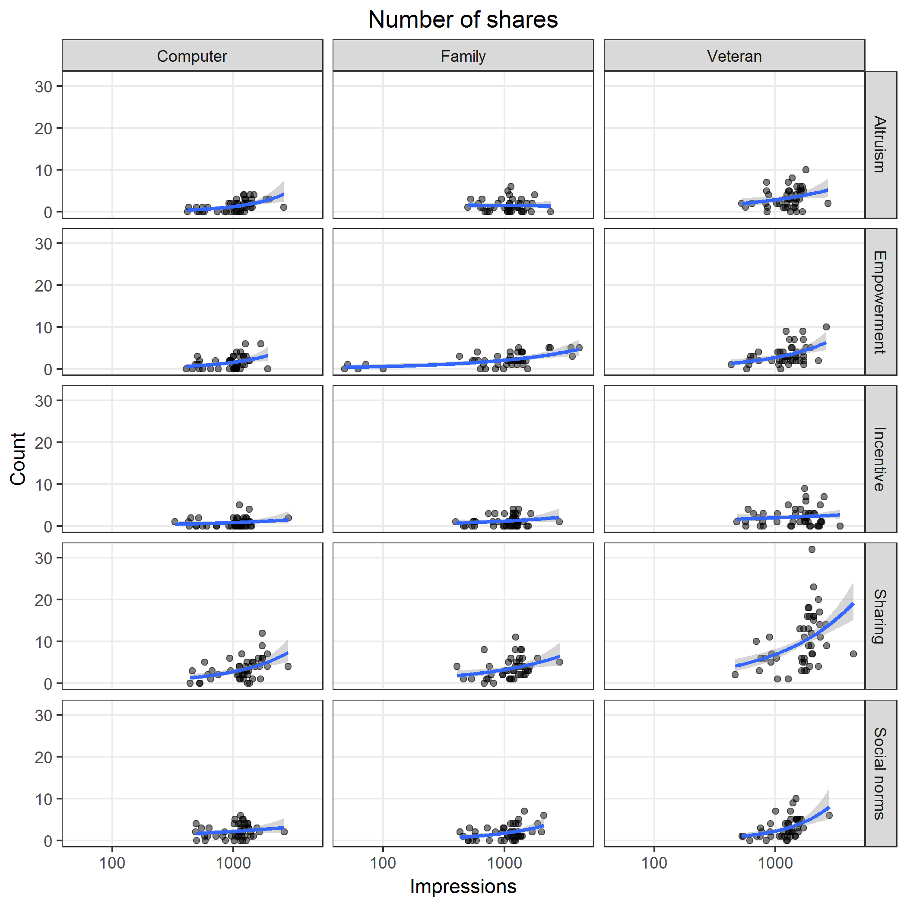

# Model counts

* Use negative binomial model
* Factors
  * Ad `image`
  * Ad `text`
* Include full factorial interaction
* Use $\log(\text{impressions})$ or $\log(\text{reach})$ as an offset variable
* Calculate predicted counts per 1,000 impressions/reach

**Model**

$$
\begin{align}
\log(y) = 
&  
\beta_0 + \\
& \beta_1 x_\text{image: Family} + 
\beta_2 x_\text{image: Veteran} + \\
& \beta_3 x_\text{text: Empowerment} + 
\beta_4 x_\text{text: Incentive} + 
\beta_5 x_\text{text: Sharing} + 
\beta_6 x_\text{text: Social norms} + \\
& \gamma_1 x_\text{image: Family} x_\text{text: Empowerment} + 
\gamma_2 x_\text{image: Family} x_\text{text: Incentive} + 
\gamma_3 x_\text{image: Family} x_\text{text: Sharing} + 
\gamma_4 x_\text{image: Family} x_\text{text: Social norms} + \\
& \gamma_5 x_\text{image: Veteran} x_\text{text: Empowerment} + 
\gamma_6 x_\text{image: Veteran} x_\text{text: Incentive} + 
\gamma_7 x_\text{image: Veteran} x_\text{text: Sharing} + 
\gamma_8 x_\text{image: Veteran} x_\text{text: Social norms} + \\
& \log(x_\text{offset})
\end{align}
$$

## Total clicks

Image files saved as [PNG](../figures/clicksTotal.png), [SVG](../figures/clicksTotal.svg)



```{r clicksTotal, fig.show = "hide"}
y <- "clicksTotal"
offset <- "impressions"
title <- "Number of ad clicks"
plotRates(y, offset, y, title)
M <- modelCounts(y, offset)
M$pred %>% kable(digits = 2)
summary(M$modelObject)
plotResid("resid", offset, sprintf("%sResid", y), title)
```

Image files saved as [PNG](../figures/clicksTotalResid.png), [SVG](../figures/clicksTotalResid.svg)


## Unique clicks

Image files saved as [PNG](../figures/clicksUnique.png), [SVG](../figures/clicksUnique.svg)



```{r clicksUnique, fig.show = "hide"}
y <- "clicksUnique"
offset <- "reach"
title <- "Number of unique ad clicks"
plotRates(y, offset, y, title)
M <- modelCounts(y, offset)
M$pred %>% kable(digits = 2)
summary(M$modelObject)
plotResid("resid", offset, sprintf("%sResid", y), title)
```

Image files saved as [PNG](../figures/clicksUniqueResid.png), [SVG](../figures/clicksUniqueResid.svg)


## Total link clicks

Image files saved as [PNG](../figures/linkClicksTotal.png), [SVG](../figures/linkClicksTotal.svg)



```{r linkClicksTotal, fig.show = "hide"}
y <- "linkClicksTotal"
offset <- "impressions"
title <- "Number of total link clicks"
plotRates(y, offset, y, title)
M <- modelCounts(y, offset)
M$pred %>% kable(digits = 2)
summary(M$modelObject)
plotResid("resid", offset, sprintf("%sResid", y), title)
```

Image files saved as [PNG](../figures/linkClicksTotalResid.png), [SVG](../figures/linkClicksTotalResid.svg)


## Unique link clicks

Image files saved as [PNG](../figures/linkClicksUnique.png), [SVG](../figures/linkClicksUnique.svg)



```{r linkClicksUnique, fig.show = "hide"}
y <- "linkClicksUnique"
offset <- "reach"
title <- "Number of unique link clicks"
plotRates(y, offset, y, title)
M <- modelCounts(y, offset)
M$pred %>% kable(digits = 2)
summary(M$modelObject)
plotResid("resid", offset, sprintf("%sResid", y), title)
```

Image files saved as [PNG](../figures/linkClicksUniqueResid.png), [SVG](../figures/linkClicksUniqueResid.svg)


## Reactions

Image files saved as [PNG](../figures/reactions.png), [SVG](../figures/reactions.svg)



```{r reactions, fig.show = "hide"}
y <- "reactions"
offset <- "impressions"
title <- "Number of reactions"
plotRates(y, offset, y, title)
M <- modelCounts(y, offset)
M$pred %>% kable(digits = 2)
summary(M$modelObject)
plotResid("resid", offset, sprintf("%sResid", y), title)
```

Image files saved as [PNG](../figures/reactionsResid.png), [SVG](../figures/reactionsResid.svg)


## Comments

Image files saved as [PNG](../figures/comments.png), [SVG](../figures/comments.svg)



```{r comments, fig.show = "hide"}
y <- "comments"
offset <- "impressions"
title <- "Number of comments"
plotRates(y, offset, y, title)
M <- modelCounts(y, offset)
M$pred %>% kable(digits = 2)
summary(M$modelObject)
plotResid("resid", offset, sprintf("%sResid", y), title)
```

Image files saved as [PNG](../figures/commentsResid.png), [SVG](../figures/commentsResid.svg)


## Shares

Image files saved as [PNG](../figures/shares.png), [SVG](../figures/shares.svg)



```{r shares, fig.show = "hide"}
y <- "shares"
offset <- "impressions"
title <- "Number of shares"
plotRates(y, offset, y, title)
M <- modelCounts(y, offset)
M$pred %>% kable(digits = 2)
summary(M$modelObject)
plotResid("resid", offset, sprintf("%sResid", y), title)
```

Image files saved as [PNG](../figures/sharesResid.png), [SVG](../figures/sharesResid.svg)
