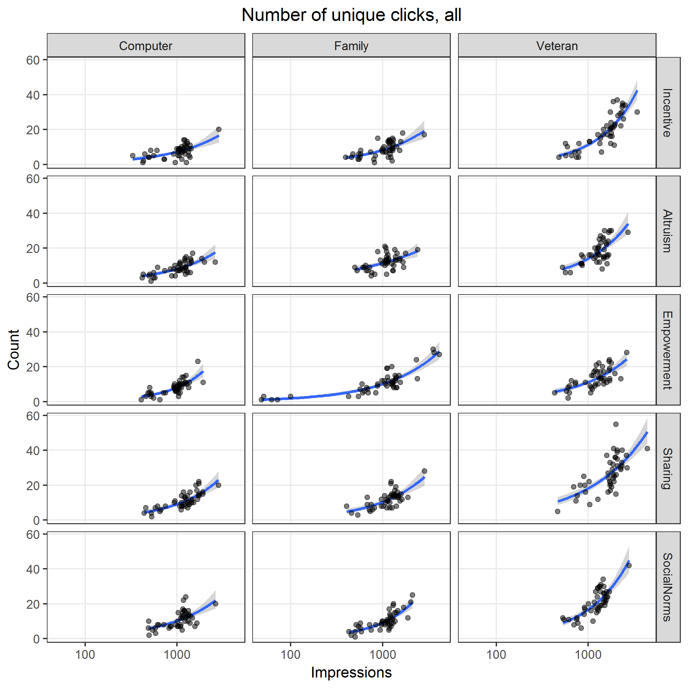

# Model counts

* Use negative binomial model
* Factors
  * Ad `image`
  * Ad `text`
* Include full factorial interaction
* Use $\log(\text{impressions})$ or $\log(\text{reach})$ as an offset variable
* Calculate predicted counts per 1,000 impressions/reach

**Model**

$$
\begin{align*}
\log(y) = & \beta_0 + \\\\
          & \beta_1 x_\text{image: Family} + 
            \beta_2 x_\text{image: Veteran} + \\\\
          & \beta_3 x_\text{text: Altruism} + 
            \beta_4 x_\text{text: Empowerment} + 
            \beta_5 x_\text{text: Sharing} + 
            \beta_6 x_\text{text: Social norms} + \\\\
          & \gamma_1 x_\text{image: Family} x_\text{text: Altruism} + 
            \gamma_2 x_\text{image: Family} x_\text{text: Empowerment} +  \\\\
          & \gamma_3 x_\text{image: Family} x_\text{text: Sharing} + 
            \gamma_4 x_\text{image: Family} x_\text{text: Social norms} + \\\\
          & \gamma_5 x_\text{image: Veteran} x_\text{text: Altruism} + 
            \gamma_6 x_\text{image: Veteran} x_\text{text: Empowerment} +  \\\\
          & \gamma_7 x_\text{image: Veteran} x_\text{text: Sharing} + 
            \gamma_8 x_\text{image: Veteran} x_\text{text: Social norms} + \\\\
          & \log(x_\text{offset})
\end{align*}
$$


## Clicks, all

Image files saved as [PNG](../figures/clicksAll.png), [SVG](../figures/clicksAll.svg)


```{r clicksAll, fig.show = "hide"}
y <- "clicksAll"
x <- "impressions"
offset <- "impressions"
title <- "Number of clicks, all"
source("../scripts/wrapper.R", print.eval = TRUE)
```


## Unique clicks, all

Image files saved as [PNG](../figures/uniqueClicksAll.png), [SVG](../figures/uniqueClicksAll.svg)



```{r uniqueClicksAll, fig.show = "hide"}
y <- "uniqueClicksAll"
x <- "impressions"
offset <- "impressions"
title <- "Number of unique clicks, all"
source("../scripts/wrapper.R", print.eval = TRUE)
```


## Total link clicks

Image files saved as [PNG](../figures/linkClicks.png), [SVG](../figures/linkClicks.svg)


```{r linkClicks, fig.show = "hide"}
y <- "linkClicks"
x <- "impressions"
offset <- "impressions"
title <- "Number of link clicks"
source("../scripts/wrapper.R", print.eval = TRUE)
```


## Unique link clicks

Image files saved as [PNG](../figures/uniqueLinkClicks.png), [SVG](../figures/uniqueLinkClicks.svg)


```{r uniqueLinkClicks, fig.show = "hide"}
y <- "uniqueLinkClicks"
x <- "impressions"
offset <- "impressions"
title <- "Number of unique link clicks"
source("../scripts/wrapper.R", print.eval = TRUE)
```


## Reactions

Image files saved as [PNG](../figures/reactions.png), [SVG](../figures/reactions.svg)


```{r reactions, fig.show = "hide"}
y <- "reactions"
x <- "impressions"
offset <- "impressions"
title <- "Number of reactions"
source("../scripts/wrapper.R", print.eval = TRUE)
```


## Comments

Image files saved as [PNG](../figures/comments.png), [SVG](../figures/comments.svg)


```{r comments, fig.show = "hide"}
y <- "comments"
x <- "impressions"
offset <- "impressions"
title <- "Number of comments"
source("../scripts/wrapper.R", print.eval = TRUE)
```


## Shares

Image files saved as [PNG](../figures/shares.png), [SVG](../figures/shares.svg)


```{r shares, fig.show = "hide"}
y <- "shares"
x <- "impressions"
offset <- "impressions"
title <- "Number of shares"
source("../scripts/wrapper.R", print.eval = TRUE)
```
