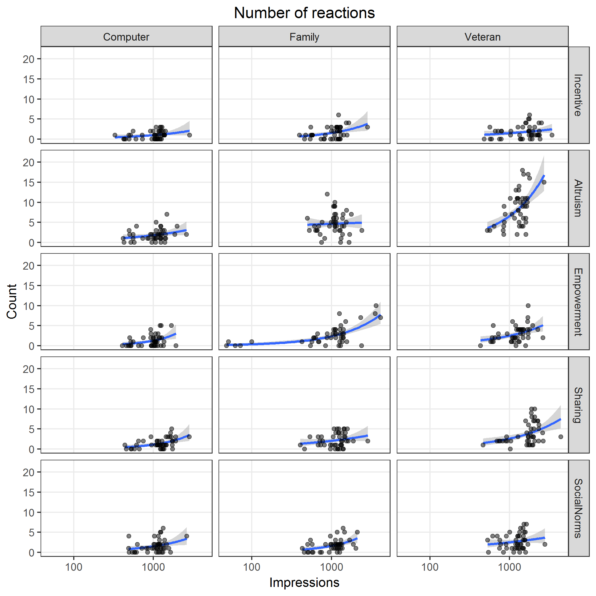

# Plot data


## Total clicks

Image files saved as [PNG](../figures/clicksTotal.png), [SVG](../figures/clicksTotal.svg)


```{r clicksTotal, fig.show = "hide"}
plotRates("clicksTotal", "impressions", "clicksTotal", "Number of ad clicks")
```


## Unique clicks

Image files saved as [PNG](../figures/clicksUnique.png), [SVG](../figures/clicksUnique.svg)


```{r clicksUnique, fig.show = "hide"}
plotRates("clicksUnique", "reach", "clicksUnique", "Number of unique ad clicks")
```


## Total link clicks

Image files saved as [PNG](../figures/linkClicksTotal.png), [SVG](../figures/linkClicksTotal.svg)


```{r linkClicksTotal, fig.show = "hide"}
plotRates("linkClicksTotal", "impressions", "linkClicksTotal", "Number of total link clicks")
```


## Unique link clicks

Image files saved as [PNG](../figures/linkClicksUnique.png), [SVG](../figures/linkClicksUnique.svg)


```{r linkClicksUnique, fig.show = "hide"}
plotRates("linkClicksUnique", "reach", "linkClicksUnique", "Number of unique link clicks")
```


## Reactions

Image files saved as [PNG](../figures/reactions.png), [SVG](../figures/reactions.svg)



```{r reactions, fig.show = "hide"}
plotRates("reactions", "impressions", "reactions", "Number of reactions")
```


## Comments

Image files saved as [PNG](../figures/comments.png), [SVG](../figures/comments.svg)


```{r comments, fig.show = "hide"}
plotRates("comments", "impressions", "comments", "Number of comments")
```


## Shares

Image files saved as [PNG](../figures/shares.png), [SVG](../figures/shares.svg)


```{r shares, fig.show = "hide"}
plotRates("shares", "impressions", "shares", "Number of shares")
```
